# Gold 人工抽检复核材料包（Spike 1，30 页）

> 为维护者人工校对 gold 做准备。**数据全部来自本地缓存与 fixtures，离线生成，未调用任何模型。**gold 为 AI 草拟（glm-5.3-flash）、未经人工校对；类目为 AI 判定。

## 使用说明

1. **建议抽检顺序**：涂改类 6 页优先（语义化删除判断最依赖人眼），其次公式 4 页，再其余。
2. 每页对照右上/页图缩略图（点开可看原图 `eval/fixtures/data/<id>.jpg`）核对下方两段全文。
3. 差异要点为系统根据编辑度量粗判 + 类目提示，具体以人眼为准。
4. **修改方式**：若 gold 需改，直接在 `gold/<id>.gold.md` 副本上修改；
   勾选「需修改」并把改好的副本放回 `eval/fixtures/gold/<id>.gold.md`、置 `gold_proofed=true`（或交给工单处理）。
5. 已核对且无误的页勾选「gold 无需修改」。

| 优先 | 类目 | 页数 |
|---|---|---|
| ☆ | 手写笔记 | 10 |
| ★★ | 数学公式 | 4 |
| ☆ | 中英混排 | 4 |
| ☆ | 流程图/架构图 | 6 |
| ★★★ | 涂改/删除线 | 6 |

---

## 01. A09｜涂改/删除线

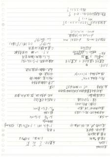（原图：`eval/fixtures/data/A09.jpg`，点击放大）

- 类目：涂改/删除线 | gold 字符 740 / glm 预测 919 | 编辑 780(ins 207/del 29/sub 544) | EditRate 1.0526 | 网关延迟 49.85s
- 已知差异要点：glm 预测比 gold 长 179 字符（可能多抄或补了细节）；替换占比高（544/780）——多为措辞/LaTeX 记号/分段差异
  - 语义化删除类：gold 按逐字忠实口径保留了被划线/涂改段并打 `<<划掉>>/<<涂改>>` 标记；glm 预测按语义化删除口径不输出明确划掉的内容。因此该页差异会偏大，请重点核对删除线归属。
- 复核副本：`gold/A09.gold.md`

- [ ] gold 无需修改
- [ ] gold 需修改（在 `gold/A09.gold.md` 副本上改后同步回 fixtures）

<details><summary>AI 草拟 gold 全文</summary>

```markdown
# 滚动轴承

## 1. 结构

- 外圈：装在轴承座孔内，起支承作用
- 内圈：装在轴颈上
- 滚动体：将滑动摩擦变为滚动摩擦
- 保持架：将滚动体隔开并均匀分布

## 2. 类型

- 按承受载荷方向分：向心轴承（主要承受径向载荷）、推力轴承（主要承受轴向载荷）
- 按滚动体形状分：球轴承、滚子轴承
- 按调心性能分：调心轴承、刚性轴承

代号：
- 保持架：J（钢板冲压）、M（铜合金实体）、D（黄铜）
- 后置代号：/C2、/AC、/B 等

## 3. 受力分析

- 径向载荷：F_r = F_R + F_A·tanα（对角接触轴承，α 为接触角）
- 轴向载荷：F_a = F_A
- 载荷系数：X、Y —— 径向系数、轴向系数
- 当量动载荷：P = X·F_r + Y·F_a

## 4. 失效形式及计算准则

- 失效形式：疲劳点蚀、塑性变形、磨损
- 计算准则：
  - 一般转速：按疲劳寿命（额定动载荷）计算
  - 低速、重载：按静强度（额定静载荷）校核
  - 高速：校核极限转速

## 5. 例题

- 内径代号 04 → d = 4×5 = 20 mm
- d = 22×28×32（内径×外径×宽度）
- α ≈ 25°～15′?（接触角）
- 寿命：L_10 = (C/P)^ε，其中 ε 对球轴承 = 3，对滚子轴承 = 10/3
- L_10h = (10^6/60n)·(C/P)^ε
- 简支梁轴向载荷：F_A = 0.5F_R?（派生轴向力 S = 0.5F_R）
- 深沟球轴承轴向界限：0.5e?……
- 计算得：n ≈ 7.9,12?转/分？

---
*注：本页部分字迹潦草，个别数字（如角度、系数）辨认可能有误。*
```
</details>

<details><summary>glm-5.3-flash 预测全文</summary>

```markdown
滚动轴承

1. 结构
- （左圈：表〔轴〕颈）
- 外圈：表（套）（圈）
- （滚）动体：球；柱、锥（滚）（面）（球）
- （保）持（架）：
- （滚）动体（大）（小）：位置（图）：

二、分类：

- （按）受（载）方向：向（心）（轴）承
- （滚）动（体）（形）状：球（类）（子）
- （列）数：单列33851
- （接）（触）角（简）（式）
- （滚）动（体）自转贯穿靠（轴）（点）摩擦（球）与轨（道）（转）向摩（轴）
- （面）同角  $\alpha（\rightarrow）$转 向 摩（轴）
- 向心：转（轴）角 $0 \times 45°$
- 推力向（轴）承：$45° < \alpha < 90°$

3. 3（条）：

（简）量（内）+基（规）（向）+ 压（置）（小）字
$P = F_r$（反） $n_{max}$ 大
$F_a/F_r$ 经 向/轴（向）荷
$X, Y: \quad$ 单（动）（荷）（数）
$C$: 基（本）（额）定（动）（荷）
$L_{10}(\frac{1}{6}) = (\frac{C}{P})^\varepsilon \quad \varepsilon$: 球（1/3）（滚）（子）（1/3）

内（圈）斜（号）：04-96， $d=（柱）$ 写 $5$ MM
$d=3238.32$: 内（单）（道）
$00-03$: $10.10?, 15,17$

直（径）系列代号：7（8）（0）（1）（2）（3）（4）：D 1↑
例：0-5（3）↑
宽（度）（结）（列）（代）号（小）：8-6（3）↑
推力：7，6，12（3）↑

1. 定义：
- 布置（角）：10° 15° 30° 40°
- 位置代号：C AC B;
- $E, Ed$, B；D（的）（内）式

- （大）（数）：

- （八）（下）（传）？：（八）$P_0$(接)（八）（同）（感）

- 轴向（不）（动）？

- 后（小）（分）（合）（轴）（照）：

- 径 + 轴（承）：

- $P_0$; 云 $\Sigma P_i$ 合（体）（八）

3. 失效与计算/举例：
- 失效思想：塑（性）（变）形（磨）（损）
```
</details>

---

## 02. B11｜涂改/删除线

（原图：`eval/fixtures/data/B11.jpg`，点击放大）

- 类目：涂改/删除线 | gold 字符 1553 / glm 预测 1173 | 编辑 1399(ins 5/del 386/sub 1008) | EditRate 0.9003 | 网关延迟 29.04s
- 已知差异要点：glm 预测比 gold 短 380 字符（可能漏抄/截断，或按语义化删除删除了删除段）；替换占比高（1008/1399）——多为措辞/LaTeX 记号/分段差异
  - 语义化删除类：gold 按逐字忠实口径保留了被划线/涂改段并打 `<<划掉>>/<<涂改>>` 标记；glm 预测按语义化删除口径不输出明确划掉的内容。因此该页差异会偏大，请重点核对删除线归属。
- 复核副本：`gold/B11.gold.md`

- [ ] gold 无需修改
- [ ] gold 需修改（在 `gold/B11.gold.md` 副本上改后同步回 fixtures）

<details><summary>AI 草拟 gold 全文</summary>

```markdown
<!-- 本页手稿倒置书写；按翻转后正确阅读方向转写。页面为左右两栏，逐行配对如下 -->

**左栏（带传动设计计算）与右栏（齿轮失效）逐行对照：**

```
带传动设计计算参数及选择                    齿轮轮齿的失效
已知：P、[?]、n₁，传动载荷、工作条件          1.齿轮失效形式：[?]齿失效
确定[?]带型、根数、中心[?]等传动参数         轮齿[?][?][?]
Pₐ = k_A P                                  齿面[?][?]、[?][?]起
→ 计算功率                                  [?]齿根[?]折断/[?]断/斜[?]"(main)"[?]
→ 选型、d_{d1}
带轮[?]基准[?]直径[?]选择：
v = πd_{d1}n₁/(60×1000)    5~30 m/s         点蚀失效：[?]交[?]应力作用下，齿面[?][?]疲劳点蚀
                                            [?]点蚀位置：靠[?]近节[?]线[?]的齿根[?]
中心至[?]带轮基准直径 d_d                    严重[?]时[?]：[?]                 齿面[?]磨损：
中心距过大：离心力[?]大、[?]胶合[?]           胶合：热胶合；冷胶合；
中心距[?]过小：[?]...a ≤ 120°~180°,...       塑性[?]变形：...~    [?]面[?]磨损[?]：
F₀小：[?]增大[?]u₁[?]：中心[?][?]...         [?]硬化[?]女王[?]两[?]：[?]最大[?]齿[?]面[?]/[?]：[?] [?]齿[?]
增大K[?]：大[?]K[?][?]，[?]2[?]°~35°[?]      [?]接触[?]线[?][?]极限[?]
[?]增大[?]x₁[?]：中心[?][?]；张[?]紧[?]轮     [?]齿轮[?][?]疲劳[?]曲[?][?]  [?] if([?]d_{d1}d_{d1}) < d_d, 2(d_{d1}+d_{d1})
[?]增大[?]、[?]传动比[?]：[?]张[?]紧[?]轮     α ≈ 0.6[?] (1 + [?]) · a/a' [?] (d_{d1}·d_{d1})²
[?][?]面[?]胶[?]合[?]：[?]迅[?]胶合；[?]摩擦[?]力[?]；[?]分离[?]的[?]曲[?]     σ_H < [σ_H]     老曲[?]疲劳[?]强度
[?]皮带[?][?]初张力 F₀：                    σ_F < [σ_F]     接触[?]疲劳[?]强度
F₀ = 500(P_α/(v·z))·k[?]·(1+120°)/[?]       2.设计准则：
新带[?]补[?]拉[?]力[?]给[?][?]补偿值          z·y_{Fa1}⁻¹ · F_e/((z+2)k_α) ≤ τ<10；z ≤ [?]带[?]
带绕[?]带轮[?]周期[?]循环[?]变[?]为:  使[?]动带轮作用在[?]轮轴上的[?]载荷F_Q：
齿[?]轮[?]材料：σ_B              特[?]轮[?]宽度(小[?]轮)/_[?] >~12[?]^[?] 常取6~9
[?]式[?]齿轮齿[?]的[?]
```

**其余无法辨认的行均已用 [?] 占位，如有涂改未能在影印件中明确分辨，此处保守保留原状，不擅自补写。**
```
</details>

<details><summary>glm-5.3-flash 预测全文</summary>

```markdown
带传动设计计算和参数选择　　　　　　　　　　　　　　齿轮传动的失效
已知：$P_1$、$n_1$、传动位置上工作条件　　　　　　　　齿轮失效形式：轮齿折断
选择带型、长度、根数、中心距、轮径、传动比　　　　　　失效原因：
$P_2$：切P　　　　　　　　　　　　　　计算切率
　　　　　　　　　　　　　　　　　　　　　　工作条件：开式
$\sigma$ 弯曲 $da$　　　　　　　　　　　　齿面硬度：硬度、磨损
带中心距适当地给带速度：　　　　　　　　　　　　轮齿失效形式：
$v = \pi d_1 n_1$　　　　$\mathcal{E}$　5～30 m/s
中心距 $a_0$，带的基准长度 $L_d$
带轮直径 $d_1$：$a_1$ 或 小，$\theta$ 中心 $\theta$ 绕力线的应力，表示
$v_0$ 大از：单根大；带 $b$ 到至到动
$i$：$[da_{min} b] a_1 < a_2 < 2(da_1 + da_2)$
$L_d' = a_0 + \frac{1}{2}(da_{min} + da_{max}) + \frac{(da_2 - da_1)^2}{4a_0}$
$a \approx a_0 + \frac{a_0}{2} \cdot \frac{L_d - L'}{L_d'}$
面接触：面根合；线接触；点接触
小带轮包角 $a_1 = 180° - \frac{da_2 - da_1}{a} \times 57.3° = 210°$　　　　齿面破坏
增大 $x_1$：增大中心距 $a$，圆弧形小～
减小传动比；张力轮　　　　　　　　　　　　齿根疲劳断口：断口尖花（
$\theta$ 使用材料：$V$　　　　　　　　　　　　齿根断裂
2、设计步骤：
带的打滑并发：　　　　　　　　　　　　$\sigma_b \leq [\sigma_b]$ $\sigma$ 用节线（ $\sigma$ 为节线
$\frac{mm}{715}$，$\frac{P_c}{(10.2)Ka}$　$\mathcal{E}$ {{$}}$：与 $\sigma$ 射力] $\sigma_b < [\sigma_b]$　　　　接触疲劳强度
带的初拉应力 $F_0$：
$F_0 = 500 \frac{P_{ca}}{c v} \left( \frac{2.5}{K_a} - 1 \right) + q v^2$　　　　考虑（累计疲劳应应力：弯曲
新带 $F_0$：
$\frac{1.5 F_0}{\text{初拉}}$ 调整中心比　　　　　　　　1.5 倍
传递传动化（带的初拉力 $F_0$）：　　　　　　　　带的初拉力 $F_0$：常用 $b \sim 9$（here $1.5 \sim 12$）
```
</details>

---

## 03. C05｜涂改/删除线

（原图：`eval/fixtures/data/C05.jpg`，点击放大）

- 类目：涂改/删除线 | gold 字符 1788 / glm 预测 2064 | 编辑 1331(ins 457/del 182/sub 692) | EditRate 0.7440 | 网关延迟 68.08s
- 已知差异要点：glm 预测比 gold 长 276 字符（可能多抄或补了细节）；替换占比高（692/1331）——多为措辞/LaTeX 记号/分段差异
  - 语义化删除类：gold 按逐字忠实口径保留了被划线/涂改段并打 `<<划掉>>/<<涂改>>` 标记；glm 预测按语义化删除口径不输出明确划掉的内容。因此该页差异会偏大，请重点核对删除线归属。
- 复核副本：`gold/C05.gold.md`

- [ ] gold 无需修改
- [ ] gold 需修改（在 `gold/C05.gold.md` 副本上改后同步回 fixtures）

<details><summary>AI 草拟 gold 全文</summary>

```markdown
# 页面顶注（右上角）

多自体 组群 <<草字>>

---

# 左栏

## MAS 1.

Bold 模型：

zσr：排斥已  zσa：吸引已
zσo：定向 repulsion attraction 定向
d_i(t+1): -Σ_σ^{σ∈M_i} f̂(r̂_ij) / ‖r̂_ij‖  M≠0
　　　　Σ_{j∈N_i^{σr}} g(r̂_{ij}) / ‖r̂_ij‖  M=0 定向
　　　　Σ_{j∈N_i^{σa}} f̂(r̂_ij) / ‖r̂_ij‖  M=0
　　　　Σ_{j∈N_i^{σo}} h(r̂_{ij}) / ‖r̂_ij‖  M=0 边缘
　　　　Σ_{α=σr,σa,σo} d_{i0}^{(σ)} r̂_{ij}(t) + Σ_{j∈N_i^{σw}} g(r̂_ij) + Σ_{j∈N_i^{σo}} f̂ HttpRequest ‖r̂‖  M≠0 说明

Viscole 模型：

θ_i(t+1): arctan[ (Σ_{j=M_i,K_i} sin θ_ij(t)) / (Σ_{j∈M_i,K_i} cos θ_ij(t)) ] + β_i
x_i(t+1) = x_i(t) + v(cos θ_i(t+1), sin θ_i(t+1))

 analogue 模型 <<划掉>>：

V_i(t): dT_i/dt  为期望
m_i dv_i/dt = m_i[ V_i^{(r)}(r_i(t) - x_i(t)) ] + 主观 + [is] + 期望w
f_ij = ⟨k_ij[r_ij - d_ij(t)] g(r_ij) <<涂改>> | r_ij - d_ij | ẑ_ij⟩
+ k_g[r_ij - d_ij] Δμ_g(r̂_ij) ẑ_ij
Γ_ij: 生效半径(effective range)  Γ_ij: 个体作用力
f_iw: A_i e^{-d_iw/W_i} + k_g(r_i - d_iw) f̂_iw⟨l⟩
Φ - k_g(r_i - d_iw) v_i(t) f̂_iw⟨l⟩  →→~

SOC 自组织临界性：P(x) ∝ x^{-2}

## Ising 模型

S_i: ±1
E = -Σ_iΣ_j S_i S_ij <<涂改>> - Σ_i h_i S_i
J_ij: 相互作用 逻辑（划线）
h_i: 外部环境（划线）

---

# 右栏

## MAS 2.

平均场建模方法：

1. 种群模型：

a. 连续单种群 Malthus 指数增长
离散： x(t) = R x(t)　x(t) = R^t x(0)
连续 (Malthus)：

λ(t) : Γλ(t)　λ(0) : e^t x(0)

b. 引入竞争：Logistic 增长　阻滞增长
ṗ：ẋ = Γx(1 - x/k)
⇒ x(t) = k N e^{Γt} / (e^{Γt} + (k/x(0)) <<涂改>> e^{Γt})
lim_{t→∞} x(t) = k

（图形：一条从低处上升、饱和趋于上界 k 的 S 形曲线，横轴向右，纵轴向上）

离散数：
λ(t+1) = R λ(t) (1 - λ(t)/k)
全 x(t) : x(t)/k 满足 Logistic 映射
Thm: 若 |dF_μ/dx|x̂| < 1 ⇒ |F'(x̂-P)| < |1-P̂|
⇒ 系统收敛、稳定

c. Lotka-Volterra 方程 捕食-被捕食
⟨ x(t) : a x(t) - b x(t) y(t)  被捕者
　 y(t) : -c y(t) + d x(t) y(t)  捕者 ⟩
⇒ 平衡态：x(t) : d/c　y(t) : a/b
逆时针旋转椭圆周期

d. 带有竞争关系的种群模型
dN₁(t)/dt = a₁ N₁ (1 - N₁/K₁ - (α₁₂ N₂)/K₂)
dN₂(t)/dt = a₂ N₂ (1 - N₂/K₂ - (β₂₁ N₁)/K₂)

e. 植物与食植动物
dy/dt = r V (1 - y/k) ⟨?⟩ - c_H [1 - e^{-d/v}]
dx/dt = H[ -a + c_H(1 - e^{-d/v}) ]
```
</details>

<details><summary>glm-5.3-flash 预测全文</summary>

```markdown
# MAS1

Boid 模型：

- $z\sigma_1$：排异　$z\sigma_2$：吸引己
- $\alpha\sigma_0$：定向　Reputation　Orientation attraction
- $d_i(t+1) = -\Sigma_j \dfrac{r_{ij}^{uv}}{|r_{ij}^{uv}|}\eta$ 符号：
  - $r_{ij}^{uv}$，$\eta > 0$：定向
  - $\eta < 0$：边缘
  - $-\Sigma_j \dfrac{r_{ij}^{uv}}{|r_{ij}^{uv}|}$，$\eta = 0$：排斥

# Vicsek 模型

$$\theta_i(t+1) = \arctan\left[\frac{\sum_j e^{i\theta_j(t)} \cos\theta_j(t)}{\sum_j e^{i\theta_j(t)} \cos\theta_j(t)}\right] + u$$

$$x_i(t+1) = x_i(t) + v(\cos\theta_i(t+1), \sin\theta_i(t))$$

# 竞争模型

- $v_i(t)$：$dr_i/dt$　δ期望
- $m_i \, dv_i/dt = m_i[\alpha^{(r_i)} e^{\beta(t)} v_i - v_i(t)]$　主动运动
- $+\Sigma_{j\neq i} f_{ij}$　β：竞争场；w：梯度
- $f_{ij} = [A_i e(r_{ij} \cdot dwr_j) + B_y(r_{ij} \cdot dw) r_{ij}^{uv}] m_j^T$
  - $+k_g(|r_{ij} - \delta_{ij}|) du_i f_{ij}^{uv}$：相互作用力
  - $f_{ij}$：内聚力
- $f_{iw} = A_i e(r_{iw} \cdot dwr_w) + k_g(r_{iw} \cdot dw) r_{iw}^{uv}$
- $\phi$ $-k_g(r_{ij} \cdot dw) v_{ij}/|v_{ij}| \hat{w}$

SOC 自组织临界性：$P_{TA} \propto x^{-2}$

# Ising 模型

- $s_i = \pm 1$
- $E = -\Sigma J_{ij} s_i s_j - \Sigma h_i s_i$
- $J_{ij}$：相互作用逻辑
- $h_i$：外部环境

# MAS2

平均场近似法：

## 1. 种群模型

### a. 连续单种群　Malthus　指数增长

- 离散：$x(t+1) = Rx(t)$　$\lambda(t) = R^t \lambda(0)$
- 连续（Malthus）：

$$x(t) = r x(t) \quad x(t) = e^{rt} x(0)$$

### b. 引入竞争：logistic 增长　阻滞增长

- 迁：$\dot{x} = r x(1 - x/k)$
- $\Rightarrow x(t) = k x_0 e^{rt} / (k + x_0(e^{rt} - 1))$
- $\lim_{t\to\infty} x(t) = k$

#### 离散：

- $x(t+1) = R x(t)(1 - x(t)/k)$
- 令 $y(t) = x(t)/k$ 得Logistic 映射
- Thm：若 $|df/dy| < 1$　$\Rightarrow |f'(y^*)| < 1$　$\Rightarrow$ 系统收敛、稳定

### c. Lotka–Volterra 方程　捕食—被食

$$\begin{cases} \dot{x}(t) = a x(t) - b x(t)y(t) \quad \text{食被} \\ \dot{y}(t) = -c y(t) + d x(t)y(t) \quad \text{捕} \end{cases}$$

- ⇒ 平衡点：$x(t) = y/d$　$y(t) = a/b$
- 逆时针走，椭圆周期

### d. 带有竞争关系的两种群模型

$$dx^{(1)}/dt = a_1 x^{(1)}(1 - \frac{x^{(1)}}{N_1} - \sigma_1 \frac{x^{(2)}}{N_2})$$

$$dx^{(2)}/dt = a_2 x^{(2)}(1 - \frac{x^{(2)}}{N_2} - \sigma_2 \frac{x^{(1)}}{N_1})$$

### e. 植物与食草动物

$$\dot{y}/dt = r_1 V(1 - y/资料) - c_1 H (1 - e^{dy/V})$$

$$dH/dt = r_1[-a + c_2(1 - e^{-dy/V})]$$
```
</details>

---

## 04. C09｜涂改/删除线

（原图：`eval/fixtures/data/C09.jpg`，点击放大）

- 类目：涂改/删除线 | gold 字符 983 / glm 预测 1001 | 编辑 626(ins 90/del 73/sub 463) | EditRate 0.6362 | 网关延迟 17.16s
- 已知差异要点：glm 预测比 gold 长 18 字符（可能多抄或补了细节）；替换占比高（463/626）——多为措辞/LaTeX 记号/分段差异
  - 语义化删除类：gold 按逐字忠实口径保留了被划线/涂改段并打 `<<划掉>>/<<涂改>>` 标记；glm 预测按语义化删除口径不输出明确划掉的内容。因此该页差异会偏大，请重点核对删除线归属。
- 复核副本：`gold/C09.gold.md`

- [ ] gold 无需修改
- [ ] gold 需修改（在 `gold/C09.gold.md` 副本上改后同步回 fixtures）

<details><summary>AI 草拟 gold 全文</summary>

```markdown
# 系统的描述

## 系统的数学模型：

$$C_0\frac{d^n r(t)}{dt^n}+C_1\frac{d^{n-1}r(t)}{dt^{n-1}}+\cdots+C_{n-1}\frac{dr(t)}{dt}+C_n r(t)$$
$$=E_0\frac{d^m e(t)}{dt^m}+E_1\frac{d^{m-1}e(t)}{dt^{m-1}}+\cdots+E_{m-1}\frac{de(t)}{dt}+E_m e(t)$$

e(t)：激励/输入

r(t)：响应/输出

## 系统的功能框图：

- 相加、乘、数乘、微分、积分、延［?］

## 系统的数学模型：

- e₁ ——(⊗)——Γ₂，　e₂↑，　e₁→[?]→Γ₂，　r = e₁e₂
- e ——(⊗)——Γ，　e₂↑，　r = e₁e₂
- e ——(A)——Γ，　e ⟶(×A)⟶ Γ，　r = Ae
- e ——(□)——Γ，　r(t) = e(t-τ)　（<small>原文写作 r(t) = e(t-T)</small>）
- e ——(d/dt)——Γ，　r = de/dt
- e ——(∫)——Γ，　r(t) = ∫₋∞^t e(t₁)dt₁

- n 阶常微分方程 只需 n 个积分器

4. 可逆系统 / 不可逆系统
- 可逆：不同激励不同响应
- 不可逆：~~不同~~ <<划掉>>，否则 √

·5. 因果系统：响应出现时间不早于激励
- 非因果系统：～

·6. 稳定系统与不稳定系统
- 稳态定义：输入有界输出有界｜即 B D　（output？）［?］
- 不稳定；～

·7. 线性系统与非线性系统：
- 线性：输入输出满足线性齐次与叠加
- e₂ ⟶ e₁e₂ < prestig？>［?] 操作

·8. 时变系统与时不变系统
- 时变：激励随时间改变，系统响应相应地随相同时间做改变
- 时变：～

## 系统特性及分类

1. 集总参数系统：
- 集总参数元件，常微分方程

分布参数系统：
- 分布参数元件，偏微分方程

2. 连续时间系统 / 离散时间系统

3. 无记忆系统和有记忆系统
- 无记忆：响应仅与当前激励有关
  - 代数方程
- 有记忆：响应与前递其它时间激励有关

应有关－积分／微分

（右下角注：微分/积分）
```
</details>

<details><summary>glm-5.3-flash 预测全文</summary>

```markdown
# 系统的描述

## 系统的数学模型：

$$C_0\frac{d^n e(t)}{dt^n}+C_1\frac{d^{n-1}e(t)}{dt^{n-1}}+\cdots+C_{n-1}\frac{d e(t)}{dt}+C_n r(t)$$
$$=E_0\frac{d^n r(t)}{dt^n}+E_1\frac{d^{n-1}r(t)}{dt^{n-1}}+\cdots+E_{n-1}\frac{d r(t)}{dt}+E_n r(t)$$

- $e(t)$：激励／输入
- $r(t)$：响应／输出

## 系统的功能框图：

- 相加、乘、数乘、微分、积分、证明（系统的数学模型）

- e₁ → [⊕] → Γ；e₁ = e(t)，Γ = e(t)e₂
  - e₂(t)
- $e \to \text{[数乘]} \to \Gamma$，e₂ = 数，$\Gamma = e \cdot \text{数}$
- e → [数乘] → Γ，Γ = e·数
- e → [延迟] → Γ，r(t) = e(t−T)
- e → [门限] → Γ，$\Gamma = \frac{e\cdot\text{数}}{e+数}$
- e → [积分] → Γ，$r(t)=\int_{-\infty}^{t} e(\tau)d\tau$

- n 阶微分方程：必需 n 个积分器

1. **集总参数系统**：
- 集总参数元件：常微分方程
- 分布参数系统：
- 分布参数元件：偏微分方程
2. **连续时间系统／离散时间系统**
3. **无记忆系统和有记忆系统**
- 无记忆：响应仅与当前激励有关（代数方程）
- 有记忆：响应与当前及其它时间的激励均有关
  - 微分／差分
4. **可逆系统／不可逆系统**
- 可逆：不同激励不同响应
- 不可逆：不可，否则
5. **因果系统**：响应出现时间不早于激励
- 非因果系统
6. **稳定系统与不稳定系统**
- 稳定：有界输入／输出（BIBO）（幅度）
- 不稳定
7. **线性系统与非线性系统**
- 线性：输入、输出满足线性条件（线性叠加：$e_2 = e_1 + e_2 \to$ 分别作用）
8. **时变系统与时不变系统**
- 时变：激励随时间改变，系统响应随时间改变
- 时不变：响应随相同时间的改变
- 时不变
```
</details>

---

## 05. C41｜涂改/删除线

（原图：`eval/fixtures/data/C41.jpg`，点击放大）

- 类目：涂改/删除线 | gold 字符 1915 / glm 预测 2535 | 编辑 1535(ins 751/del 132/sub 652) | EditRate 0.8011 | 网关延迟 101.28s
- 已知差异要点：glm 预测比 gold 长 620 字符（可能多抄或补了细节）；插入占比高（751/1535）——glm 出现了 gold 没有的内容；替换占比高（652/1535）——多为措辞/LaTeX 记号/分段差异
  - 语义化删除类：gold 按逐字忠实口径保留了被划线/涂改段并打 `<<划掉>>/<<涂改>>` 标记；glm 预测按语义化删除口径不输出明确划掉的内容。因此该页差异会偏大，请重点核对删除线归属。
- 复核副本：`gold/C41.gold.md`

- [ ] gold 无需修改
- [ ] gold 需修改（在 `gold/C41.gold.md` 副本上改后同步回 fixtures）

<details><summary>AI 草拟 gold 全文</summary>

```markdown
```markdown
# 非线性方程组求根

## 1. 简单迭代法：

- 二分法与分法：略

Thm. 设 φ(x) ∈ C[a,b] 在 (a,b) 内是，
①. ∀x ∈ [a,b]，φ(x) ∈ [a,b]；
②. ∃λ ∈ [a,b]，|φ'(x)| ≤ λ < 1
则必有：
①. ∃! s ∈ [a,b]，φ(s) = s
②. ∀x₀ ∈ [a,b]，x_{k+1} = φ(x_k)，
③. {x_k} 收敛 ⟹ C ≥ s，敛速 [?]，敛性收敛
④. |s - x_k| ≤ (1/(1-λ)) |x_k - x_{k-1}|；
   |s - x_k| ≤ (λ^k/(1-λ)) |x_1 - x_0|

Thm. 设 s = φ(s)，φ' 在 s 的某邻域内存在连续，且 |φ'(s)| < 1，∀x₀ ∈ U(s, δ)，x_{k+1} = φ(x_k)，则 {x_k} ∈ U(s, δ) 且收敛于 s。

Def. 设 {x_k} → s，e_k = x_k - 0，若 ∃ Γ ≥ 1，C > 0，且 lim_{k→∞} |e_{k+1}|/|e_k|^Γ = C，∃ C > 0，|e_{k+1}|/|e_k|^Γ ≤ C
称 {x_k} → s 是有 P 阶敛率收敛性，P 即是 P 阶敛率收敛。C 称敛率因子。

Thm. ①. Γ = 1 ⟹ 线性性收敛
      ⟹ 0 < C ≤ 1
②. Γ > 1：超线性收敛
    Γ = 2：平方收敛

Thm. 设 φ^{(m)}(x) 在 [?] s-邻域内连续。
s = φ(s)，若 φ^{(m)}(s) ≠ 0，s = 1, ..., m-1，
φ^{(m)}(s) ≠ 0
且 ∃ δ > 0，∀x₀ ∈ [s-δ, s+δ] 且 x₀ ≠ s，
x_{k+1} = φ(x_k)，则 {x_k} 为 m 阶敛率收敛分歧率敛于 s。

## 右栏：

### 血. Steffensen 加速收敛法：

- 收敛：φ(x_k)，记 h_k = φ(x_k)，
  x_{k+1} = x_k + (y_k - x_k)^2 / (x_k - 2y_k + z_k)  （看起来类似“加速”方法：《计算》公众号与连接线）

### 2. Newton 法（切线法）

x_{k+1} = x_k - f(x_k)/f'(x_k)    (k = 0, 1, ...)

Thm. 若 f 在 [?] 区域内 [?] 有连续及 f'(x) ≠ 0，
则 ∃ δ > 0。∀x₀ ∈ [s-δ, s+δ]，可由 Newton 法克制
则 {x_k} 收敛于 s，若 f'(s) ≠ 0，∀x_k ≠ s，则 {x_k}
是平方敛敛率的。（局部性收敛）

定理证明

Thm. 若 f'' 在 [a,b] 上具有二阶连续导数。
Thm. ①. f(a)f(s) < 0    ②. f'(x) 在 [a,b] 不变号
③. f'' 在 [a,b]，f'(x) ≠ 0   ④. x₀ ∈ [a,b]，f(x₀)F''(x₀) > 0
则可 Newton 法产生的 {x_k} 是逐次收敛敛到 f(x)
问 [a,b] 的唯一一根。且是平方收敛敛

### 3. m 重根 Newton 迭代法：

①. φ(x) = x - m f(x)/f'(x)     二阶敛收敛
②. x_{k+1} = x_k - f(x_k) f'(x_k) / [f'(x_k)^2 - f(x_k) f''(x_k)]，
   其中 m [?]
③. φ(x) = x - f(x)/f'(x) - φ[?]

### 4. 割线法：

x_{k+1} = x_k - f(x_k)(x_k - x_{k-1}) / [f(x_k) - f(x_{k-1})]

Thm. 设 f(s) = 0，s ∈ [a,b] 且 s ∈ (a, b) 内 f'' 存在连续，f'(x) ≠ 0。记 e_k = s - x_k [?]，可
e_k = s - x_{k+1} = e_k e_{k-1} [- f''(ξ_k)] / 2 f'(ζ_k)]
ξ_k [?] 存在于 x_{k-1}, x_k 之间

Thm. ∃ δ > 0，可 s [?]，由 f'' 连续，f'(x) ≠ 0，有
割线法产生敛的 {x_k} 在 [?] 局部敛率收敛
```
（说明：个别字迹模糊处按 [?] 占位，手稿中勾划、改写痕迹的文字已尽量按可见笔迹如实誊录。）
```
</details>

<details><summary>glm-5.3-flash 预测全文</summary>

```markdown
# 非线性方程组求根

## 1. 简单迭代法：

$\Gamma$ 一 条件 $\Gamma$ 二 方法：略

**Thm.** 设 $\varphi(x)\in C[a,b]$ 在 $[a,b]$ 上满足：

1. $\forall x\in[a,b]$，$\varphi(x)\in[a,b]$；
2. $\forall x\in[a,b]$，$|\varphi'(x)|\le L<1$

则有：

① $\exists !\ s\in[a,b]$，$\varphi(s)=s$

② $\forall x_0\in[a,b]$，$x_{k+1}=\varphi(x_k)$，

③ $x_k\} \in C[a,b]$ 且 收敛于 $s$，有线性敛速

④ $|s-x_k|\le \frac{L}{1-L}|x_k-x_{k-1}|$，

$$(|s-x_k|\le \frac{L^k}{1-L}|x_1-x_0|$$

**Thm.** 设 $S=\varphi(s)$，$\varphi'$ 在 $S$ 的某邻域内连续，则 $Sa>0$，$\forall x_0\in U(S,\delta)$，$x_{k+1}=\varphi(x_k)$ 则 $\{x_k\}\subset \widetilde{U}(S,\delta)$ 且收敛于 $S$。

**Def.** 设 $x_k\to S$，$e_k=x_k...0$。若 $\exists \ \Gamma_2$；$C>0$，s.t. 且 $\lim_{k\to\infty}\frac{|e_{k+1}|}{|e_k|}=C$

$C$ 收敛，s.t. $\frac{|e_{k+1}|}{|e_k|}\le C$

称 $\{x_k\}$ 为 $\Gamma$ 阶收敛敛速率，即 $\Gamma$ 是 $\Gamma$ 阶收敛的。$C$ 称为收敛因子。

**Thm.** ① $\Gamma=1\ \Rightarrow$ 线性收敛
$\Rightarrow\ 0<C\le 1$

② $\Gamma>1$：超线性收敛
$\Gamma=2$：平方收敛

**Thm.** 设 $\varphi^{(m)}(x)$ 在 邻 $S$ 某区间连续，$S=\varphi(s)$，若 $\varphi^{(i)}(s)=0$，$i=1,\cdots,m-1$，$\varphi^{(m)}(s)\ne 0$

则 $\exists\ \delta>0$，$\forall x_0\in \widetilde{U}(S,\delta)$，$\{x_k\}$ 由 $\{x_0\in S\}$ 且 $x_0\ne S$，$x_{k+1}=\varphi(x_k)$ 时 $\{x_k\}$ 以 $m$ 阶敛速，速收敛于 $S$

## 如：Steffensen 加速收敛法：

$$\begin{cases}\text{柴}：\varphi(x_k)，\ \text{云}\_{k\pi}=\varphi(y_k) \\ x_{k+1}=x_k-\frac{(y_k-x_k)^2}{x_k-2y_k+z_k}\end{cases}$$

（$_A$ 字条件的 $x_0$ 连续性）

## 2. Newton 法（切线法）

$$x_{k+1}=x_k-\frac{f(x_k)}{f'(x_k)}\quad (k=0,1,\cdots)$$

**Thm.** 若 $f$ 在 $S$ 某区间 $f'(x)$ 连续且 $f(x)=0$，则 $\exists\ \delta>0$，$\forall x_0\in \widetilde{U}(S,\delta)$，$\delta \subset \widetilde{U}$，由 Newton 法产生则 $x_k\}$ 收敛于 $S$；若 $f''(s)=0$ 且 $x_0\ne S$，则 $\{x_k\}$ 是平方收敛的。（局部收敛）

**吸引域（收敛域）**

**Thm.** 若 $f'(x)$ 在 $[a,b]$ 上具有连续二阶导，且

① $f(a)f(s)<0$  ② $f''(x)$ 在 $[a,b]$ 上不变号

③ $\forall x\in[a,b]$，$f'(x)\ne 0$  ④ $\exists\ x_0\in[a,b]$，$f'(x_0)f(x_0)>0$，$|x_0|>$

则由 Newton 迭代产生 $\{x_k\}$ 递单，周收敛于 唯一区
间 $[a,b]$ 的唯一根，且是平方收敛的

## 3. $m$ 重根 Newton 迭代法：

① $\tilde\varphi(x)=x-\frac{m\,f(x)}{f'(x)}$　二阶收敛

② $x_{k+1}=x_k-\varphi(x_k)\ne f'(x_k) - [f'(x_{k+1})-\tilde\varphi(x_k)]'\tilde\varphi(x_k)$　至少二阶

③ $\varphi(x)=x-f'(x)/f'(x_k)-p f$

## 4. 割线法：

$$x_{k+1}=x_k-\frac{f(x_k) x_k-x_{k-1}}{f(x_k)-f(x_{k-1})}$$

**Thm.** 设 $f'(s)>0$，$S-\delta(S_0\ne \widetilde{U}\subset S)$ 内 $f'(x)$ 连续，$f''(x)$

记 $e_k=x_k-S-k$，则有：

$$e_{k+1}=S-x_{k+1}=e_k e_{k-1}[-f''(\xi_{k+1})/2f'(\xi_{k+1})]$$

$\xi_k$ 在 $x_k,x_{k-1},s$ 之间

**Thm.** $\exists\ \delta>0$，对于 $S$ 内 $f''(x)$ 连续，$f'(x)$ ≠ 0，有

割线法产生的 $\{x_k\}$ 以单 $\gamma$ 阶（1.618）敛速收敛收

（局部收敛）
```
</details>

---

## 06. D07｜涂改/删除线

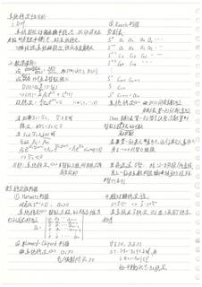（原图：`eval/fixtures/data/D07.jpg`，点击放大）

- 类目：涂改/删除线 | gold 字符 2421 / glm 预测 1950 | 编辑 1263(ins 123/del 595/sub 545) | EditRate 0.5215 | 网关延迟 29.09s
- 已知差异要点：glm 预测比 gold 短 471 字符（可能漏抄/截断，或按语义化删除删除了删除段）；删除占比高（595/1263）——glm 未输出 gold 中内容（涂改类多为删除线，其余类请核漏抄）；替换占比高（545/1263）——多为措辞/LaTeX 记号/分段差异
  - 语义化删除类：gold 按逐字忠实口径保留了被划线/涂改段并打 `<<划掉>>/<<涂改>>` 标记；glm 预测按语义化删除口径不输出明确划掉的内容。因此该页差异会偏大，请重点核对删除线归属。
- 复核副本：`gold/D07.gold.md`

- [ ] gold 无需修改
- [ ] gold 需修改（在 `gold/D07.gold.md` 副本上改后同步回 fixtures）

<details><summary>AI 草拟 gold 全文</summary>

```markdown
# 系统稳定性分析

## 1. D.of.

系统扰动偏离平衡点后，扰动消失后能否回复至平衡态。称系统稳定。

一致性(渐近性)系统稳定性及自身有关

## 2. 数学条件：

设 $\frac{G(j\omega)G(-j\omega)}{1+x} = \frac{N(s)}{D(s)}$，取 $r(t)=\delta(t)$，$R(s)=1$ [?] (原文：设 $\frac{E(s\cdots)}{D(s)} = \frac{N(s)}{D(s)}$，取 $r(t)=\delta(t)$，$R(s)=1$)

∀ 无重根特征根 $\tilde{s}$:

$D(s) = a_0 \prod_{i=1}^{n} (s - \tilde{s}_i)$

⟹ $c(t) = \sum A_i e^{\tilde{s}_i t} + C^A(t)$

故稳定：$\lim_{t\to\infty} e^{\tilde{s}_i t} = 0 \quad i = 1, 2, \cdots, N$

当 $\tilde{s}_i$ 为 $s_i = \sigma_i$，$\sigma < 0$ 时：

稳定：$\Re\tilde{s}_i = s_i < 0$ (原文：$$\sigma_i < 0$$)

当 $s_{ijk} \mp \sigma_i \pm \omega_i$ 时：

$$\lambda \dot{\lambda} = A_{i_1} e^{A_{i_1}t} + A_{i_1}^{\varepsilon} A_{i_1}^{\varepsilon} e^{(\sigma_i + j \omega_i)t} = A e^{\sigma_i t} \sin(\omega_i t + \varphi)$$

⟹ $\sigma_i < 0$

亦即：系统稳定 ⟺ 特征方程所有根均具有负实部

## §3 稳定性判据

### ①. Hurwitz 判据

对 $\tilde{n}$ 阶 $a_n s^n \cdots = 0$，$a_n > 0$

系统稳定 ⟺ 特征方程 $\frac{b_i[?]}{a_i}$ 移去维发行列式全部为正：

$$D_n : \begin{vmatrix} a_1 & a_3 & \cdots & a_{2n-1} \\ a_0 & a_2 & \cdots & a_{2n-2} \\ 0 & a_1 & \cdots & a_{2n-3} \\ \vdots & & \ddots & \\ \vdots & & & 0 & \cdots & a_n \end{vmatrix}$$ (原文：$$D_n : \begin{vmatrix} a_1 & a_3 & \cdots & a_{2n-1} \\ a_0 & a_2 & & a_{2n-2} \\ 0 & a_1 & \cdots & a_{2n-3} & a_{2n-4} \\ \vdots & & & \vdots \\ 0 & \cdots & & 0 & \cdots & a_n \end{vmatrix}$$)

### ⓪. Lienard–Chipard 判据

系统稳定 ⟺ $a_i > 0$

奇/偶数阶 $\Delta_i > 0$ (原文：$$\pi_i > 0$$)

### ②. Routh 判据

劳斯表：

| $S^n$ | $a_0$ | $a_2$ | $a_4$ | $a_6$ | ... |
|---|---|---|---|---|---|
| $S^{n-1}$ | $a_1$ | $a_3$ | $a_5$ | $a_7$ | ... |
| $S^{n-2}$ | $C_{13}$ | $C_{23}$ | $C_{33}$ | ... | |
| $S^{n-3}$ | $C_{14}$ | $C_{24}$ | ... | | |
| ... | | | | | |
| $S^2$ | $C_{1,n-1}$ | $C_{2,n-1}$ | | | |
| $S$ | $C_{1,n}$ | | | | |
| $S^0$ | $C_{0,n+1} = a_n$ | | | | |

系统稳定 ⟺ 1. $D(s)$ 所有系数为正

劳斯表第一列所有元为正

**Thm.** 劳斯表第一列符号次数=次数等等 = 特征方程根的正半平面根数 (原文：$$\text{Thm}.\text{劳斯表第一列预号次数=次数等等}_{+}^{\pi}\text{特征方程}\text{(?) 根的正}\text{根}^{\text{数}}\text{数})

**pro.**
若某行第一元为零(?)，续行其它元非零(?)；用 $\varepsilon \to 0$ 代替 0 继续 (原文：用 $\varepsilon \to 0$ 代替 0 继续)

若存在全 0 行：根 + 共轭复根/纯虚根 用上一行构参数构成(?) 辅助方程解点 代替 移除符号 (?) (原文：用上一行构参数构成辅助方程解点代替函数移)

## 4. 相对稳定性：

$$S = \tilde{S} - \sigma \Rightarrow \tilde{S} = S + \sigma$$

若系统在 $\tilde{s}$ 稳定，则在 $S$ 具有负稳定性裕度 (原文：$$\text{称谷}$$)

$\forall \varepsilon > 0, \exists \delta > 0$

s.t. $||x - x_e|| < \delta$ 时，有

$$||x(t) - x_e|| < \varepsilon$$

称平衡状态 $x_e$ 稳定
```
</details>

<details><summary>glm-5.3-flash 预测全文</summary>

```markdown
# 车系统稳定性分析

## 1. D. Def.

**车系**（系统）受扰动偏离平衡状态，扰动消失后
**能否** [恢复到平衡态，称系统稳定。(注)] 

→ [缺]线性车系[经]稳定[性]仅与自身有关

## 2. 数学等价：

设 $G(S) = \frac{N(S)}{D(S)}$，取 $F(S) = D(S)$，$R(S) = 1$
没有 $n$ 个异特征值 $\lambda_i$

$$D(S) = a_0\prod_{i=1}^{n}(S - S_i)$$

$$\Rightarrow C(t) = \sum A_i e^{S_i t} + C^*(t)$$

$S_i$ 稳定：$\lim_{t\to\infty} e^{S_i t} = 0 \quad i = 1, 2, \cdots, n$

且**仅当** $S_i \in \nabla$，$\forall$ i 时
稳定：$\Re S_i < 0$，$S_i \in \Re > 0$

当 $S_{i,k} \in \Re \pm \omega$ 时
可证 $A_i e^{(S_i \pm \omega)t} + A_{i+1} e^{(\sigma_i - \omega)t} = A e^{(\sigma_1 t)} \pm \sin \omega t + \varphi_1$

$\Rightarrow \sigma_i < 0$

亦即：车系稳定 $\Leftrightarrow$ 闭环特征方程所有根均[必] [须]负实部

## 3. 稳定性判据

### ① Hurwitz 判据

**对** $a_0 S^n + a_1 S^{n-1} + \cdots = 0$，$a_0 > 0$

特征方程  $a_0 S^n + \cdots = 0$，$a_0 > 0$

车系稳定 $\Leftrightarrow$ 特征方程的 条件维  系 [数]
（行）列式全部为正：

$$D_n : \begin{vmatrix} a_1 & a_3 & \cdots & a_{2n-1} \\ a_0 & a_2 & \cdots & a_{2n-2} \\ 0 & a_1 & \cdots & a_{2n-3} \\ 0 & a_0 & \cdots & a_{2n-4} \\ \vdots & & & \\ 0 & 0 & \cdots & a_n \end{vmatrix}$$

### ② Lilenard–Chipard 判据

**当**车系稳定 $\Leftrightarrow$ $a_i > 0$
（奇/偶数阶）$D_k > 0$

### ③ Routh 判据

劳斯表：

| | | | | |
|---|---|---|---|---|
| $S^n$ | $a_0$ | $a_2$ | $a_4$ | $a_6$ |
| $S^{n-1}$ | $a_1$ | $a_3$ | $a_5$ | $a_7$ |
| $S^{n-2}$ | $c_{13}$ | $c_{23}$ | $c_{33}$ | … |
| $S^{n-3}$ | $c_{14}$ | $c_{24}$ | … | |
| $\vdots$ | | | | |
| $S^2$ | $c_{n-1,1}$ | $c_{n-1,2}$ | | |
| $S^1$ | $c_{n,1}$ | | | |
| $S^0$ | $c_{n+1,1} = a_{n,n}$ | | | |

车系稳定 $\Leftrightarrow$ 劳斯表（Routh）**所有元素**均为正

（实际排序：Routh 表第一列所有元素均为正）

Thm. 劳斯表第一列符号其次数（变号次数）等于
特征方程正根的个数

**正实数** [判断]

若某第一列元素为零（或出现零元素），或其他某行元素非零，则用 $\varepsilon \to 0$（正小量 $\varepsilon$）代替 $0$ 继续

若存在一对纯虚根 / 纯虚根，用上一行作为系数构成辅助方程求解，以代替 $S^n$

## 4. 状态稳定性：

$S = -\xi\sigma \Rightarrow \dot{S} = -\xi + \sigma$？

在系统$\xi$ 稳定，则在 $S$ 具有稳定
裕度

（若）$\xi \geq 0$，$\xi \leq 0$；
s.t. $|x - x_e| + |S| \leq \xi$ 时，有
$|x(t) - x_e(t)| \leq \xi$

称平衡状态 $x_e$ 稳定
```
</details>

---

## 07. A02｜数学公式

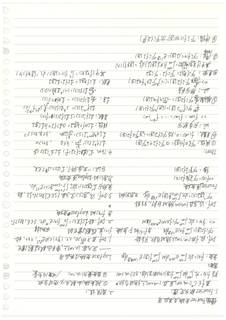（原图：`eval/fixtures/data/A02.jpg`，点击放大）

- 类目：数学公式 | gold 字符 3312 / glm 预测 1786 | 编辑 2509(ins 28/del 1555/sub 926) | EditRate 0.7573 | 网关延迟 25.07s
- 已知差异要点：glm 预测比 gold 短 1526 字符（可能漏抄/截断，或按语义化删除删除了删除段）；删除占比高（1555/2509）——glm 未输出 gold 中内容（涂改类多为删除线，其余类请核漏抄）
  - 数学公式类：差异多来自 LaTeX 写法（$…$ 与 $$…$$、`rac`/`\sum`/下标排版）与空行/分段，请核对公式内容与推导步骤是否一致。
- 复核副本：`gold/A02.gold.md`

- [ ] gold 无需修改
- [ ] gold 需修改（在 `gold/A02.gold.md` 副本上改后同步回 fixtures）

<details><summary>AI 草拟 gold 全文</summary>

```markdown
# 第四章 Fourier 变换及其应用

## 一、Fourier 积分定理：二、周限性：

- 在 $t\in(-\infty,+\infty)$ 上，在 $(-\infty,+\infty)$ 上有绝对可积… <<
- 则 $f(t) = \int_0^{+\infty}[a(\mu)\cos\mu t + b(\mu)\sin\mu t]\,d\mu$ （记号从 $\int_{-\infty}^{+\infty} e^{i\mu t}\,d\mu \cdot F(\mu)$ 化为 $(0,+\infty)$）的富有之数，且嫌疑为 $(0,+\infty)$ / [/般移动量]

**实（左上栏）**

**变差**：$f(t) = \int_{-\infty}^{+\infty} e^{i\mu t}\,d\mu \int_{-\infty}^{+\infty} f(\tau)e^{-i\mu\tau}\,d\tau$ 的 Fourier 逆变换。/"=

（第一条线）

- **Def.** 若在 $(-\infty,+\infty)$ 挍绝对可积。则存//
  - $CF(t) = \int_{-\infty}^{+\infty} f(t)e^{-i\mu t}\,d\mu$ （其记号>>乘）（ $F(\mu)$）其 $F(\mu)$ 由第一多接
  - $\Rightarrow F(\mu) = \int_{-\infty}^{+\infty} f(t)e^{i\mu t}\,dt$ 记 $M$（此处 $|f(t)|\,dt$ 收 [?]）
  - $CF$ （或）[?] ↑（此处所：“ $\mathfrak{F}[意思]$” — $f(t)$ 的 Fourier 逆象换）

$$F^{-1}[F(\mu)] = f(t)：\text{若}\int_0^{+\infty}F(\mu)e^{i\mu t}\,d\mu \text{ 之方 函 数则约}$$

**Fourier 逆象换：**

$$\Leftrightarrow f(t) = \mathfrak{F}^{-1}[F(\mu)]$$

（当）$\Leftrightarrow \mathfrak{F}[CF(t)]$ (记)

**Thm：**

①.戒内性：$\mathfrak{F}[CF(t)\alpha F(t)] = 0$ $F(t)F(t)+CF(t)$ (记)

②.素数性：$f'(t)，0；$ 则 $\mathfrak{F}[F'(t)] = \mu \div \mathfrak{F}[F(t)]$

**证：** 分部积分

$$\Rightarrow \int f'(t)e^{i\mu t}\,dt \div f(t)e^{-i\mu t}\Big|_{-\infty}^{+\infty} - \int C f(t)\cdots e^{i\mu t}\,dt\ ハ$$

⇒ 则 $\mathfrak{F}[F'(t)] = \mu\mathfrak{F}[F(t)]$ ($\because$ $CF(t)e^{-i\mu t}|_{-\infty}^{+\infty} = 0$ 时 [?] 归)

③.极限场看 $\mathfrak{F}[F(t)] = \mu$ 收 [?] 3$\mathfrak{F}[F(t)]$ (记)

**证：** 有原函数

$$\Rightarrow \int_{-\infty}^{+\infty} F'(t)e^{i\mu t}\,d\mu \leftrightarrow (\mu)\mathfrak{F}[CF(t)]^{Re}\{F(t)\}(\text{记})$$

（有原象）： $\mathfrak{F}[F(t)]$ ← $\mathfrak{F}[F(t)]$，[?] $\mathfrak{F}$ →

其中被积较 $\left|\frac{sh}{y}\right| = \int_{-\infty}^{+\infty} F(t)e^{-i\mu t}\,d\mu$ (或 $J$ 条件)(记)

其中 $|F(\tau)|\dots = \int_0^{+\infty} |f(t-t)|\,d\mu \,dt$ (题条件:记)

$$\text{被}\mathfrak{F}[CF(t)]\mathfrak{F}[\alpha]-\mu\mathfrak{F}[F(t)]$$（记）

## 二、$\delta$ 函数及其应用

**Laplace 变换及其应用**

——规范在 $[0,+\infty)$ 上，要能函数指数衰减

- **Def.** 若 $\mathfrak{M}[t]$，则 $|f(t)|Me^{st}$，$\forall t > 0$，称 $f(t)$ 指 [?] 播了函数，（此点约 [?] 播 [?]，称//  森 [?] [?]）
- 2. **Def.** 振大轴 $(s) = \int_0^{+\infty} f(t)e^{-st}\,dt$，$\text{Re}\,s > s_0$。称 $f(t)$ 由 Laplace 变换。

- 3. **Def.** 说 [?] 函数）定义为 $\{F(s)\}\{|(s)| [?](s)\}$ [?]，多权分 [?] 定义：记 $\Large^{\mathfrak{F}}_{L^{-1}}\{f(t)\} = F(s))$，则 [?] <b>
  称 $F(s)$ 为 $f(t)$ 的 Laplace 象原函数。

$F(s)$ 函 [?] 一至条 [?]，$F$，$F(s)$ [?] $\Leftrightarrow t$ 天 [?]。

**Thm：**

- $\mathfrak{L}[e^{\alpha t}F(t)] = F(s-\alpha)$、$\text{Re}\,s$/$\text{Re}(s-\alpha)$
- $\mathfrak{L}[t^n f(t)] = (-1)^n \frac{d^n}{ds^n}F(s)$，$\text{Re}\,s$.
- $\mathfrak{L}[t e^{\lambda t}F(t)] = \frac{d}{ds}\widehat{F(t)}$、$\text{Re}\,(s-\alpha)$ [?]
- 线性：$\mathfrak{L}\alpha F_1 + \beta\mathfrak{L} = \alpha\mathfrak{L}[F_1] + 8\beta\mathfrak{L}[?]$
- 象函数：$\mathfrak{L}[f'(t)] = s\mathfrak{L}[f(t)] - f(+0)$
  - $\mathfrak{L}[f''] = s^2\mathfrak{L}[f(t)] - s f(+0^{+1}) - \mathfrak{F}[f'(0^{+1})]$
- 象象： $\mathfrak{L}[f(t)] - \mathfrak{L}[F(t)]$
  - $\mathfrak{L}\mathfrak{F}[f(t)] = (+\mu)\mathfrak{F}[f(t)]$
- 象数：$\mathfrak{L}[f(t)] = \mathfrak{L}[F(t)]$，$x [?]$
  - 其中 $F(\tau)(t) = \int_0^t f(t-\tau)g(\tau)\,d\tau$ ( 积 材: 记)

④.性质（可扩性）：$\mathfrak{F}[CF(t)F(t)] = C\mathfrak{F}[F(t)]$ (记)

①.伸缩：$\mathfrak{F}[CF(\mu t)] = \frac{1}{|\mu|}\mathfrak{F}[F(t)]$ (记)（可 $F(\mu)$ 为：）
```
</details>

<details><summary>glm-5.3-flash 预测全文</summary>

```markdown
# 傅丽 Fourier 变换及其应用

## 一．Fourier 积分定理

1. 背景：Fourier 积分定理是 Laplace 变换理论的基础。

在 $(t^{(∞)},+\infty)$ 上，设 $f(t)$ 为绝对可积的分段光滑函数，即 $\int_{-\infty}^{+\infty}|f(t)|\,dt<\infty$，且 $f(t)$ 在 $(-\infty,+\infty)$ 上满足 Dirichlet 条件，则

$$f(t)=\frac{1}{2\pi}\int_{-\infty}^{+\infty}\left[\int_{-\infty}^{+\infty}f(\tau)e^{-i\omega\tau}\,d\tau\right]e^{i\omega t}\,d\omega$$

## 二．Fourier 变换的定义

设 $f(t)$ 定义在 $(-\infty,+\infty)$ 上，且满足上述条件，则称

$$F(\omega)=\int_{-\infty}^{+\infty}f(t)e^{-i\omega t}\,dt$$

为 $f(t)$ 的 Fourier 变换，记 $F(\omega)=\mathcal{F}[f(t)]$；而

$$f(t)=\frac{1}{2\pi}\int_{-\infty}^{+\infty}F(\omega)e^{i\omega t}\,d\omega$$

称为 $F(\omega)$ 的 Fourier 逆变换，记 $f(t)=\mathcal{F}^{-1}[F(\omega)]$。

左栏：

- $Laplace$ 变换及其应用
- —— 求原函数、帮助求解微分方程
- 1. $Def$: 定义 $X(s)=\int_0^{+\infty}f(t)e^{-st}\,dt$，$s>0$，称为 $f(t)$ 的 Laplace 变换
- 2. $Def$: 设 $f(t)$ 为 $[0,+\infty)$ 上的可积函数，即 $\int_0^{+\infty}|f(t)|\,dt<\infty$
- 3. $Def$: 设 $\{S_n\}$ 为一列可测集，$S_n\subset\mathbb{R}$，则集
- 象函数：如 $F(s)=\mathcal{L}[f(t)]$，$f(t)$ 称为象原函数
- 例：$\mathcal{L}[1]=\frac{1}{s}$（$s>0$），$\mathcal{L}[e^{at}]=\frac{1}{s-a}$，$\mathcal{L}[t^n]=\frac{n!}{s^{n+1}}$
- 性质：线性、微分性质 $\mathcal{L}[f'(t)]=sF(s)-f(0)$、积分性质 $\mathcal{L}\left[\int_0^t f(\tau)\,d\tau\right]=\frac{F(s)}{s}$
- 位移性质：$\mathcal{L}[e^{at}f(t)]=F(s-a)$
- 卷积定理：$\mathcal{L}[f_1*f_2]=F_1(s)F_2(s)$

4. Thm：（象原函数）$f(t)$、$f'(t)$ 在 $[0,+\infty)$ 上连续……则 $f'(t)$ 的 Laplace 变换性质……（依据于）

5. 备注：当 $f(t)$ 在 $[0,+\infty)$ 上可积时，$\mathcal{L}[f(t)]$ 存在……

左下角：无限区间上 $[0,+\infty)$，$\delta(t)$、卷积、初值定理等（分段残缺，保守保留）。

右侧续：

- 三．应用与计算
- S函数分子为1的一阶系统：$\mathcal{L}[u(t)]=1/s$
- 微分方程 $y''+ay'+by=f(t)$，取 Laplace 变换化为代数方程求解
- 例：$y''+y=0$，$y(0)=y_0$，$y'(0)=0$……
- $\delta$函数：$\mathcal{L}[\delta(t)]=1$
- 周期函数的 Laplace 变换：$\mathcal{L}[f]=\dfrac{\int_0^T e^{-st}f(t)\,dt}{1-e^{-sT}}$（$T$ 为周期）
```
</details>

---

## 08. B04｜数学公式

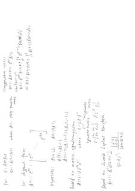（原图：`eval/fixtures/data/B04.jpg`，点击放大）

- 类目：数学公式 | gold 字符 751 / glm 预测 1139 | 编辑 916(ins 392/del 5/sub 519) | EditRate 1.2181 | 网关延迟 9.09s
- 已知差异要点：glm 预测比 gold 长 388 字符（可能多抄或补了细节）；插入占比高（392/916）——glm 出现了 gold 没有的内容；替换占比高（519/916）——多为措辞/LaTeX 记号/分段差异
  - 数学公式类：差异多来自 LaTeX 写法（$…$ 与 $$…$$、`rac`/`\sum`/下标排版）与空行/分段，请核对公式内容与推导步骤是否一致。
- 复核副本：`gold/B04.gold.md`

- [ ] gold 无需修改
- [ ] gold 需修改（在 `gold/B04.gold.md` 副本上改后同步回 fixtures）

<details><summary>AI 草拟 gold 全文</summary>

```markdown
For Ẋ = AXtBu
X(t) = Φ(t, t₀)X(t₀)  where Φ(t, t₀) State transition matrix

For diagonal form:
Φ(t+t₀) = e^(At) = [ e^(λ₁t) ... e^(λ_k t) ] <划掉>

Properties: Φ(t₀, t₀) = I  Φ(t₀, t₀) = AΦ(t)
          Φ⁻¹(t) = Φ(-t)
          Φ(t₁ - t)Φ(t - t₀) = Φ(t₁ - t₀)

Based on matrix eigencomposition.
Φ(t) =Ve^(Λt)V⁻¹     where   A = VΛV⁻¹
                        <—> Eigenvalue
                             Eigenvector matrix
V = [v₁ ... v₁] [ Λ₁ ]<划掉>
      v₁₁ v₁₂ v₁₃  Λ = Λᵢ
Based on Inverse Laplace transform.
Φ(t) = L⁻¹[(sI - A)⁻¹]
(sI - A)⁻¹ = [ d|sI - A| / -c|  0 | ] / det(sI - A)

Homogeneous (u=0):
X(t) = Φ(t, t₀)X(t₀) = e^(At) X(t₀)
Now homog <划掉>~
X(t): e^(At) X(0) + ∫₀ᵗ e^(A(t-τ)) Bu(τ) dτ <划掉>
or X(t+t₀) = Φ(t)X(0) + ∫₀ᵗ Φ(t-τ)Bu(τ) dτ<划掉>
```
</details>

<details><summary>glm-5.3-flash 预测全文</summary>

```markdown
For  义: $\dot{x}(t)=A\,x(t)$, $x(t)=\underline{\Phi}(t,\tau)\,x(\tau)$
    where $\underline{\Phi}(t,\tau)$: state transition matrix

For diagonal form:
$\underline{\Phi}(t+\tau): e^{A_t\,t}=\begin{bmatrix} e^{\lambda_1 t} & & \\ & \ddots & \\ & & e^{\lambda_n t} \end{bmatrix}$

Properties: $\underline{\Phi}(0)=I$, $\dot{\underline{\Phi}}(t)=A\underline{\Phi}(t)$
$\underline{\Phi}^{-1}(t)=\underline{\Phi}(-t)$
$\underline{\Phi}(t-\tau)\underline{\Phi}(\tau-t_0)=\underline{\Phi}(t-t_0)$

# Homogeneous $(\ne 0)$:
$x(t)=\underline{\Phi}(t,0)x(0)=e^{At}\,\chi(0)$
Non-homogeneous—
$x(t)=e^{At}x(0)+\int_0^t e^{A(t-\tau)}\,\underline{B}\,u(\tau)\,d\tau\ (\text{叠加})$
or $x(t+\tau)=\underline{\Phi}(t+\tau)x_0+\int_0^t \underline{\Phi}(t+\tau-\sigma)\,\underline{B}\,u(\tau)\,d\sigma$

# Based on matrix eigencomposition
$\underline{\Phi}(t)=V e^{\Lambda t} V^{-1}$
where $A=V\Lambda V^{-1}$, ← Eigenvector
Eigenvector matrix
$V=[v_{v_1}\; v_{v_2}\; v_{v_3}],\ \Lambda=[\lambda_1 \ 0\ \cdots]^{n}$

# Based on inverse Laplace transform:
$\underline{\Phi}(t)=\mathcal{L}^{-1}[(sI-A)^{-1}]$
$(sI-A)^{-1}=\dfrac{\text{adj}(sI-A)}{\det(sI-A)}$
```
</details>

---

## 09. C19｜数学公式

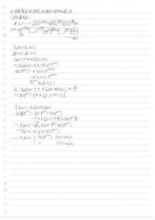（原图：`eval/fixtures/data/C19.jpg`，点击放大）

- 类目：数学公式 | gold 字符 1314 / glm 预测 1261 | 编辑 583(ins 103/del 157/sub 323) | EditRate 0.4433 | 网关延迟 26.39s
- 已知差异要点：glm 预测比 gold 短 53 字符（可能漏抄/截断，或按语义化删除删除了删除段）；替换占比高（323/583）——多为措辞/LaTeX 记号/分段差异
  - 数学公式类：差异多来自 LaTeX 写法（$…$ 与 $$…$$、`rac`/`\sum`/下标排版）与空行/分段，请核对公式内容与推导步骤是否一致。
- 复核副本：`gold/C19.gold.md`

- [ ] gold 无需修改
- [ ] gold 需修改（在 `gold/C19.gold.md` 副本上改后同步回 fixtures）

<details><summary>AI 草拟 gold 全文</summary>

```markdown
# 利用离散率[?]实现对模拟信号的滤波

## 1. 技术方案：

- 流程图（第一行）：
  - $x_A(t)$ → A/D → $x_d[n]$ → 滤波 $H_d(e^{j\omega})$ → $y_d[n]$ → D/A → $y_A(t)$
- 流程图（第二行）：
  - $x_c(t)$ →（$T$，标注 $x_P(t)$）→ 采样 → $x_d[n]$ → $[H_d(e^{j\omega})]$ → $y_d[n]$ → 方框 → $y_c(t)$ →（$T$，[?]）→ $y_c(t)$
  - …… → $y_c(t)$

$x_d(n) : x_c(nT)$

$y_d\,(n) : y_c\,(nT)$

$x_P(t) = \sum x_c(nT)\,\delta(t - nT)$

$\Rightarrow x_P(j\omega) = \sum x_c(nT)\,e^{-j\omega nT}$

$x_d(e^{j\omega}) = \sum x_d(n)\,e^{-j\omega n}$

$= \sum x_c(nT)\,e^{-j\omega n}$

$\stackrel{\dot\omega = \omega T}{=}\ x_P(j\,\dot\omega/T)$

又：$\displaystyle x_P(j\omega) = \frac{1}{T} \sum x_c\big(j(\omega - k\omega_s)\big)$，其中 $\omega_s$，$\omega_s = \frac{2\pi}{T}$

$\Rightarrow x_d(e^{j\omega}) = \frac{1}{T} \sum x_c\big(j(\omega - k\omega_s)/T\big)$

$y_c\,(j\omega) = x_c(j\omega)\,H_c(j\omega)$

$y_d\,{\color{red}\blacksquare}\,e^{j\omega} = x_d\,(e^{j\omega})\,H_d(e^{j\omega})$

$= \frac{1}{T} \sum x_c\big(j(\omega - k\omega_s/T)\big)\,H_d(e^{j\omega}?)$ （该处 [?]）

$\Rightarrow\ y_P(j\omega) = \frac{1}{T} \sum_{k=-\infty}^{\infty} x_c\big(j(\omega - \frac{k2\pi}{T})\big)\,H_d(e^{j\omega}?)$

$\Rightarrow\ u_c(j\omega) = x_c(j\omega)\,H_d(e^{j\omega}T)$

$\therefore\ H_c(j\omega) = \begin{cases} H_d(e^{j\omega T}) & |w| \le \omega_s/2 \\ 0 & |w| > \omega_s/2 \end{cases}$
```
</details>

<details><summary>glm-5.3-flash 预测全文</summary>

```markdown
# 利用离散系统实现对模拟信号的滤波

## 1. 按薄分析：

$\text{x}_c(t) \to \boxed{A/D}\ \text{x}_d[n] \to \text{系统} \to \boxed{D/A}\ \text{y}_c(t)$

$\text{x}_c(t) \to \text{x}_p(t) \to \boxed{\text{}}\ \text{x}_d[n] \to \text{系统} \to \text{y}_p(t) \to \text{y}_c(t)$

---

$$x_d(n) = x_c(nT)$$

$$y_d(n) = y_c(nT)$$

$$x_p(t) = \sum_n x_c(nT)\delta(t-nT)$$

$$\Rightarrow X_p(j\omega) = \sum_n x_c(nT)e^{-j\omega nT}$$

$$X_d(e^{j\omega}) = \sum_n x_d(n)e^{-j\omega n}$$

$$= \sum_n x_c(nT)e^{-j\omega n T}$$

$$\xlongequal{\omega = \omega T} X_p\left(j\tfrac{\omega}{T}\right)$$

又：$X_p(j\omega) \neq \sum_k X_c[j(\omega - k\omega_s)],\ \omega_s = \tfrac{2\pi}{T}$

$$\Rightarrow X_d(e^{j\omega}) \neq \sum_k X_c\left[j\left(\tfrac{\omega - 2\pi k}{T}\right)\right]$$

---

$$Y_c(j\omega) = X_c(j\omega)H_c(j\omega)$$

$$Y_d(e^{j\omega}) = X_d(e^{j\omega})H_d(e^{j\omega})$$

$$= \sum_k X_c\left[j\left(\tfrac{\omega - 2\pi k}{T}\right)\right]H_d(e^{j\omega})$$

$$\Rightarrow Y_p(j\omega) = \sum_{k=-\infty}^{\infty} X_c(j\omega - \tfrac{2\pi k}{T})H\left(e^{j\omega T}\right)$$

$$\Rightarrow Y_c(j\omega) = X_c(j\omega)H_d\left(e^{j\omega T}\right)$$

$$\therefore H_c(j\omega) = \begin{cases} H_d(e^{j\omega T}) & |\omega| < \omega_s/2 \\ 0 & |\omega| > \omega_s/2 \end{cases}$$
```
</details>

---

## 10. D22｜数学公式

（原图：`eval/fixtures/data/D22.jpg`，点击放大）

- 类目：数学公式 | gold 字符 1818 / glm 预测 1484 | 编辑 616(ins 46/del 381/sub 189) | EditRate 0.3386 | 网关延迟 16.78s
- 已知差异要点：glm 预测比 gold 短 334 字符（可能漏抄/截断，或按语义化删除删除了删除段）；删除占比高（381/616）——glm 未输出 gold 中内容（涂改类多为删除线，其余类请核漏抄）
  - 数学公式类：差异多来自 LaTeX 写法（$…$ 与 $$…$$、`rac`/`\sum`/下标排版）与空行/分段，请核对公式内容与推导步骤是否一致。
- 复核副本：`gold/D22.gold.md`

- [ ] gold 无需修改
- [ ] gold 需修改（在 `gold/D22.gold.md` 副本上改后同步回 fixtures）

<details><summary>AI 草拟 gold 全文</summary>

```markdown
# 分段插值

## 1. 预备

半散多项式： <<划掉>>

设 $x_0^k < \begin{matrix} x_1^k \\ 0 \\ x_2^k \end{matrix} < 0$，<<划掉>>

则 $x_0^k$ 为 $k$ 次半散多项式！<<划掉>>

李安定理（定理？）：$\lambda_0^2 < \frac{k}{2} \cdot \frac{x_2^k}{x_2^k}$ <<划掉>>

## Ⅰ. 函数线性无关；

①. 函数组线性无关：

对数组组 $\{x, \varphi_1, \varphi_2\}$，

$\exists\, x \in [a, b],\ \varphi(x)$

$a_1 = a_2 = \cdots = a_n$ <<划掉：a_1=a_2=...=a_n>>

$\Leftrightarrow \sum a_i x_i = 0$：$\varphi_i \neq 0$ 当且仅当 $a_1 = a_2 = \cdots = 0$ <<划掉>>

## ②. 函数组线性无关；

对 $\{'x^{(k)}\}_{j \geq 0, 1, \cdots}$

其中任意函数组在 $[a,b]$ 上线性无关 $n$ 次样条插值  <<划掉>>

## 2. 范数

1. $|f|_1 = \int_a^b |f|\,dx$ 绝对可积 —— $L_1$

$|f|_2 = \left(\int_a^b f^2\,dx\right)^{\frac{1}{2}}$ 平方可积 —— $L_2$

$|f|_{L^p} = \left(\int_a^b |f|^p\,dx\right)^{\frac{1}{p}}$ —— $L_p$

$|f|_{H^1} = \left(\frac{1}{b-a} \int_a^b |f(x)|^2\,dx\right)^{\frac{1}{2}}$ —— $H_1$（[?]）

$|f|_{L^\infty} = \max_{a \leq x \leq b} |f(x)|$ —— $L_\infty$

---

# 样条插值：

对区间 $[a,b]$ 上的一个分划 $\pi: a = x_0 < x_1 < \cdots < x_n = b$。

若 $S(x)$ 满足条件：

(1) $S(x)$ 在每个子区间 $[x_i, x_{i+1}]\ (i = 0, 1, \cdots, n-1)$ 上，是次数属于 $k$ 的多项式；

(2) $S(x)$ 在 $[a, b]$ 上有 $k-1$ 阶连续导数；

则称 $S(x)$ 为关于 $[a,b]$ 上对应于分划 $\pi$ 的 $k$ 次样条函数/样条函数，简称 $k$ 次样条。

称 $\{x_0, x_1, \cdots, x_n\}$ 为样条结。<<[?]>>

$x_1, \cdots, x_{n-1}$ 内结点，$x_0, x_n$ 边界结点。

## 样条空间是：

$\{1, x, \cdots, x^k, (x-x_1)_+^k, \cdots, (x-x_{n-1})_+^k\}$ <<划掉：>

$S_k(x) \stackrel{?}{=} \sum_{i=0}^{n-1} a_i x_i^k + \sum_{j=?}^{n-1} b_j (x - x_j)_+^k$ <<划掉>>，此[?]为[?]阶[?]

# 三次样条插值：

$S(x)$ 共 $4n$ 个待定函数（参数？）

$S(x) \in 0.1, 2$ 阶导数，$3n+3$ 个条件（方程）

$n+1$ 对插值条件 + 二（边）边界条件

## 第一类边界条件：<<划掉：第一类边界条件>> 自然样条 自然[?]样[?]

$S'(x_0) = y_0'$，$S'(x_n) = y_n'$

若 $y_0' = y_n' = 0$，称为自然样条

## 第二类：

$S'(x_0) = y_0'$，$S'(x_n) = y_n' <<划掉>>$

## 第三类：被插值函数是周期函数

$S(x_0) = S(x_n)$，$S(x_0)' \in S(x_n)$ <<划掉：>>$S(x_0)' = S(x_n)$

$S''(x_0) = S''(x_n)$
```
</details>

<details><summary>glm-5.3-flash 预测全文</summary>

```markdown
# 分段插值

## 1. pep.

### 半数多项式：

证 $x^k < \begin{cases} x^0 & x\ge 0 \\ 0 & x<0 \end{cases}$

$x^k$ 为 $k$ 次半数多项式

半范存在：$x^2 <$（半）

### 函数线性无关：

(1). 函数组线性无关：

对 $n$ 曲数组 $\{u_1, u_2, u_3\}$

$\forall x \in [a,b]$，$y(x)$：$a_1 = a_2 = a_3 = 0$（世界在 3.0）
$c_0 = 2$；$a_i = 0$ 当且仅当（……）

(2). $n$ 曲函数线性无关：

对 $\{y_i(x), i \ge 0, 1, \cdots\}$

其中任意函数组在 $[a,b]$ 上线性关三次样条插值：

## 2. 范数

$\|f\|_1 = \int_a^b |f|\,dx$，绝对可积　$L_1$

$\|f\|_2 = \left(\int_a^b f^2\,dx\right)^{\frac{1}{2}}$　平方可积　$L_2$

$\|f\|_p = \left(\int_a^b f^p\,dx\right)^{\frac{1}{p}}$　$L_p$

$\|f\|_{H^\alpha} = \left(\sum_{j=0}^{\alpha} a \int_0^b f^{(j)}\,dx\right)^{\frac{1}{2}}$　$H_1$

$\|f\|_\infty = \max_{a \le x \le b} |f(x)|$　$L_\infty$

## 榉条插值：

对区间 $[a,b]$ 上给一个分割 $\pi$：$a = x_0 < x_1 < \cdots < x_n = b$

若 $S(x)$ 满足条件：

(1). $S(x)$ 在每个子区间 $[x_i, x_{i-1}]$（$i = 0, 1, \cdots, n-1$）上

是次数不超过 $k$ 的多项式

(2). $S(x)$ 在 $[a,b]$ 上有 $k-1$ 阶连续导数

则称 $S(x)$ 为定在 $[a,b]$ 上对应于分割 $\pi$ 的

$k$ 次样条函数或样条函数，简称 $k$ 次样条

称 $x_0, x_1, \cdots, x_n$ 样条基

$x_1, \cdots, x_{n-1}$ 内特点，$x_0, x_n$ 边界特点

### 样条空间基：

$$\{1, x, \cdots, x^k, (x-x_1)_+^k, \cdots, (x-x_{n-1})_+^k\}$$

$$S_k(x) = \sum_{i=0}^{k} a_i x^k + \sum_{j=1}^{n-1} b_j (x - x_j)_+^k$$

三次样条插值：</br>
$S(x)$ 共 $4n$ 个待定系数

$x(i) = 0, 1$ 二阶导数：$3n + 3$ 个方程

$n+1$ 个插值条件 + 二边条件

第一类边界条件：$S'(x_0) = y_0'$，$S'(x_n) = y_n'$

若 $y_0' = y_n' = 0$，称自然样条

第二类：

$S'(x_0) = y_0''$，$S'(x_n) = y_n''$

第三类：（被插值函数是周期到）

$S(x_0) = S(x_n)$，$S(x_0)' \triangleq S'(x_n)'$

$S''(x_0) = S''(x_n)$
```
</details>

---

## 11. A10｜中英混排

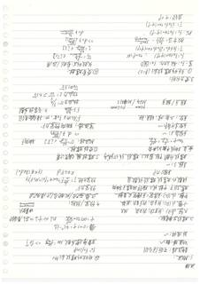（原图：`eval/fixtures/data/A10.jpg`，点击放大）

- 类目：中英混排 | gold 字符 2046 / glm 预测 974 | 编辑 1739(ins 13/del 1086/sub 640) | EditRate 0.8495 | 网关延迟 57.96s
- 已知差异要点：glm 预测比 gold 短 1072 字符（可能漏抄/截断，或按语义化删除删除了删除段）；删除占比高（1086/1739）——glm 未输出 gold 中内容（涂改类多为删除线，其余类请核漏抄）
  - 中英混排类：核对中英文词与全角/半角、标点是否与图一致。
- 复核副本：`gold/A10.gold.md`

- [ ] gold 无需修改
- [ ] gold 需修改（在 `gold/A10.gold.md` 副本上改后同步回 fixtures）

<details><summary>AI 草拟 gold 全文</summary>

```markdown
# 连接

/ 螺纹：

- 静连接：可拆/不可拆
- 动连接：键、销

螺纹条件：√

## 2. 螺纹的主要参数：

大径 d、D：外牙牙顶，内牙牙顶？内牙 11D：外牙牙底，内牙牙底。 M8

中径 d₂、D₂：牙厚=沟槽宽 处直径

螺距 P：中径牙线上相邻两牙对应轴向 线数 n：螺纹？线数

导程 S = nP　　导角？倒{导程选 大 越好（延（快）切去？）

垂直于轴柱？圆柱面上的 剖开为（回柱？）形：

tan ψ = S/(πd₂)：升？ 越小 → 自锁；

∴行走？牙？α d，ψ₁ ≤ [?]　←虚纹一般？　① 受剪 连接 12 警少<<划掉>>

　　S_1~　　　　∴ d ≥ S/(tan ψ) 轴向 F

　　导程选大 越好（延（快）切去？）　　d ≥ d₁ S/(π[(?)])

　　结果连轴力： 外，f₂ — 间连接

　　grep<<涂改>>： <～>　　连接 螺钉 拉力 F’

　　∴ psi?意义; t?k m; 修？柄之组数？　　‘／profiles?∴项数 f’? <<划掉>>

　　『螺纹牙？带<<涂改>>： f_1? tan² φ_v? 1/2? × tan ψ　单向、S≤1.5~2°　∧ 段量 条%S_1<<涂改>>　　K：间影响 1.三<<涂改>>

　　f_L/l ≈ 1/2? · f_1? tan² φ_v · 1/2? × tan ψ <<涂改>>　　#?

　　夹？ O?=? 双头？？ ③ 受剪 连接：

　　ψ_h? <<涂改>> S_<<涂改>>

　　∴ P[?]/max ≤ [σ]

　　F₂ = 2f₁? min? [σ] <<涂改>>

　　凸缘+跨连接误差 ③（压）质量？←『 ⓪ 非眨?[?]? 螺纹 用 P10

　　f_v = f_b/cos φ　　f_w = ?<<涂改>> ≈ 0

　　效率 R = S? / (π d₂ tan ψ)

　　tan ψ? = 2π? tan? d₂·tan(ψ+φ_v) <<涂改>>

　　螺含齿。<f<<涂改>> cf_?<<涂改>>

　　结 rate? ≤ 1<<涂改>> tan? <<涂改>> 1 ≤ [?]　◇ do? × H/[?]max? <<涂改>>　　△ p ≈ 1.3 d tan? <<涂改>>

　　la? <<涂改>> d_2? = [?]/(cos? tan φ_v)? <<涂改>>

　　tan? <<涂改>> S/tan? <<涂改>>

## 3. 受力分析：

1. 矩形螺纹 变形 [F、Q]

　升：F = 驱动力； fa₂ 组力

　F₁ = F·tan(ψ + φ_v)； 牙？为 1/4? ·　tan[?]M

　拧松：F′ = (S/(πd₂))·tan(ψ - φ_v)

2. 三角（普通）螺纹：

　牙型角：三角形；锯齿；矩　　tan φ_v = f/cos(α/2)　　ρ₁?5mm　M24/ M20×1.5

　粗牙/细牙　　ψ₃?mm <<涂改>>

　牙型半角 ？～　　　连接 螺栓；受轴向 1.三？ 票柱>>

　tan φ_v = f/(cos β/2)：减小

　∴ d_s? = F/[(?)] 轴向 F

　戏剧冲突？：F a? · 2.三[?]　螺纹<<涂改>>

　R(S≤1.5~2°)? <<涂改>>

　tan ψ = S/(πd₂)：减小 → 自锁　　① 受剪 连接：

　回柱 变系？ ③ 质量参数？

　R_(ε?1) ≤ [?]

　U_ε/(?) <<涂改>> S<(?) <<涂改>>　d < V_∞ ≥ v<<涂改>> 0.58<<涂改>>

　f₂/l ≈ 1.38√? <<涂改>>

---

（页边/竖排补充文字）：

- [?] 三声 1/42<<涂改>> ?<<涂改>>
- 导程 选 大 越好（延（快）切去？）S_1~
- 戏剧冲突。F a? · 2.三[?] [?]
- f₂ ≤ F/[(?)] 轴向 F
- [?]：螺纹 牙？ 覆盖<<涂改>>

（右上角倒写）：

- [?] ψ_1?
- tan ψ = S/(πd₂·tan)
- a′_{F? <<划掉>> cos? tan φ_v}? <<涂改>>

（右上小字）：

- R：S·[?]·[?]·[?]<<涂改>>
- F₁ = F·tan-(ψ - φ_v)
- 自锁：ψ ≤ φ_v

（底部倒写）：

- la?· tan?·tan-(ψ-φ_v)
- tan ψ ≤ φ_v
- a?_[?]<<涂改>> cos? tan φ_v? <<涂改>> d_2?·[?] <<划掉>> = 1
- tan? <<涂改>> (1?/(1.3 tan?))? = √?·[?]

（页边箭头符号、框图若干，无法还原，记为）

[图形：手绘箭头与方框示意，内容无法辨认为文字]
```
</details>

<details><summary>glm-5.3-flash 预测全文</summary>

```markdown
# 螺栓

/ 螺栓造：

- 螺栓连接：可拆/不可拆
- 特点：结构简单√
- 联接条件：√

## 2. 螺栓联接参数校验：

- 螺纹 d、D：外螺纹大径 M8
- 中径 d₂(D₂)：确定螺纹副间隙、被旋
- 螺距 P：中径线上相邻两螺纹对应点轴向
  线数 n：单线螺纹
  导程 S＝nP
  S＝nP  P₂·d  （MPa 取 dₐ）

单线 n＝1，则 P＝S

螺栓联接中圆螺母（细牙）旋合长度较长：

→ α＝0° 时＋45°＋e 扳
  → α＝arctan nP/πd₂  n(≥1) ⇒ α＝(30°夹角)标准件

- 精度等/标注：
  - 过薄定选/标注（贴合凸缘面之）
  - 预紧力 F′
  - 拧紧力矩 T＝F′·tg(λ+ρv)·d₂/2+(M₁,F₁F)
    （F₁ 摩擦系数 P）
    取 T＝0.2 F′d （MPa 无 (Da，dₐ)）

## 螺栓组受力：

螺栓联接中螺栓的受力情况 ①受拉螺栓联接 ②受剪螺栓联接

垂直于轴向的剖面内：
- tanψ 中：tg÷＞抗
- 剖面情况 ∨

受剪螺栓联接：
- 松螺栓联接：σ＝F/(πd₁²/4)≤[σ]  轴向 F
  ⇒ d₁≥√(4F/(π[σ]))＝d₁
- 紧螺栓联接：轴向拉力 F′
  ⇒ F₀＝F′+F：m 遮合面积 f：摩擦系数 K：可靠性系数
  适用于受轴向载荷的紧螺栓联接

式中：f₁＝K·F₀·C：F₃/d₁

联接：粗牙/细牙 M24/M24×1.5

拉应力 σ＝1⁴/4·F′/d₁²≤0.6[σ]
扭转应力 τ＝wc·/d₁³＝0.5σ

校核直径 d₁＝0.87d₁

## 3. 受力分析1

① 矩形花键连接（1.83）
② 标准三角形连接：fa小凹陷√
受：fr：驱动、fa、协调√

受载/载荷性质：弯矩/压溃
Fv＝πd₂m·h≤[F]
τ＝M̃max/W₃≤[τ]
τ＝F₃d₂/(0.1d³)tan(1+γ)
设：tanα：fg·d·tanλ+γ/γ

效率 η：fa·/fa⁻·tanλ/(tan(φ+λ))

M₅：fr：fg·tan(1-γf)
T：fialdₒ·tan(λ-f)

自锁：λ＜ρ

cos(λ+ρv)/?cosλ
≈ do η＝tanλ/(tan(λ+ρv))
```
</details>

---

## 12. A13｜流程图/架构图

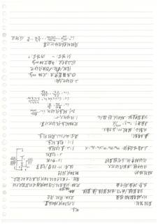（原图：`eval/fixtures/data/A13.jpg`，点击放大）

- 类目：流程图/架构图 | gold 字符 1505 / glm 预测 600 | 编辑 1209(ins 10/del 916/sub 283) | EditRate 0.8028 | 网关延迟 37.85s
- 已知差异要点：glm 预测比 gold 短 905 字符（可能漏抄/截断，或按语义化删除删除了删除段）；删除占比高（916/1209）——glm 未输出 gold 中内容（涂改类多为删除线，其余类请核漏抄）
  - 流程图/架构图类：gold 与 glm 对节点文字、箭头方向的 Markdown 描述方式可能不同，请以原图核对节点与连线是否完备、方向是否正确。
- 复核副本：`gold/A13.gold.md`

- [ ] gold 无需修改
- [ ] gold 需修改（在 `gold/A13.gold.md` 副本上改后同步回 fixtures）

<details><summary>AI 草拟 gold 全文</summary>

```markdown
# 手稿转录

> （原纸为横向倒置书写，已按旋转 180° 后方向转录）

---

## 第 1 栏（原文最右竖栏 → 实际最左栏）

- 圆柱齿轮：
- 齿越来越多[?]接触按标准值
- 分度圆键/齿/顶柱/齿根圆柱/基圆推　齿廓：渐开线
- 齿[?]数：模数 m，压力角 α；齿数 z；t=m/b²；d=mz
- 分度圆直径：d=m/z　[?]
- 传动比：单级传动比大
- 传动效率低，发热量大，需[?]油润滑
- 正确啮合条件：$m_{\alpha_1}=m_{\alpha_2}$；$m_{a_1}=m_{a_2}$；$\alpha_{\alpha_1}=\alpha_{\alpha_2}$ [?]

## 第 2 栏（仅横排段落）

- [?: 大字] ◇ 与[?] 的[?]
- 特点：
  - 几何为曲线状渐开线 <<划掉>>
  - 齿条由此而来，混合
  - 齿条：柯[?]如是[?]当
  - 定轴齿轮：运动几何轴线相对机架固定不动
  - 周转：一个或几个齿轮轴线位置相轮其中齿轮固定[?] 整体回转
- 组成：1+太阳轮（中心轮）
  - 1—3：太阳轮（中心轮）
  - 2—：行星轮（锥齿[?]）
  - F=2：差动轮系
  - F=1：行星轮系
  - 混合：数几个以上周转轮系

## 第 3 栏

- 函数子：模数 m，压力角 α；齿数 z；$t=m/z$；$d=mz$；d。 [?]
- 分度圆直径：d=m/z；M [?]
- 1.定轴轮系传动比 [?]：
- 定轴轮系传动比计算：
  - $i_{15}$：$\omega_{\text{主}}$ 与 $\omega_{\text{从}}$ 之比
  - 定轴齿轮：$\omega_{\text{恰}}$（[?]）$\dfrac{n_{\text{主}}}{n_{\text{从}}}$
  - 当一 [?]：转数计算　$n$ 之比约[?] 为一$u_{\text{切}}$；数值为[?]
  - $\implies \dfrac{\omega\text{主}\text{转}}{z_{\text{从}}} = \dfrac{72}{\text{万}\mathrm{E}_1}$；$n_3$ [?] …$\dfrac{z_3}{z_4}\cdot\dfrac{z_4}{z_5}\ (\text{柱}[?])$
-


## 第 4 栏

- 传动比大小（方向）
- 2.行星轮系：
  - ①行星架为枢：定轴 ω_H
  - 传规/转化机构反转法 <<划掉>>
  - （图：右侧标注 717、277；左侧标注 44←2←1 [?]）
- ②反转法：平面定轴复合
  - $\omega_A^H = \omega_A - \omega_H$　一 内啮合 + [?]
  - $\omega_A^H - \omega_B^H$（[?]）
  - $i_{13}^H = \dfrac{n_1 - n_H}{n_3 - n_H} = -\dfrac{z_3}{z_1}$　2↔[?]　[?] [?]
- 周转轮系转化机构计算：
- $i_{13}^H = \dfrac{\omega_1^H}{\omega_3^H} = \dfrac{\omega_1-\omega_H}{\omega_3-\omega_H} = \pm\dfrac{z_{\text{轮}}}{z_{\text{小}}}$　[?]　[?] 反转法

---

*注：多处字迹潦草无法确认，以 [?] 占位；<<划掉>> 表示原文被涂改的内容。*
```
</details>

<details><summary>glm-5.3-flash 预测全文</summary>

```markdown
# 轮系

**轮系：**

- 一对齿轮啮合传动是最简单的齿轮系
- 定轴轮系：各齿轮轴线位置固定不动
- 周转轮系：一个或几个齿轮的轴线位置绕其他齿轮固定齿轮轴线转动
  - 差动轮系
  - 行星轮系
- 轮系啮合传动时，各齿轮转速的大小
  - 是齿数比 $z$、转速比：$n_1/n_2$ 保持不变
- 传动比大小：$\dfrac{\omega_1}{\omega_2}=\dfrac{n_1}{n_2}$
- i：$\dfrac{\omega_1}{\omega_2}=\dfrac{n_1}{n_2}=\dfrac{z_2}{z_1}$，两齿轮转向相反时取负号
- $i_{13}=\dfrac{\omega_1}{\omega_3}=\dfrac{n_1}{n_3}=\dfrac{z_3}{z_1}$，方向判断：外啮合取负、内啮合取正

$$i_{14}=\frac{\omega_1}{\omega_4}=\frac{n_1}{n_4}=\frac{z_2\,z_4}{z_1\,z_3}$$

（符号：外啮合一次取一个负号）

周转轮系传动比计算，反向结论：

$$i_{13}^{H}=\frac{\omega_1^H}{\omega_3^H}=\frac{n_1^H}{n_3^H}=\frac{\omega_1-\omega_H}{\omega_3-\omega_H}$$
```
</details>

---

## 13. A15｜手写笔记

（原图：`eval/fixtures/data/A15.jpg`，点击放大）

- 类目：手写笔记 | gold 字符 567 / glm 预测 550 | 编辑 504(ins 30/del 48/sub 426) | EditRate 0.8873 | 网关延迟 27.1s
- 已知差异要点：glm 预测比 gold 短 17 字符（可能漏抄/截断，或按语义化删除删除了删除段）；替换占比高（426/504）——多为措辞/LaTeX 记号/分段差异
  - 手写类：核对字形易混字、数字/单位、行内缩写是否与图一致。
- 复核副本：`gold/A15.gold.md`

- [ ] gold 无需修改
- [ ] gold 需修改（在 `gold/A15.gold.md` 副本上改后同步回 fixtures）

<details><summary>AI 草拟 gold 全文</summary>

```markdown
凸轮机构

1.分类：
① 盘形/移动/圆柱 [?]凸轮
② 尖顶/滚子/平底
③ 沟槽/摩擦/弹性/等宽/力锁合
④ 直动/摆动
对心/偏距

2.基本参数：
·基圆／二类圆半径 r_{b} 由从动件
① 结构要求
② 经力情况要求
基圆半径压力角:
$$\tan\alpha=…\frac{(l_{B}+s)}{…}=\frac{(l_{B}+s)}{\ldots}$$ <<划掉>>
$$\sin((\alpha+\varphi)+(-s)^{2})+e^{2}$$
r_{b}=(0.1–2)r_{T}

实验:
3.基圆半径倾向于基圆半径[?]压力角小?
凸轮机构运动时
从动件运动角
在-区机构运动角
②-回程机构运动角
对-区机构运动角
或-区机构运动角
从动件行程 h

3.从动件运动规律：
常用运动规律：
- 等速、等加速/等减速[?]运动：多段 <<划掉>>
- 三角形、一次动态、缓冲等性 <<涂改>>
运动：柔性冲击 适用于中
低速传动
- 多项式运动、简单谐波(简谐)运动 最大有限度累积性
适用中速轻载
- 正弦加速度(简谐梯 <<涂改>>)曲线 <<涂改>> 装lash <<划掉>> 元过程中：高速轻载
分段函数：高速重载
正弦加速度：高速中载

4.改善：
滚子机构在中高速下随杆 <<涂改>> 上
```
</details>

<details><summary>glm-5.3-flash 预测全文</summary>

```markdown
凸轮机构
凸轮机构的压力特性：

1. 分类：
   - ① 盘形凸轮／移动凸轮（运动形式）
   - ② 尖端（尖顶）从动件／滚子从动件／平底从动件（从动件形式）
   - ③ 直动（对心／偏置）从动件／摆动从动件（相对位置）

   1. 压力角最大压力角 $\tan\alpha_{max}=\frac{ds/d\varphi}{r_0+s}$（halten；$r_0$ 为基圆半径）

2. 基本参数：
   - 基圆半径 $r_0$，$r_0\geq(0.1\sim0.5)H$，滚子半径 $r_T$
   - 从动件运动规律：最大压力角 $\alpha_{max}\leq[\alpha]$（推荐值：升程 $30^\circ$，回程 $70^\circ\sim80^\circ$，摆动 $45^\circ$）

3. 从动件运动规律：
   - 等速运动规律（刚性冲击、柔性冲击）
   - 等加速等减速运动规律（柔性冲击）
   - 简谐（余弦加速度）运动规律
   - 正弦加速度（摆线）运动规律（无冲击）

4. 原因：凸轮机构工作原理（压力角与基圆半径、从动件速度的关系）

$$[v_{max}]=\frac{(d\varphi/dt)^2}{(e^2-S')^2+e^3}$$
```
</details>

---

## 14. A17｜手写笔记

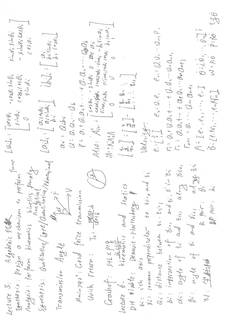（原图：`eval/fixtures/data/A17.jpg`，点击放大）

- 类目：手写笔记 | gold 字符 2727 / glm 预测 2581 | 编辑 1597(ins 306/del 453/sub 838) | EditRate 0.5854 | 网关延迟 35.81s
- 已知差异要点：glm 预测比 gold 短 146 字符（可能漏抄/截断，或按语义化删除删除了删除段）；替换占比高（838/1597）——多为措辞/LaTeX 记号/分段差异
  - 手写类：核对字形易混字、数字/单位、行内缩写是否与图一致。
- 复核副本：`gold/A17.gold.md`

- [ ] gold 无需修改
- [ ] gold 需修改（在 `gold/A17.gold.md` 副本上改后同步回 fixtures）

<details><summary>AI 草拟 gold 全文</summary>

```markdown
# Lecture 3: Algebraic <<划掉:方法记号>>方法

**Synthesis: 设计 a 机构 to perform 功能**

- **Analysis**: perform 运动学 / 动力学 / 解析分析
- **Synthesis**: Quadrature/type/Quantitative/Dimensional

**Transmission Angle**（附小图：连接 $a$ 处夹角 $\gamma$，向量 $u$）

$\mu_{min} \geq 40°$: Could force transmission

**Quick Return**: The 不独立机制（附圈 b²·a⁵草绘图）

**Grashof**: $S+L \leq P+Q$，最短构件，运动学

# Lecture 6, 双叶：Denavit-Hartenberg

**DH 参数：**

- $a_i$：第 i 根 common axis 垂直 to 第 i 与 第 i+1
- $\alpha_i$：距离, between $x_{i-1}$, $x_i$
- $b_i$：distance of 交点 $x_{i-1}$ and $x_i$, 在 $x_{i+1}$（注：[?]）
- $\alpha_i$：angle of $z_i$ and $z_{i+1}$（注：[?]）
- $\theta_i$：angle of $x_i$ and $x_{i+1}$
- 单连杆回转 R pair: $\alpha_{i-1},\ a_i,\ \theta_i$（注：[?]）
- $\alpha_i$：单连杆 BP pair: $t_{i-1}$, $b_i$

---

$\left[A_i\right]_2 = \begin{bmatrix} \cos\alpha_1 & -\cos\alpha_1\sin\beta_1 & \sin\alpha_1\sin\beta_1 \\ \sin\alpha_1 & \cos\alpha_1\cos\beta_1 & -\sin\alpha_1\cos\alpha_1 \\ 0 & \sin\beta_1 & \cos\alpha_1 \end{bmatrix}$

$\left[A_{i-1}\right]_3 = \begin{bmatrix} \alpha_1 \cos\alpha_1 & \alpha_1 \\ \alpha_1 \sin\alpha_1 & b_1 \sin\alpha_1 \\ b_1 & b_1' \cos\alpha_1 \end{bmatrix}$

（附注：$\left[A_i\right]_1 = \left[A_{i-1}\right]\_?$）

$a_2 = a_1 + c_2$
$e_2 = a_1 + b_2$

$\alpha_1 + \alpha_2 + \alpha_3 = \cdots + \alpha_n + \alpha_2 - \alpha_1 = \cos\alpha_1\ 椭圆$

与 $A_{i0}$：$\tilde{A}_{i4} = \begin{bmatrix} \cos\alpha_1 & -\sin\alpha_1 & 0 & \text{余} \alpha_1 \\ \cos\alpha_1 \sin\beta_1 & \cos\alpha_1 \cos\beta_1 & -\sin\beta_1 & -b_1 \sin\alpha_1 \\ \sin\alpha_1 \sin\beta_1 & \sin\alpha_1 \cos\beta_1 & \cos\beta_1 & b_1 \cos\alpha_1 \\ 0 & 0 & 1 \end{bmatrix}$

记作：$H = A_{i1}A_{i2}A_{i2}$

$T_{\frac{\alpha_1}{2}, \frac{\pi}{2}}^{\alpha_1 \dots} = \begin{bmatrix} b_1 & \alpha_1; \\ b_2 & \frac{\pi}{2} \\ \vdots & \vdots \\ b_{33} & \end{bmatrix}$

**Velocity:**

$\underline{e}_2 = \underline{0}_1$, $\underline{0}_2 = \underline{0}_1$（注：[?]）：$e_{i-1} = Q_i \underline{0}_i \cdots \omega_{i-1}$, $\underline{0}_i$

$\underline{0}_2 = \begin{bmatrix} 0 \\ 1 \end{bmatrix}_{\underline{0}_1 \dots}^{?}$

- $\tau_1 = \alpha_1 + Q_1 \alpha_1 + \cdots + Q_n \alpha_n + \alpha_n \omega_n$（注：[?]）, $\underline{0}_n \omega_n$
- $\tau_2 = \alpha_1 \alpha_1 + \alpha_2 \alpha_2 + \alpha_3 \alpha_3 \cdots \alpha_n \alpha_n$
- Torque = $\alpha_1 \cdot \tau_i$（注：[?]）$\alpha_2 \cdot \tau_2 \cdots \alpha_n \cdot \tau_n$

$\dot{\theta}_i \geq e_{i+1}$（注：[?]）, $\dot{\theta}_{i+1} = e_i \cdot \dot{e}$, $\dot{\theta}_i = \dot{\theta}_0, \cdots, \dot{\theta}_n$

$\underline{\dot{x}} = \underline{e}$（注：[?]）$K\dot{r}_1 \cdots \tau_n \dot{r}_{11}$, $u = h\dot{\theta}$（注：[?]）, $p_{1} = \underline{0}$, $t_{1}\dot{0}$

---

（页顶倒置小注：$\ell_{\text{回}} \ell_{\text{回}}$，<<涂改>>[?]）
```
</details>

<details><summary>glm-5.3-flash 预测全文</summary>

```markdown
# Lecture 3: Algebraic 方法

- Synthesis: Design a mechanism to perform 一次
- Analysis: Perform kinematics kinetics
- Synthesis: Qualitative type/quantitative
- Analytical/Dimensional

Transmission Angle

$\mu_{min} > 40°$: Good design
Quick return: $T_2$ < $T_1$ 180°+β

[图：压力角 α 与传动角 μ 关系示意图]

Grashof: $S + L \le P + G$

Lecture 6: Kinematics and Statics
DH 便于: Denavit-Hartenberg

- $a_i$: limb axis
- $\alpha_i$: common perpendicular to $a_{i-1}$ and $a_i$
- $G_i$: distance between $x_{i-1}, x_i$
- $b_i$: intersection of $r_{i+1}$ and $a_i$, 0° in $x_i$
- $ox_i$: angle of $x_i$ and $x_{i+1}$, acting $\sigma_{i+1}$
- $B_i$: angle of $x_i$ and $x_{i+1}$, revolving $a_i$, $a_{i-1}$ 的公垂线
- $\chi_i$: R joint: $a_i$, $b_i$
- BP pair: $b_i$

$$
[\Omega_i]_{i1} = \begin{bmatrix} \cos\theta_i & -\cos\alpha_i\sin\theta_i & \sin\alpha_i\sin\theta_i \\ \sin\theta_i & \cos\alpha_i\cos\theta_i & -\sin\alpha_i\cos\theta_i \\ 0 & \sin\alpha_i & \cos\alpha_i \end{bmatrix}
$$

$$
[\Omega_i]_{i2} = \begin{bmatrix} \alpha_1\cos\theta_i & a_i \\ \alpha_1\sin\theta_i & b_i\cos\alpha_i \\ b_i & b_i\sin\alpha_i \end{bmatrix}, \quad [b_i]_{i3} = \begin{bmatrix} \alpha_i \\ b_i\sin\alpha_i \\ b_i\cos\alpha_i \end{bmatrix}
$$

$a_{i2} = a_{i3}b_{i3}$, $a_{i4}$
$\alpha_i = \alpha_i$, $\alpha_2$, $\alpha_6$
$F_i = a_i + \alpha_i \alpha_2 \alpha_3 \cdots + \alpha_i \alpha_{i+1} \cdots + \alpha_k a_{i}$, $a_{i+1}$, $a_{i+2}$

$$
A_{(i,i)} = \begin{bmatrix} \cos\theta_i & -\sin\theta_i & 0 \\ \cos\alpha_i\sin\theta_i & \cos\theta_i\cos\alpha_i & -\sin\alpha_i \\ \sin\alpha_i\sin\theta_i & \sin\alpha_i\cos\theta_i & \cos\alpha_i \end{bmatrix} \begin{bmatrix} a_i \\ -b_i\sin\alpha_i \\ b_i\cos\alpha_i \end{bmatrix}
$$

$$
A_i = A_{i,2}' A_{i,3} A_{i,4}
$$

$$
r_{i-1} = \begin{bmatrix} x_i \\ -\frac{\sqrt{3}}{3} x_i \\ \frac{\sqrt{3}}{3} x_i \end{bmatrix} \begin{bmatrix} a_{i1} \\ a_{i2} \\ a_{i3} \end{bmatrix}
$$

Velocity:

$$
\rho_{i-1} = \begin{bmatrix} \delta \\ ? \end{bmatrix}, \quad \rho_{i-1} = [\Omega, 0_{1 \times 1}] \cdots [\Omega, 0_{1 \times 1}] \rho_i
$$

- $r_{i-1} = \alpha_1 (\alpha_1 \alpha_2 + \cdots + \alpha_{k-1} \alpha_k + \cdots \alpha_k \alpha_1) \cdots a_k 0_{4 \times 1}$
- $\bar{r}_{i-1} = \alpha_1 (\alpha_1 \alpha_2 + \cdots + \alpha_{k-1} \alpha_k) + \alpha_k \alpha_1 \cdots a_k 0_{4 \times 1}$
- $T_{i-1} = \alpha_1 \cdots \alpha_{k-1} 0_{4 \times 1}$

$A_i = [I, \rho_{i-1}, \dots, \dots, \rho_{i-1}]$, $\dot{\alpha}_i = \dot{\alpha}_1, \dots, \dot{\alpha}_{i-1}$

$\tilde{b} = [r, x_1, \dots, x_n]$, $\dot{\alpha} = \dot{x}_0$ → $\dot{p} = 0$ → 乔丹
```
</details>

---

## 15. A18｜流程图/架构图

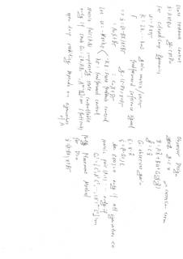（原图：`eval/fixtures/data/A18.jpg`，点击放大）

- 类目：流程图/架构图 | gold 字符 1199 / glm 预测 939 | 编辑 548(ins 55/del 316/sub 177) | EditRate 0.4567 | 网关延迟 9.29s
- 已知差异要点：glm 预测比 gold 短 260 字符（可能漏抄/截断，或按语义化删除删除了删除段）；删除占比高（316/548）——glm 未输出 gold 中内容（涂改类多为删除线，其余类请核漏抄）
  - 流程图/架构图类：gold 与 glm 对节点文字、箭头方向的 Markdown 描述方式可能不同，请以原图核对节点与连线是否完备、方向是否正确。
- 复核副本：`gold/A18.gold.md`

- [ ] gold 无需修改
- [ ] gold 需修改（在 `gold/A18.gold.md` 副本上改后同步回 fixtures）

<details><summary>AI 草拟 gold 全文</summary>

```markdown
# State feedback control

$\dot{x} = Ax + Bu,\quad y = Cx + Du$

- for: closed loop dynamics
- $u = -Kx + r\bar{}$
  - $K := [K_1, \dots, K_n]$ gain matrix / vector
  - $r\bar{}$: feedback / reference signal
- $\dot{x} = (A - BK)x + Br\bar{}$
- $= \dot{x} : (A - BK)x + Br\bar{}$
- $= \ :\ A_{0}x + Br\bar{}$, $y = (I - C\eta)(x + K\tau)$ [?] <<划掉>>（此处有一行被涂改）<<涂改>>

Let

- $u := -Kx + K\tau\langle -K\eta\ :$ state feedback control
  - $K\tau\ :$ feedforward control

Matrix Pair $(A, B)$: completely state controllable
only if $\quad \text{rank}\ G_c := [B, AB, \dots, A^{n-1}B] = n$ (full rank)

open loop stability depends on eigenvalues of $A$

---

# Observer Design

$\dot{x} = Ax + Bu,\quad y = Cx \Rightarrow$ correction term

- $\hat{\dot{x}} = A\hat{x} + Bu + G(y - \hat{y})$
- $\hat{y} = C\hat{x}$
  - $G$: observer gain
- $\varepsilon := x - \hat{x}$
- $\hat{\xi} := P(\Delta(G))\xi$ [?]

$A + \varepsilon(\Delta(G))$ [?] $\succ 0$ [?] only if all eigenvalues < 0
only if

matrix pair $(A, C)\dots$ [?]
$G_c := [C^{\mathsf T},\ (CA)^{\mathsf T},\ \dots,\ (CA^{n-1})^{\mathsf T}].\qquad$ (observation) [?]

## Pole Placement Method

for $D \succ 0$

$\dot{x} = (A + BGK)x + Br\bar{}$ [?]
```
</details>

<details><summary>glm-5.3-flash 预测全文</summary>

```markdown
# State Feedback Controller

$\dot{x} = Ax + Bu$，$y = Cx + Du$

for closed loop dynamics:

$$u = -Kx + r$$

$$K = [\lambda_1, \ldots, \lambda_{n_x}]$$ — gain matrix / vector

$r$ — feedback / reference signal

$$\dot{x} = (A - BK)x + Br$$

$$= (A - BK)x + Br$$

$y = (C - DK)x + Dr = Cx + DK^T$

Let $U: -Kx + r$，$-Kx$ : state feedback control

Matrix pair $(A, B)$ completely state controllable if

only if $\operatorname{rank}[B, AB, \ldots, A^{n_x-1}B] = n_x$ （full rank）

open loop stability depends on eigenvalues of $A$

# Observer Design

$$\dot{x} = A\hat{x} + Bu + L(y - \hat{y})$$ ⇒ correction term

$$\hat{y} = C\hat{x}$$

$L$ : observer gain

$\tilde{e} : x - \hat{x}$

$$\dot{\tilde{e}} = (A - LC)\tilde{e}$$

矩阵 pair $(A, C)$ ： only if all eigenvalues $< 0$

$\varepsilon(0) = 0$

Matrix pair $(A, C)$ ： only if

$C, C^T A^T, (C^T A^T)^2, \ldots$ full rank

## Pole Placement Method

for $D = 0$

$$\dot{x} = (A - BK)x + Br$$
```
</details>

---

## 16. B05｜手写笔记

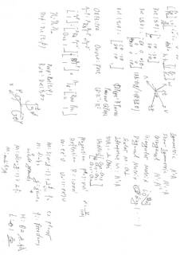（原图：`eval/fixtures/data/B05.jpg`，点击放大）

- 类目：手写笔记 | gold 字符 1868 / glm 预测 1828 | 编辑 1455(ins 291/del 332/sub 832) | EditRate 0.7785 | 网关延迟 45.58s
- 已知差异要点：glm 预测比 gold 短 40 字符（可能漏抄/截断，或按语义化删除删除了删除段）；替换占比高（832/1455）——多为措辞/LaTeX 记号/分段差异
  - 手写类：核对字形易混字、数字/单位、行内缩写是否与图一致。
- 复核副本：`gold/B05.gold.md`

- [ ] gold 无需修改
- [ ] gold 需修改（在 `gold/B05.gold.md` 副本上改后同步回 fixtures）

<details><summary>AI 草拟 gold 全文</summary>

```markdown
# 手稿转写（左半页，倒置部分）

- [?] [?]ᵀ [?] 、u 、uv …（另有 [?] ₂₈⁻[?] 等，字迹潦草，含义为矩阵 [u v] 相关记号 [?]）

- **Rot(1,θ)₂：**
  $$\begin{bmatrix} \cos\theta & -\sin\theta \\ \sin\theta & \cos\theta \end{bmatrix}$$
  （旁边记：cos θ ≈ 1（θ=0/小的 [?]），"i 段 [θ]/[?]±θ" [?]）

- **Not Δ(1,θ)₂：** [?] 无 cosθ 项，θ、[?] 箭头指向 (y指向 xv 方向的图示：斜向箭头，标注 x、y、z)

- **But (2.89)₂：** [u v] 关于 co(θ)（此处记 cosθ ≈ 1，cosθ^⁻[?]） <<划掉>> [?]，得 [?] 的转置结果 [?] ，θ = [?] 中间的记号 [?] <<涂改>>

- **On(技巧，θ)：** On(u,v)：Post [u v] = Rᵀ [u v]
  $$A^{-1} = A^{ST}R^{-1} + A^T O^{T}$$（记号不确切，[?]）
  $$\begin{bmatrix} -u^{ST} \\ v \end{bmatrix} \sim \begin{bmatrix} -A^{ST}R^{ST} \\ \;\; A^{T}\,O^{T} \end{bmatrix}\begin{bmatrix} [\?]^{ST} \\ v \end{bmatrix} \cup$$
  $$A^{-1} = \begin{bmatrix} -R^{ST}[?]^{ST1} \\ I^{S} \end{bmatrix} \begin{bmatrix} 0 \\ 1 \end{bmatrix} \cup$$ （此行记号难以确读 [?]）

- **Aᵗ ≡ Oᵛ'A₁：**

- **(R₂)p：** Rot(R̄,r̄,p̄)

- **R̄⁽ᵂ⁾[?] = Rot(R̄, b̄, θ̄)** [?]
  **R̄ᵤ[?] = Rot(1, b̄, θ̄)**

- x | φ ↗ φ̄ φ̂（三角/角度示意图：x 轴，φ、φ + θ、φ̄ 等箭头）

---

# 手稿转写（右半页）

- **Symmetric：** Aᵀ = A，即 **Aᵗᵘ ≡** [?]

- **Skew-Symmetric：** Aᵗ = −A
- **Orthogonal：** Aᵗ·A = I（记号 [A]¹）

- **Triangular Matrix：** [ triangular ]：
  $$\begin{bmatrix} \cdots \\ 0 \end{bmatrix}$$
  Diagonal Matrix：diag( diag. − … ) [?]

- **Scalar：** α = αI（[?] αI）
- **Idempotent：** A = A²，即 A·A = A·A
- **TQ(A)₁ ≡ Q̄Q̄ᵀ：**（Q 部分记号 [?]）
  Vectors [?]：
  $$\begin{bmatrix} \alpha_{22}-\alpha_{33} \\ \alpha_{22}-\alpha_{33} \\ \alpha_{21}-\alpha_{33} \end{bmatrix}$$（下标数字重复潦草，[?]）

- **Projection：** p̄ = vv̄ᵀ n，n = n /‖n‖
- **Reflection：** R̄ = I − 2nnᵀ
  **ν = eeᵀᵛ** [?]，ν′ = (I − eeᵀ)ν [?]

- **M：** 3/4·(n−1) + ⌊eᶠ[?]⌋，t₀ ≈ ½⁻[?] n — to pt+noᵗ
- **N₁：** J links
  - n ‡ （关节 [?]）：N·po ints（<<涂改>> 划改处 [?]）
  - N：n ᵈᵉᵍʳᵉᵉˢ �schaft s [?] ← ν ᵈᵒᶦᶰᵗˢ ‰ [?]

- **M′：** nolify [?]（“弹 [?]”），其中 [?] ₁₂ ≡ 3ᶠ[?]

- H：O 之 点，[?] ₄ — L：₃[?]（底部小字，[?]）

*(若干记号因潦草无法确读，以 [?] 标注。)*
```
</details>

<details><summary>glm-5.3-flash 预测全文</summary>

```markdown
# 笔记转录

$[R_{\theta}] = \begin{bmatrix} v_1 & v_2 \\ \cdots \end{bmatrix}$，标准基 $\hat{e}_i$，$[k]_M$

$Rot(\alpha, \theta)_2 = \begin{bmatrix} \cos\theta & -\sin\theta \\ \sin\theta & \cos\theta \end{bmatrix}_{空}$

$Rot(y,\theta)_3 = \begin{bmatrix} \cos\theta & 0 & \sin\theta \\ 0 & 1 & 0 \\ -\sin\theta & 0 & \cos\theta \end{bmatrix}_{\text{(转轴 }\theta\text{ / 夹角 }\theta)}$

箭头图：从原点出发沿 $x$、$y$、$z$（$x$ 向左，$y$ 向右，$z$ 向下）的方向向量

$Rot(x,\theta)_3 = \begin{bmatrix} 1 & 0 & 0 \\ 0 & \cos\theta & -\sin\theta \\ 0 & \sin\theta & \cos\theta \end{bmatrix}$

But $(\alpha\beta\gamma) = [S_\theta\ S_\alpha\ S_\gamma]$

$$\text{Object} = T_{uvw} V_{uvw}, \quad V_{uvw} = Q_{xyz} V_{xyz}$$

$O(uvw)$：Pre，$O(uvw)$：Post

$Q = R^{-1} ? R^T$

$A_T = (R_{KB}^T)^{-1} + A + 0''$

$\begin{bmatrix} -u^T \\ 1 \end{bmatrix} = \begin{bmatrix} A_{R_3} & A_{T'} \\ \text{ones} & 1 \end{bmatrix} \begin{bmatrix} \beta_{R_0}^T \\ 1 \end{bmatrix} u$，$A_T = \begin{bmatrix} -R_{R_3}\ \beta_{p_1} \\ 1 & ... \end{bmatrix}$

$A_x^0 (A_1)^T = A_2$

$RXP : Rot(\Sigma, \phi)$，$Ry watch = Rot(\Sigma, y)$，$Ry0 = Rot(x, \theta)$

左下角手绘图：曲面 $\varphi$、$\theta$、$\gamma$（球面角标注 $\varphi, \theta, \gamma$，坐标 $x$）

---

## 右侧栏

**Symmetric**：$A^T = A$

**Skew–Symmetric**：$A^T = -A^1$

**Orthogonal**：$A^T A = I$

**Triangular Matrix**：

Diagonal Matrix：$\mathrm{diag}(\cdots)$

**Scalar** $M$：$\alpha I$

**Idempotent** $M$：$A^2 A$，即 $A^2 = A$

$T(A) = xx$ 对称

**Vectors** $\begin{bmatrix} \sigma_3 & ... & 0 \\ \sigma_2 & & \\ ... & & \end{bmatrix}_{\alpha_2, \alpha_3}$

**Projection** $P = V(V^T)^{-1}$，$u = \frac{2}{\|u\|}$

**Reflection** $Rx = V(V^T)$

$V = QV'$，$u = (I - ?)V$

$M : 3(n-1) + 3^{\frac{k}{2}} 1$，$p_i$ → to $P+ \cdots$

$n$：links（关节），$p_i$：points → 自由度（degrees of freedom）

独立：$M = \dim(I) = ?$

$M$：mobile

$H: \theta_2$ 无法表述，$[I: \theta]$ 面
```
</details>

---

## 17. B10｜手写笔记

（原图：`eval/fixtures/data/B10.jpg`，点击放大）

- 类目：手写笔记 | gold 字符 1196 / glm 预测 902 | 编辑 939(ins 7/del 302/sub 630) | EditRate 0.7845 | 网关延迟 68.15s
- 已知差异要点：glm 预测比 gold 短 294 字符（可能漏抄/截断，或按语义化删除删除了删除段）；替换占比高（630/939）——多为措辞/LaTeX 记号/分段差异
  - 手写类：核对字形易混字、数字/单位、行内缩写是否与图一致。
- 复核副本：`gold/B10.gold.md`

- [ ] gold 无需修改
- [ ] gold 需修改（在 `gold/B10.gold.md` 副本上改后同步回 fixtures）

<details><summary>AI 草拟 gold 全文</summary>

```markdown
# 混合[?]轮〔齿〕根弯曲计算　（划线：<<划掉>>）　　螺旋条件[?] <<划掉>>

## 受力分析：
1. **直齿圆锥齿轮：**（<<涂改>>）
   - 圆周力：$F_t = 2T_1 / d_{m1}$ <<涂改>>
   - 从动轮与主动轮方向相反
   - 主动轮与圆周[?]方向相同
   - 径向力：$F_r = F_t \tan\alpha \cos\delta_1$[?]
   - 指向各自轮心<<划掉>>
   - 外[?]齿轮指向[?]齿轮轮心 [?]
   - 内齿轮[?]：背离[?]齿轮轮心 [?]
   - 法向力：$F_n = F_t/\cos\alpha_n$ [?]
   - 轴向力：$F_a = F_t \tan\alpha \sin\delta_1$[?]
2. **斜齿圆锥[?]齿轮**：[?]
   - 法向力：$F_n = F_t/\cos\alpha_n$ [?] <<划掉>>
   - 圆周力：$F_t = 2T_1/d_1$ [?]
   - 径向力：$F_r = F_t \tan\alpha / \cos\beta$ [?]
   - 轴向力：$F_a = F_t \tan\beta$ [?] <<划掉>>
   - 径向力[?]：指向[?]轴线[?] [?]
3. **直齿圆锥[锥]齿轮：**[?]
   - 圆周力：$F_t = 2T_1/d_1$ [?]
   - 径向力：$F_r = F_t \tan\alpha \cos\delta_1$ [?]
   - [?]指向齿轮轮心 [?]
   - 轴向：[?] $F_{ar1} = F_{an2} \cos\delta_1$ [?]
   - 啮合向关系[?]：$F_{r2} = -F_{a1}$ ； $F_{a2} = -F_{r1}$ [?]
   - 方向：[?] $\cos\,$?\; $\sin\delta_1$ [?]

4. **蜗轮蜗杆：**[?]

---

**左栏（原稿另一侧）：**

机械零件设计规定 —— 设计准则<<划掉>>

- 1. 机械零件的基本（的几）[?] 类型<<划掉>>
  - 失效：强度[?]（失效）/（失效）[?]
  - 失效形式：∨ [?]
    - 1）[?] [?]（机械性能 能）[?]
- 2. 设计准则：
  - ① 强度[?]性能，抗[?]断裂 [?]
  - 失效：[?] 转荷 / 度[?] 胶合 [?]
  - 应力：静[?] σ / 循环[?] [?]
  - 应力比：$r = \sigma_{min}/\sigma_{max}$ [?]
  - 疲劳[?] 数（应力循环）[?] /（疲劳极限）[?]
  - [?]作用（寿命）[?] <u>同</u>循[?]环 [?]
```
</details>

<details><summary>glm-5.3-flash 预测全文</summary>

```markdown
机械零件设计概述 —— 设计准则

1. 齿轮圆周齿轮 —— 设计时保证（机器零件失效形式及其类型）

受力分析：
- 占±齿条：从动轮与圆周方向相同
- 圆周力：$F_t = \frac{2T}{d}$
- 主动轮 = 驱动轮与圆周方向相反

2. 受力分析：
受力大小：圆周力 $F_t = \frac{2T}{d}$，径向力 $F_r = F_t \tan\alpha$，轴向力 $F_a = F_t \tan\beta$

3. 判定圆周齿轮：
- 圆周力 $F_t = \frac{2T}{d_1}$
- 径向力 $F_r = F_t \tan 20° \cos\delta_1$
- 轴向力 $F_{a1} = F_t \tan\beta_1 \sin\delta_1$

方向关系：
$F_{r1} = -F_{r2}$；$F_{a1} = -F_{a2}$

4. 蜗轮蜗杆：

---

强度计算

- 齿面的弯断齿折
- 计算准则：
- 圆周方向可分弯方向相反
- 圆周力：$F_t = \frac{2T}{d}$（打叉掉）
- 外齿轮、斜齿齿轮：$F_{t2} = \frac{2T_2}{d_2}$
- 内齿轮弯断齿轮：$F_{t2} = F_{t1}\cos\alpha$
- 齿面接触强度
- 中心距 $a \geq$ 按接触极限
- 齿根弯曲强度
- 弯曲应力比 $F = \frac{2KT}{bm^2z}$
- 模数、齿数、齿宽调比
- 弯曲疲劳弯、弯曲强度极限

判断传力：传递强度 $\sigma_F \leq [\sigma_F]$

根据力矩决定（按强度极限有限值决定）

弯矩 $M = F_t \cdot \frac{d}{2}$

1. 确定齿形参数（渐开线齿轮）：
2. 计算各力：
   - 圆周力 $F_t = \frac{2T_1}{d_1}$
   - 径向力 $F_r = F_t \tan\alpha$；$F_r = F_t \frac{\tan 20°}{\cos\beta}$
   - 轴向力 $F_a = F_t \tan\beta$
```
</details>

---

## 18. B13｜手写笔记

（原图：`eval/fixtures/data/B13.jpg`，点击放大）

- 类目：手写笔记 | gold 字符 906 / glm 预测 1051 | 编辑 797(ins 167/del 23/sub 607) | EditRate 0.8787 | 网关延迟 51.99s
- 已知差异要点：glm 预测比 gold 长 145 字符（可能多抄或补了细节）；替换占比高（607/797）——多为措辞/LaTeX 记号/分段差异
  - 手写类：核对字形易混字、数字/单位、行内缩写是否与图一致。
- 复核副本：`gold/B13.gold.md`

- [ ] gold 无需修改
- [ ] gold 需修改（在 `gold/B13.gold.md` 副本上改后同步回 fixtures）

<details><summary>AI 草拟 gold 全文</summary>

```markdown
> **说明**：本页为上下颠倒书写的两栏手稿，以下按原稿页面从上到下转写，数学式均以 LaTeX 表示，无法辨认处以 [?] 占位。

---

## 左栏

① 主曲面向载荷：

$$f_0 = F - F_1'$$
$$= 2.5 \times [?] \ \text{kN}$$
$$f_0 = F_1 + F_1' \times \text{kN}$$

- $F_1$：预紧力
- $P'$@[?]：[?]力
- $F_1'$：被联件受力
- $[?]$：螺[?]力

$$[?]_0 < [?]$$

$$\delta_T：尺寸数$$

$$\varepsilon_T：尺寸数$$

- $\sigma_P：拉应力[?]极限$
- $\sigma \le 2.5\ [\sigma]，被联件的厚度$
- $a_1：被联件数$
- $f：[?]$
- $[?]$

- 铰制孔用螺栓钢材按强度设计：

- $K_{al}：螺栓抗拉剪切系数$
- $S_a：安全系数$

- ①受力合理：透镜面[?]称，相对载荷对称
- ②螺纹体间距适当：间隙适当，扳手空间 (b₀)
- ③垫片数量适当：符合要求
- ④凸度差螺栓器而出：表
- ⑤同一圆周 4.6.8
- ⑥减少件的弯曲应力，凸台/沉头座

## 右栏

2. 受力分析/计算

假设：螺栓圆周，受弯矩为相同的弹性

① 高频螺栓：受扭矩

- 螺栓受扭矩 $T：F' \times [?] / z$

$$f_{smax} = T_{max} / [?]^2$$

- 对回转轴矩

$$f_m' = M_{max} / [?]^2$$

$$\sigma_{Fmax} = \frac{[?]}{[?]} + f' \le [\sigma]$$

$$\sigma_{Fmin} = \frac{[?]}{[?]} - f' \ge 0$$

- 曲面向 $F_0：F' = \frac{[?]}{[?]}$
- 轴向力 $F：F' \times \frac{k_1\text{kN}}{K\text{fkN}}$

$$f_S = [?]$$
```
</details>

<details><summary>glm-5.3-flash 预测全文</summary>

```markdown
# 型钢梁塑性阶段受力特征

①主梁与挠角：

$$f_0 = F_1 F'_1 \quad f_1:载角 \quad f'_1:截群角$$

$$\delta = \frac{f - f'_1}{f - F'_1},\quad f'_1:极[?]受力$$

$$\Rightarrow f_0 = F_1 + F'_1 = f_{\max}$$

弹性模量：$f_0$（$10$倍），$[f_0]$：跨元

$$f_v: F \cdot \frac{h^2}{K(\text{或}\sqrt{h})},\quad \text{截面}\ \delta_{13}, \delta_9, S_{16}, S_{18}, S, 8/8, 8/10, 8/12, 9/2$$

型钢：$d_i$ 挑径（内外）

$$\varepsilon_{\tau}: 大小系数$$

塑性铰 $f_{\max} \geq f$：材料应力极限

$F_1 = 2, 3$ 应力：塑性铰强度 $\cdots$ 塑性铰强度形成内力/计算

$S_a:$安全系数

塑性铰设计：

①受荷梁；仍进/满/横：相对强度收总相对偏差

②悬臂梁固定端：固定端近；悬臂梁（$6^\circ$）

最大弯曲伸长、超过短余件

③底内梁宽/弯角宽表

④可—圈围 $q:6.8$

⑤聚 $[?]$受曲应力；凸/低大度

## 二、承力分析/模

假定：剪拉梁圆、抗弯合力[?]同程性

① gallium 结构、支法集

承拉矩 $T: F_1 \cdot V_{\max} \cdot \Sigma(1)$

点截面强度随 $\delta_{20}$：

$$f_{s,\max} = T_{\max}/\Sigma_{[?]}^{-1}$$

对应剪拉矩：

$$f'_w: M_{\max}/\delta^2 \text{式}$$

$$\nabla_{\max}: \frac{q_{\text{全}}}{2} - W = [C,\delta]$$

$$\nabla_{\min}: \frac{q_{\text{全}}}{2} + W = [C,\delta]$$

方向 $S_v$: $F' \frac{K_{\max}}{f_{s} K_{\max}}$；横向 $f_v$: $\frac{K_{\sigma/my}}{f_s K_{\max}}$

$$f_s = \frac{f'_{[?]}}{f_{s}[?]}$$
```
</details>

---

## 19. B17｜手写笔记

（原图：`eval/fixtures/data/B17.jpg`，点击放大）

- 类目：手写笔记 | gold 字符 1719 / glm 预测 1641 | 编辑 1556(ins 31/del 110/sub 1415) | EditRate 0.9047 | 网关延迟 113.95s
- 已知差异要点：glm 预测比 gold 短 78 字符（可能漏抄/截断，或按语义化删除删除了删除段）；替换占比高（1415/1556）——多为措辞/LaTeX 记号/分段差异
  - 手写类：核对字形易混字、数字/单位、行内缩写是否与图一致。
- 复核副本：`gold/B17.gold.md`

- [ ] gold 无需修改
- [ ] gold 需修改（在 `gold/B17.gold.md` 副本上改后同步回 fixtures）

<details><summary>AI 草拟 gold 全文</summary>

```markdown
**工科院微春分社**

一、
1. 定态：
    其中c₀ᵢ, c₁, ..., cₙ₋₁均为给定常数，
    方程 定阶：未知数数最高阶函数数
    常分成列举和联号多题作重其将物荷的初问是 <<（此行文字倒置，疑为：微分方程把许多事件共同构成的问题）>>
    n阶方程一般形式：
        F(x, y, y′, ..., y⁽ⁿ⁾) = 0 [?]记 2.<<划掉>>，称 为n阶线性方程。
        其 中 假 y⁽ⁿ⁾ <<涂改>> 上 的 n 元 [?]性方程
        若 [?] 对 n 阶显含未知数导数均称线性微分方程，而行 函数 $^{(1)}$y 为 <<涂改>> 上是 n 阶线[?]微分[?]。设 y = y(x), x∈I 一 区域上是连续函数。则在其 上 它 可 表 示 为 一 个 恒 等 式 <<涂改>>
    1.线性微分方程
        n阶线性方程一般形式为
        [?] y⁽ⁿ⁾ + [?] [?] x) = f(x) 且 a₀(x)≠0
            曲线 Γ = {(x, y) | y = y(x), x∈I}, 一 条 [?]曲线 <>
        若 f(x) ≡ 0 称其 为 n 次 [?] <<划掉>> 线性奇 (方程)
    2.非线性微分方程
        在 D 内每一点 (x, y) 以 其 某 向 量 y′, y″ 为 <<涂改>> [?]
    通 [?]
        单 值 连 续，和 亮 关 平 面 上 的 都 连 接
        这 样 在 + [?] 能 定 一 [?][?] 加
    总 理 或者 [?]：
    设[?] y′′⁽ⁿ⁾ 在 上 有 n 阶 连 续 [?]，且 满 足
        F(x, y, y′, y″, ..., y⁽ⁿ⁾) = 0 ， x∈I
    则 称 y = y(x) 为 定 在 上 的 一 个 显 式 解
    若 有 [?] x = φ(t) 在 区 间 的 [?] 函 数 是 y = y(x) 则 [?]
    称 显 式 (隐式) = 0 则 F(x) 的 对 显 式 [?]
        解，答： x被(解) 例 y = y(x) 不 含 任 何 [?] [?]
    [?] 为 为 y(x) 的 [?] 解。
    函 数 [?] 若 y(x) 的 解 式 = y = y(x, c₁, ..., cₙ) 含 有 n 个 [?]
    [?][?] 数 y(x), c₁(?)₂ ..., cₙ)，并 称 为 为 y(x) 的 [?](形式) [?]。
    通 解。
    但 c₁ …，cₙ 独立， Jacobi 行列式 [?]
        J = ∂φ/∂(y, c₁, ..., cₙ) <<涂改>> [?]
        ≠ 0 记 φ₁, φ₂, ..., φₙ [?]
    若 由 函 数 φᵢ(x, c₁, ..., cₙ) 所 确 定 的 [?]
    函 数 式： y = φᵢ(x, c₁, ..., cₙ) 所 消 去 [?] (x, c₁, ..., cₙ)
    [?] 的 [?] 函数 [?]。
        一般地， [?] 和 函 数 [?][?] 为 0
    定 解 条 件： 为 确 定 通 解 中 常 数 所 需 给 定 (过 定)
    (定 解 条 件) 来 由 或 条 件 [?] 
    对 某 些 式 假 定 通 过 带 消 c₁ …，cₙ 阶 数 相 同
    [?] 见 [?] 定 连 解 中 需 加 [?] [?] 条 件：
    当 y(x₀) = y₀, ..., [?] ⋯, [?] (x₀) = y₀⁽ⁿ⁻¹⁾ ┐
    ...

---

**注：** 原页为倒置手稿且分辨率较低，多处文字辨认困难，已用 [?] 标注；个别行（尤其开头几行倒置内容）按可辨片段尽力转写，可能存在行序或字词误差。
```
</details>

<details><summary>glm-5.3-flash 预测全文</summary>

```markdown
# 一、常微分方程（特征线法笔记）

*（页眉小字：〔不全可辨，似为"二阶线性双曲方程"字样，保守保留〕）*

## 1. 预备概念

设方程组中所求未知函数个数相同的最高阶（导数）方程组：

$$F_i\left(x,\,y,\,u_1,\cdots,u_N,\ \frac{\partial u_j}{\partial x},\ \cdots\right)=0,\qquad i=1,\cdots,N$$

其中 $x,y$ 为自变量，$u_1,\cdots,u_N$ 为未知函数；其中含 $N$ 个，关于 $u_1,\cdots,u_N$ 为给定函数。

已知方程组的全部个数相同的独立方程组。

- 微分方程组及相应的特征（方程），其中一切条件都相同称为相容，问题是方程组……
- 其中含 $NMP$ 上的 $n$ 个线性无关的方程，称它们为方程组的特征（方程）组。
- 曲线 $y=y(x)$、$u_1,\cdots,u_N$：若事先给定特征曲线 $x(y)$，代表区域上的连续函数曲线。设 $y=y(x)$，$y\in D$ 是 $(1)$ 的解，则在 $D$ 上它表示 $D$ 内的一条光滑曲线

$$\Gamma=\{(x,y)\in D\ :\ y=y(x)\},$$

称其为 $(1)$ 的一条特征曲线。

## 2. 初值问题

- 若 $f(\lambda)\equiv 0$，称其有无穷个（线性无关的）解，且 $\lambda(\lambda)\neq 0$。
- 若解非齐次问题：考虑在 $D$ 内每一点 $(x,y)$ 以其为心、$r$ 为半径作一个圆（及周边取极限），得其圆点。特解

$$u(y^0,\ \cdot\ ,\ r)\ \text{与}\ r$$

假设：解 $u(y^\alpha)$ 在 $D$ 上有两阶连续导数，且满足

$$F\left(x,\,y,\,u,\,u_x,\,u_y,\,\cdots,\,u_{x^{(k)}y^{(l)}}\cdots\right)=0,\qquad k\in\mathbb{Z}_{+}$$

（和称为方程组，在 $D$ 某点上的一个邻域内的解。）

- 初值问题：在 $D$ 内的……隐去解 $y=y(x)$ 为解。
- 若存在 $y^0=0$ 为 $(1)$ 的特（奇）解。

## 3. 解的分类

- **特解**：若 $(1)$ 的解 $y=y(x)$ 不含有任意常数，称为 $(1)$ 的特解。
- **通解**：若 $(1)$ 的解 $y=y(x)$ 含有 $N$ 个任意常数 $c_1,\cdots,c_N$，称其为 $(1)$ 的通解。
  - 任意常数 $c_1,\cdots,c_N$ 之间满足 **Jacobian 行列式**

$$J=\frac{\partial\left(y^{(1)},\,\cdots,\,y^{(n)}\right)}{\partial\left(c_1,\,\cdots,\,c_n\right)}\neq 0$$

则由 $\left(s_1,\cdots,s_n\right)$（对应 $c_1,\cdots,c_N$）确定的隐函数

$$y_i=y_i(x;\,c_1,\cdots,c_N)\quad(\text{单值的、独立的})$$

称为通解（积分曲线族）。

- ****通积分**：一般地，$J$（或 $W$）恒有 $\neq 0$。

## 4. 定解条件

- 定解条件：为在解析解中常数 $c$ 取值所需 $N$ 个其个数通常等于方程的阶数（相同）。
- 常见的定解条件有**初始条件**：

$$\text{当 } x=x_0,\ y=y_0,\ \cdots,\ \frac{\mathrm{d}^{\,k}y}{\mathrm{d}x^{\,k}}\Big|_{x=x_0}=\text{（对应初值）}$$
```
</details>

---

## 20. C08｜手写笔记

（原图：`eval/fixtures/data/C08.jpg`，点击放大）

- 类目：手写笔记 | gold 字符 816 / glm 预测 1001 | 编辑 423(ins 222/del 38/sub 163) | EditRate 0.5177 | 网关延迟 13.12s
- 已知差异要点：glm 预测比 gold 长 185 字符（可能多抄或补了细节）；插入占比高（222/423）——glm 出现了 gold 没有的内容
  - 手写类：核对字形易混字、数字/单位、行内缩写是否与图一致。
- 复核副本：`gold/C08.gold.md`

- [ ] gold 无需修改
- [ ] gold 需修改（在 `gold/C08.gold.md` 副本上改后同步回 fixtures）

<details><summary>AI 草拟 gold 全文</summary>

```markdown
# 信号与系统（页眉右上：信号与系统）

## 一.信号与系统概论

1) 引言：

1. 定义： M 信号/系统
   信号分析：信号运算

2). 信号的描述与分类

1. 描述：
   - 公式法：闭式公式（Close Form）地
     因变量：信息 ← 时间空间
   - 图形法：图像 非解析信号
   - 表格法：离散点、

2. 分类： 具备 + 排它
   - 确定性信号 /随机信号/伪随机信号
   - 连续信号/离散信号 ⇌ 对时间连续/离散
   - 模拟信号：连续＋幅值连续
   - 数字信号：离散＋幅值离散
   - 周期信号/非周期信号　周期：T 元统修 [?]

## 1.信号的运算

① 四则运算
② .倍.乘运算
③. 微.积分运算　f'(t)： lim(h→0) [f(t+h)-f(t)]/h ； ∫₋∞ᵗ f(τ)dτ
- 微分行算不改变周期性：转化不改变
- 积分周期性不改变周期性
④ 反褶运算：f(t) ⟶ f(-t)
⑤ 时移运算：f(t) ⟶ f(t+t₀)
   ⑴相对性　左移/右移 [?]
⑥ 压缩扩展：f(t) ⟶ f(at)
   不改变周期性质　T ⟶ T/a [?]
   a>1 ：至 f(at) 是 f(t) 在时间轴上压缩 a 倍
   0<a<1. 扩展 1/a 倍

变换方法：
变量不变法

3. 能量信号： 对信号 f(t)
   W = lim_{T→∞} ∫_{-T/2}^{T/2} f²(t)dt  为能量
   P = lim_{T→∞} (1/T) ∫_{-T/2}^{T/2} f²(t)dt  为功率
   0≤W<∞ ：能量信号　0<P<∞：功率信号

4. 分析处思路与方法
   ① 用基 [?] 一般性信号子为基本信号
     号的极限
   ② .基于基本信号的分析时结果及一般信号
     其关系. 得出结果.
```
</details>

<details><summary>glm-5.3-flash 预测全文</summary>

```markdown
# 信号与系统

## 一.信号与系统概论

右上方：信号与系统

1. 信号：
   1. 定义：信号/系统
      信号分析：信号表示
2. 信号的描述与分类
   - 描述：
     - 公式法：闭式表述（Close Form）
     - 图形法：图像 ← 时间空间
     - 表格法：离散数据、非解析信号

2. 分类：完备 + 排它
   - 确定性信号 / 随机信号（伪随机信号）
   - 连续信号 / 离散信号 ⇔ 对时间连续/离散
   - 模拟信号：连续 + 幅值连续
   - 数字信号：离散 + 幅值离散
   - 周期信号 / 非周期信号　周期：无始终

## 右栏

1. 信号的运算
   1. 四则运算
   2. 倍·乘运算
   3. 微分和积分运算：$f'(t) = \frac{df(t)}{dt}$，$f^{(-1)}(t) = \int_{-\infty}^{t} f(t)\,dt$
   4. 微分运算不改变周期性，积分不存在；积分周期如不改变周期性
2. 反褶运算：$f(t) \longrightarrow f(-t)$
3. 时移运算：$f(t) \longrightarrow f(t \pm t_0)$
   - ①相对性　左移/右移（+、−）
4. 压缩扩展：$f(t) \longrightarrow f(at)$
   - 不改变周期性　$\dagger \rightarrow$ 丢
   - a>1：至 f(at)，f(t) 在时间轴上压缩 a 倍
   - 0<a<1：扩展 1/a 倍

变换方法：字量不变法

3. 能量信号：又对信号 f(t)
   $$W = \lim_{T\to\infty} \int_{-T/2}^{T/2} f^2(t)\,dt \quad \text{为能量}$$
   $$P = \lim_{T\to\infty} \frac{1}{T} \int_{-T/2}^{T/2} f^2(t)\,dt \quad \text{为功率}$$

   - 0<W<∞：能量信号　0<P<∞：功率信号

4. 分析思路与方法
   - ① 用某#一般性表示为基本信号的基本（信号的）组合
   - ② 基于**基本信号的分析**结果及**一般信号**与（基本信号的）**关系**，得出结果。
```
</details>

---

## 21. C13｜流程图/架构图

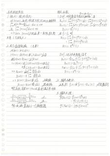（原图：`eval/fixtures/data/C13.jpg`，点击放大）

- 类目：流程图/架构图 | gold 字符 1250 / glm 预测 2316 | 编辑 1617(ins 1103/del 38/sub 476) | EditRate 1.2926 | 网关延迟 79.89s
- 已知差异要点：glm 预测比 gold 长 1066 字符（可能多抄或补了细节）；插入占比高（1103/1617）——glm 出现了 gold 没有的内容
  - 流程图/架构图类：gold 与 glm 对节点文字、箭头方向的 Markdown 描述方式可能不同，请以原图核对节点与连线是否完备、方向是否正确。
- 复核副本：`gold/C13.gold.md`

- [ ] gold 无需修改
- [ ] gold 需修改（在 `gold/C13.gold.md` 副本上改后同步回 fixtures）

<details><summary>AI 草拟 gold 全文</summary>

```markdown
# 左栏

## 系统的因果性

1. 佩利–维纳准则：

对 |H(ω)|，系统物理可实现的**必要条件**：
∫_{-∞}^{∞} (g |ln|H(ω)||)/(1+ω²) dω < +∞
且 ∫_{-∞}^{∞} |H(ω)|² dω < ∞

⇒ ∫_{|ω|>σ} |H(ω)| 不能在某一有限数段为 0（可有零点[?]）。

2. 希尔伯特变换 （重要）

对 h(t)：h(t)U(t)

H(ω)，即 H(ω) ⊗ [π δ(ω) + (j/π · 1/ω)]

当且仅当 H(ω) 的：R(ω) + jX(ω)

⇒ H(ω)，且 [π R(ω) + jX(ω) ⊗ ω 支]

+ j[π X(ω) - R(ω) ⊗ (1/ω)]

⇒ R(ω)，X(ω) ⊗ (1/πω) 正变换
X(ω)，-(1/π) ∫_{-∞}^{∞} (R(ω))/(ω-ω̃[?]) dω

⇒ R(ω)，X(ω) ⊗ (1/ω) 逆变换
X(ω)，R(ω) ⊗ (-1/ω)

即系统因果 ⇔ |H(ω)|实部部[?]满足希变换

H(ω) —（通过 |H(ω)| 与 (1/ω) 因果希尔变换器）→ f̃(t) 正
f̃(t) —（通过 |H(ω)| 与 (1/ω)）→ f(t) 逆

<<以上流程图：H(ω) 经带 |H(ω)| 因子 (1/ω) 的系统得 f̃(t)，标记“正”；f̃(t) 经带 |H(ω)| 因子 (1/ω) 的系统得 f(t)，标记“逆”>>

 Troll变换等效于一个稳相器

# 右栏

## 相关函数

f₁(t) 和 f₂(t)

1. D.P. 对能量信号 f₁(t) 和 f₂(t)，有
R₁₂(τ) = ∫_{-∞}^{∞} f₁(t+τ) f₂*(t) dτ = ∫_{-∞}^{∞} f₁(t+τ) [f₂*(t)] f₂*(t) dt
R₂₁(τ) = ∫_{-∞}^{∞} f₂(t) f₁*(t-τ) dt = ∫_{-∞}^{∞} f₂(t-τ) f₂*(t) dt
R₁₂(τ) = R₂₁*(-τ)

当 f₁ = f₂ 时
R(τ) = ∫_{-∞}^{∞} f(t+τ) f*(t) dτ
= ∫_{-∞}^{∞} f(t) f* (t-τ) dτ
R(-τ) - R*(τ)

Def. 对于功[?]均限信号
R_A[?](τ) = lim_{T→∞} (1/2T) ∫_{-T}^{T} f(t+τ) f*(t) dt
R_A(τ) - R_A*(-τ)
R_B[?](τ) = lim_{T→∞} (1/2T) ∫_{-T}^{T} f(t) f*(t-τ) dt
R(τ) - R* (-τ)

2. 相关与卷积
注意到 f₁(t) ⊗ f₂*(-t) = R₁₂(t) 对能量信号

3. 相关定理：
𝔉{R₁₂(τ)} = F₁(ω) F₂*(ω)
= 𝔉{f₁} 𝔉{f₂}
𝔉{R(τ)} = |𝔉{f}(ω)|²
```
</details>

<details><summary>glm-5.3-flash 预测全文</summary>

```markdown
# 系统的因果性

## 1. 佩利—维纳准则

对 $|H(\omega)|$，系统物理可实现的必要条件：

$$\int_{-\infty}^{\infty} \ln|H(\omega)| \, d\omega < +\infty$$

且

$$\int_{-\infty}^{\infty} |H(\omega)|^2 \, d\omega < \infty$$

$\Rightarrow$ 否则 $|H(\omega)|$ 不能在某一有限频段为零（可有限点）

## 2. 希尔伯特变换（充要）

对 $h(t)$：$h(t) = U(t)$

$H(\omega)$：记 $H(\omega) \,\text{①}\, \delta(\omega + \tfrac{1}{\omega})$

$\mathcal{H}\{H(\omega)\} = R(\omega) + jX(\omega)$

$\Rightarrow H(\omega) = \text{记} \left[ R(\omega) \text{①} X(\omega) \text{①} \mathcal{H} \right]$ $\dots$

$$H(\omega) = \left[ R(\omega) \text{①} X(\omega) \text{①} \delta \right] + \tfrac{1}{\pi}\left[ X(\omega) \text{①} R(\omega) \text{①} \delta \right]$$

$\Rightarrow$

$$R(\omega) = \frac{1}{\pi} \int_{-\infty}^{\infty} \frac{X(u)}{\omega - u} \, du$$

$$X(\omega) = -\frac{1}{\pi} \int_{-\infty}^{\infty} \frac{R(u)}{\omega - u} \, du$$

$\Rightarrow$

- $R(\omega) = X(\omega) \text{①} \tfrac{1}{\pi\omega}$，正变换
- $X(\omega) = R(\omega) \text{①} (-\tfrac{1}{\pi\omega})$，逆变换

即系统因果 $\Leftrightarrow H(\omega)$ 实虚部满足希变换

$$\xrightarrow{j(t)} \left[ H(\omega + j\tfrac{\pi}{2}) \right] \xrightarrow{f(t)} \quad 正$$

$$\xrightarrow{\hat{f}(t)} \left[ H(\omega + j\tfrac{\pi}{2}) \right] \xrightarrow{f(t)} \quad 逆$$

希变换等效于一个移相器

---

# 相关函数

## 1. Def. 对能量信号 $f_1(t)$ 和 $f_2(t)$，有

$$R_{12}(\tau) = \int_{-\infty}^{\infty} f_1(t) f_2^*(t - \tau) \, dt = \int_{-\infty}^{\infty} f_1(t + \tau) f_2^*(t) \, dt$$

$$R_{21}(\tau) = \int_{-\infty}^{\infty} f_2(t) f_1^*(t - \tau) \, dt = \int_{-\infty}^{\infty} f_2(t + \tau) f_1^*(t) \, dt$$

$$R_{12}(\tau) = R_{21}^*(-\tau)$$

当 $f_1 = f_2$ 时：

$$R(\tau) = \int_{-\infty}^{\infty} f(t + \tau) f^*(t - \tau) \, dt$$

$$= \int_{-\infty}^{\infty} f(t + \tau) f^*(t) \, dt$$

$$R(-\tau) = R^*(\tau)$$

## Def. 对功率极限信号

$$R_{12}(\tau) = \lim_{T \to \infty} \frac{1}{T} \int_{-\frac{T}{2}}^{\frac{T}{2}} f_1(t) f_2^*(t - \tau) \, dt$$

$$R_{12}(\tau) = R_{21}^*(-\tau)$$

$$R_{21}(\tau) = \lim_{T \to \infty} \frac{1}{T} \int_{-\frac{T}{2}}^{\frac{T}{2}} f_1(t) f^*(t - \tau) \, dt$$

$$R(\tau) = R^*(-\tau)$$

## 2. 相关与卷积

注意到 $f_1(t) \text{①} f_2(-t) = R_{12}(t)$（对能量信号）

## 3. 相关定理

$$\mathcal{F}\{R_{12}(\tau)\} = F_1(\omega) F_2^*(\omega)$$

$$= \mathcal{F}\{f_1\} \, \mathcal{F}\{f_2\}$$

$$\mathcal{F}\{R_{11}(\tau)\} = |\mathcal{F}\{f_1(\omega)\}|^2$$
```
</details>

---

## 22. C23｜手写笔记

（原图：`eval/fixtures/data/C23.jpg`，点击放大）

- 类目：手写笔记 | gold 字符 302 / glm 预测 166 | 编辑 258(ins 17/del 154/sub 87) | EditRate 0.8515 | 网关延迟 9.09s
- 已知差异要点：glm 预测比 gold 短 136 字符（可能漏抄/截断，或按语义化删除删除了删除段）；删除占比高（154/258）——glm 未输出 gold 中内容（涂改类多为删除线，其余类请核漏抄）
  - 手写类：核对字形易混字、数字/单位、行内缩写是否与图一致。
- 复核副本：`gold/C23.gold.md`

- [ ] gold 无需修改
- [ ] gold 需修改（在 `gold/C23.gold.md` 副本上改后同步回 fixtures）

<details><summary>AI 草拟 gold 全文</summary>

```markdown
符号：
S₀, S_b, S_p: 符号位
对 4位 A,B; 符号位进位 C_f ; 结果进位 C

溢位判断：
①. C⊕C_f
②. 符号位检测 S₀̅=S_b̅ S_p̅t S₀ S_b S_p̅

（注： conduc下划线部分为划线标注的公式 “S₀ S_b S_p t…” 原始写法为：S₀̄?S_b̄?S_p̄ t S₀ S_b S_p̄，其中部分字符的划线情况如下：第①行的 “C⊕C_f” 下方有下划线；“②. 符号位检测” 后接公式中 “S_b” 与 “S_p” 上有横线（非删除线，属取反符号）。）

补充订正：经复查，公式中的上横线应为取反符号，非涂改，故不标注 <<划掉>>。
```
</details>

<details><summary>glm-5.3-flash 预测全文</summary>

```markdown
符号：

$S_0$、$S_8$、$S_F$：符号位

对 4 位 $A \cdot B$：符号位选位 $C_f$；结果进位 $C$

溢出判断：

1. $C \oplus C_f$
2. 符号位检测：$\overline{S_0}\,\overline{S_F}\,S_F + S_0\,S_8\,\overline{S_F}$
```
</details>

---

## 23. C28｜手写笔记

（原图：`eval/fixtures/data/C28.jpg`，点击放大）

- 类目：手写笔记 | gold 字符 1207 / glm 预测 1169 | 编辑 897(ins 102/del 141/sub 654) | EditRate 0.7425 | 网关延迟 52.48s
- 已知差异要点：glm 预测比 gold 短 38 字符（可能漏抄/截断，或按语义化删除删除了删除段）；替换占比高（654/897）——多为措辞/LaTeX 记号/分段差异
  - 手写类：核对字形易混字、数字/单位、行内缩写是否与图一致。
- 复核副本：`gold/C28.gold.md`

- [ ] gold 无需修改
- [ ] gold 需修改（在 `gold/C28.gold.md` 副本上改后同步回 fixtures）

<details><summary>AI 草拟 gold 全文</summary>

```markdown
变长编码方法：
1. 香农编码
  对 S 的一排列：<逐出> P₁ P₂ ⋯ Pₙ <<划掉>>
  取 l₁ = ⌈-log P(Sᵢ)⌉? 记 aᵢ = -log P(Sᵢ) |(?)
  全 ? = <首>? P(Sᵢ)，将其转为二进 <制>? 数
  取小数点，左后 i 位作 <备>? i 消息的码 <?> 组

2. 霍夫曼编码
  编码方法：<即把> Huffman
  将 <<划掉>> 下 <<划掉>> 最小 P 合并，缩 <短> 成信源 S ′；<<划掉>>
  重复 <<划掉>> 直到 S ′ 仅 <<划掉>> 不多 <<划掉>> 于 2 个符号

  Thm. Huffman 即时且唯一可译
  Thm. Huffman 是 <<划掉>> 最好的
  <归纳> 摘归纳证
  最小，设为 s₁ 合并，<先>? <要?> 为已合并 <炼>? 体

3. Fano 编码  <概率匹配码>
  ① Sᵢ 按 Pᵢ 降序排列
  ② 分成 概率 全 相同 两组，赋 0/1
  ③ 对 组内 重复 操作
  即 时，唯一可译

离散信值
1. 离散 无 <记忆>? 信道 数学模型
Def. 离散 信值 <源>? 输入空间 A = {a₁, ⋯, aₙ}，
  Xiß: 对 S P₁S₁, ⋯, Pₙ 输出空间 B = {b₁, ⋯, b₃?}
  概率 [?] 记 输 入 序列 X = X₁, ⋯, Xₙ, 如果 极 <?> 值
  x‾i = ? x₁, ⋯, xₙ? 其中 Xₗ ∈ A, k, n ∈ N，输出序 <?> 列
  Y = {Y₁, ⋯, Yₙ}，取值 <随机>? 序列, ⋯ 为 <随机>，共 <?> 部
  信 值 矩阵：P(Y|X) : P(y₁?), ⋯, yₙ | x₁, ⋯, xₘ (?)
  <信道> 概率 模型：{X, P(y₁?), ⋯, yₙ | x₁, ⋯, xₘ}

Def. 离散 信值 无 <记忆>? 信道
  P(y | x) 凑?：P(y₁?ₗ | xₙₗ?)
  · 称其为 离散 无 记忆 信道 DMC
  数学模型 {X, P(y₁?), ⋯, Y}

Def. ∀ n, m ∈ N, ∀? ∈ B，若 DMC 满足
  P(yₘ?ₙ? | xₙ₁?) = P(yₘₙ? | xₘₙ?)
  称此信道 平稳 <?> / 恒 <?> 重

Def. 无噪 信道：Yₙ 与 yₙ ← 一 对 应
  ∀ l ∈ N, N，yₙ = f(xₙ)
  且 P(yₙ | xₙ) = { 1, yₙ = f(xₙ)
                    0, yₙ ≠ f(xₙ) }

Def. 有干扰 无记忆 信道：
  P(yₙ | xₙ) : = 节<?> P(yₙ₁? | xₙ)

Def. 有干扰 有记忆 信道：⌈⌉
```
</details>

<details><summary>glm-5.3-flash 预测全文</summary>

```markdown
# 变长编码方法

1. 香农编码
   - 对 $S$ 的某一排列，出去 $P(s_1),P(s_2),\cdots,P(s_n)$
   - 取 $l_i\approx\lceil-\log P(s_i)\rceil$（$l_i=-\log P(s_i)$ 亦可）
   - 取累计概率 $F_i$，将其转为二进制小数
   - 取小数点后 $l_i$ 位作为 $s_i$ 的码字

2. 霍夫曼编码
   - 编码方法：参考 Huffman
   - 将 $r$ 重的符号合并成一个 letter
   - 编成 $r$ 进制霍夫曼码会给第 3 点一些启发反复直至 $S$ 只有一个符号

- Thm. Huffman 码即时且唯一可译
- Thm. Huffman 码是紧致的
- 证明：归纳
- 最小/最小合并 → 最优叶已含所有条件

3. Fano 编码：概率匹配码
   1. 将 $S$ 按概率降序排列
   2. 分成概率尽可能相等的两组，前组编 $0$/后组编 $1$
   3. 对每组递归重复操作
   - 则代码即时、唯一可译

# 离散信道

1. 无记忆有限代数模型
   - Def. 离散信道由输入字母表 $X'[a_1,a_2,\cdots,a_K]$、输出字母表 $B:=[b_1,b_2,\cdots,b_J]$ 和转移概率矩阵 $P:j\to j$ 构成
   - 输出 $Y:y_1,y_2,\cdots,y_m$ 中 $y_i\in B$，$\{y_i\}_{i=1}^m$ 为输出序列
   - 于是 $p(y_1,\cdots,y_m|x_1,\cdots,x_m)$ 可分解

2. Def. 无记忆信道：
   $$p(y_1,\cdots,y_m|x_1,\cdots,x_m)=\prod_{i=1}^m p(y_i|x_i)$$

3. Def. 离散无记忆信道 DMC：
   $$\{X, Y, P(y|x), n, Y\}$$

Def. $\forall n,m\in\rm{Nat},\; i\in X,\; j\in B$：DMC 为平稳 →
$$P(y_{n+j}|x_{n+i})=P(y_{m+j}|x_{m+i})$$
独立于时间 $n$（时不变）

Def. 噪声信道：$y=f(x)$ 一一对应
$$\forall i\in\rm{Nat},\; y_i=f(x_i)$$
则
$$p(y_i|x_i)=\begin{cases}1,& y_i=f(x_i)\\0,&\text{否则}\end{cases}$$

Def. 有干扰无记忆信道：
$$p(y_i|x_i)=\text{有}\;p(y_i|x_i)$$

Def. 有干扰有记忆信道：……
```
</details>

---

## 24. C34｜中英混排

（原图：`eval/fixtures/data/C34.jpg`，点击放大）

- 类目：中英混排 | gold 字符 1803 / glm 预测 2717 | 编辑 2085(ins 933/del 20/sub 1132) | EditRate 1.1558 | 网关延迟 57.97s
- 已知差异要点：glm 预测比 gold 长 914 字符（可能多抄或补了细节）；插入占比高（933/2085）——glm 出现了 gold 没有的内容；替换占比高（1132/2085）——多为措辞/LaTeX 记号/分段差异
  - 中英混排类：核对中英文词与全角/半角、标点是否与图一致。
- 复核副本：`gold/C34.gold.md`

- [ ] gold 无需修改
- [ ] gold 需修改（在 `gold/C34.gold.md` 副本上改后同步回 fixtures）

<details><summary>AI 草拟 gold 全文</summary>

```markdown
# 工科计算方法

（左页眉：误差）

## 1. 数字

λ = (0.α₁ α₂ ⋯ αₙ αₙ₊₁ ⋯ αₘ β) \| x = 0.α₁α₂⋯αₙ βᶜ ， c: 阶码，β: 数手 [?]（数基？）

- 0 ≤ αᵢ ≤ 9, i ≥ 1 [?]； 1 ≤ α₁ ≤ 9 [?]
- ⟹ M < m < M [?]

对于长为 ℓ 位的计算机， m ≤ c ≤ M [?]
机器数系 F(β, t, m, M)

- |x| > (1-β)βᵐ ：上溢
- |x| < βᵐ⁻¹ ：下溢 x ∈ [βᵐ⁻¹, (1-βᵗ)βᴹ]
- G = ℝ [?]，(-βᵗ)βᴹ ⊂ F(β, t, m, M) [?]
- ⓪. 计入 [?]
- ①. 截断 [?]

（右侧：）ε_f(a+b) = ε_f(a)ε_f(b) [?]（应为 ε_f(a) + ε_f(b) 之类，按原文）

ε_f(ab) = ε_f(a) + ε_f(b) [?]

ε_f(a/b) = ε_f(a) + ε_f(b) [?]

## 范数

### 1. 向量范数

设 x⃗ ∈ ℝⁿ, 若 ||x|| 满足：

- ①. 正定性：||x|| > 0, ||x|| = 0 当且仅当 x… [?]
- ②. ||αx|| = |α| ||x||, α ∈ ℝ 齐次性 [?]
- ③. ||x+y|| ≤ ||x|| + ||y|| ∀x, y ∈ ℝⁿ

三角不等式

则解释 [?] ||x|| 为 x 的范数

## 2. 误差与有效数字

模型误差、观测误差、截断误差、舍入误差 [?]
被逼近：计算方法 Sₕ + R(β) ⇒ 截断 [?]

精确 [?] [?] [?] [?] [?]（下方一行小字，部分可读）[?] [?] [?] [?] [?] [?]（若依 [?]）[?] 向下指向 [?] δ(A)/A = -1/2 [?]（模糊组合行）

绝对误差 e = x - a  ε₂ sup |e|
绝对误差限 ε
相对误差 eᵣ: 满足 [?] e/a = ε/a
相对误差限 ε: e/a [?]（≤ ε/|a|）
有效数字 ∪ [?]（取）[?] a 添加数 [?]

a* = 0.a₁ a₂ ⋯ aₙ x 10ᵐ
|x - a| ≤ 0.5 x 10ᵐ⁻ⁿ [?]，称 a 为 n 位有效数 [?]

π* = 0.31415 x 10¹ 4 位
0.31416 x 10¹ 3 位 [?] [?]（涂改）

放大因子 |f'(a)| 对于 f(x)

|e_f(u)| ≈ |f'(a)/f(a)| |e_f(a)|

与时 [?] 条件数 [?]

ζ(a+b) ≤ ζ(a) + ζ(b)
ζ(ab) ≤ |a|ζ(b) + |b|ζ(a)
ζ(a/b) ≤ |a|ζ(b) + |b|ζ(a) / b² [?]（原文写法 |a|ζ(b)+|b|ζ(a)/b²）

## 2. 常用范数

x = (x₁, ⋯, xₙ)ᵀ ∈ ℝⁿ

- ₁范数：||x||₁ = Σᵢ |xᵢ|
- ₂范数：||x||₂ = √(Σᵢ xᵢ²) [?]
- ∞范数：||x||∞ = max₁≤i≤n |xᵢ|
- p范数：||x||_p = (Σ|xᵢ|ᵖ)^(1/p)

(Σₖ₌₁ⁿ aₖbₖ)² ≤ (Σₖ₌₁ⁿ aₖ²)(Σₖ₌₁ⁿ bₖ²) [?]（写成 aₖ² 格式）
(Σₖ₌₁ⁿ aₖbₖ) ≤ (Σₖ₌₁ⁿ aₖᵖ)^(1/p)(Σₖ₌₁ⁿ bₖᵍ)^(1/ᵍ)，p + q …: [?]（1/p + 1/q = 1）

## 3. 范数的等价性

Def: 若 ∃ C > 0, s.t. ∀x ∈ ℝⁿ, ||x||_A ≤ C||x||_B, 称 ||·||_A 比 ||·||_B 强

Def: 若 ||·||_A 比 ||·||_B 强且 ||·||_B 比 ||·||_A 强，称 ||·||_A 与 ||·||_B 等价 [?] [?]（推论）

Thm: ℝⁿ 的一切范数等价 [?]

## 4. 矩阵范数：ℝⁿˣⁿ

- ①. ∨ [?]（对勾）
- ②. ∨
- ③. ∨
- ④. ||AB|| ≤ ||A|| ||B|| 相容性—便于分析 [?]
```
</details>

<details><summary>glm-5.3-flash 预测全文</summary>

```markdown
# 工程计算方法

## 误差

### 1. 数字

$x = 0.a_{-1}a_{-2}\cdots a_{-n}a_{-n+1}\cdots a_{-m}\cdots a_{s}\cdots a_{w}\cdots \mid \beta$

$x = 0.a_1a_2\cdots a_s \times \beta^c$，C:阶码，β：数字

$0 \le a_i \le 9$，$i \ge 1$；$1 \le a_i \le 9$

$j \text{—} a \le m \le m_1$

对于长为 $t$ 的计算机，$m \le c \le M$

机器数系 $F(\beta, t, m, M)$

- $|x| > (1-\beta)\beta^m$：上溢
- $|x| < \beta^{m-1}$：下溢，$x \in F^{\beta^{m-1}}$，$(1-\beta)\beta^m]$
- $G = \mathbb{R}^m$，$(-\beta)^c\beta^m] \xrightarrow{f_0} F(\beta, t, m, M)$
  1. 全入
  2. 截断

### 2. 误差与有效数字

- 模型误差、观测误差、截断误差、舍入误差
- 截断：计算方法，$S_N + R_N(x) \to$ 截断

**绝对误差** $e = \tilde{x} - x$，$\varepsilon \ge \sup|e|$

**绝对误差限** $\varepsilon$

**相对误差** $e_r$：满足 $\dfrac{e}{|x|} = \dfrac{\tilde{e}}{|\tilde{x}|}$，$\tilde{x}$ 精确时 $\dfrac{e}{|x|} = \dfrac{\tilde{e}}{|\tilde{x}|}$

**相对误差限** $\varepsilon_r = \dfrac{\varepsilon}{|x|} \le \dfrac{\varepsilon}{|\tilde{x}|}$

**有效数字**： $\vee$

$x = \pm 0.a_1a_2\cdots x_n \times 10^m$

$|x - \tilde{x}| \le 0.5 \times 10^{m-n}$，称 $\tilde{x}$ 为 $n$ 位有效数

- $\pi^* = 0.31415 \times 10^1$，4位
- $0.31416 \times 10^1$，5位

**放大因子** $|f'(a)|$，对于 $f(x)$

$|e_f(a)| \le \left|\dfrac{f'(a)}{a}\right| \le |e_r(a)|$

$f$ 的条件数

- $\tilde{e}(a+b) \le \tilde{e}(a) + \tilde{e}(b)$
- $\varepsilon(ab) \le |a|\varepsilon(b) + |b|\varepsilon(a)$
- $\varepsilon\left(\dfrac{a}{b}\right) \le \dfrac{|a|\varepsilon(b) + |b|\varepsilon(a)}{b^2}$

- $e_f(a+b) = \dfrac{\tilde{e}a|f'(a)|}{x(0.1)x_2(a)}$
- $e_f(ab) = e_f(a) + e_f(b)$
- $e_f(a/b) = e_f(a) + e_f(b)$

## 范数

1. **向量范数**：

    $\forall \vec{x} \in \mathbb{R}^n$，若 $||x||$ 满足：
    1. 正定性：$||x|| > 0$；$||x|| = 0$ 当且仅当 $x = 0$
    2. 齐次性：$||\alpha x|| = |\alpha| \, ||x||$，$\alpha \in \mathbb{R}$，$x \in \mathbb{R}$（实/齐次性）
    3. 三角不等式：$||x+y|| \le ||x|| + ||y||$，$\forall x, y \in \mathbb{R}^n$

    则称 $||x||$ 为 $x$ 的范数

2. **常用范数**：$x = (x_1, \cdots, x_n)^T \in \mathbb{R}^n$

    - $||x||_1 = \sum\limits_{i=1}^{n} |x_i|$，$||x||_2 = \sqrt{\sum\limits_{i=1}^{n} |x_i|^2}$
    - $||x||_\infty = \max\limits_{1\le i\le n} |x_i|$，$||x||_p = \left(\sum\limits_{i=1}^{n} |x_i|^p\right)^{1/p}$

    $\left(\sum\limits_{k=1}^{n} a_k b_k\right)^2 \le \sum\limits_{k=1}^{n} a_k^2 \sum\limits_{k=1}^{n} b_k^2$

    $\sum\limits_{k=1}^{n} |a_k b_k| \le \left(\sum\limits_{k=1}^{n} |a_k|^p\right)^{1/p} \left(\sum\limits_{k=1}^{n} |b_k|^q\right)^{1/q}$，$p + q = 1$

3. **范数的等价性**：

    - Def 若 $\exists \, c_1, c_2, \, s.t. \, \forall x \in \mathbb{R}^n$，$||x||_A \le c \, ||x||_B$，则 $||.||_A$ 比 $||.||_B$ 强
    - Def 若 $||.||_A$ 比 $||.||_B$ 强且 $||.||_B$ 比 $||.||_A$ 强，则 $||.||_A$ 与 $||.||_B$ 等价
    - Th. $\mathbb{R}^n$ 上一切范数等价

4. **矩阵范数**：$\mathbb{R}^{n \times n}$

    1. √  2. √  3. √
    4. $||AB|| \le ||A|| \, ||B||$，相容性—便分析
```
</details>

---

## 25. C40｜中英混排

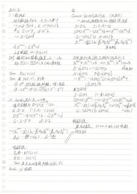（原图：`eval/fixtures/data/C40.jpg`，点击放大）

- 类目：中英混排 | gold 字符 2435 / glm 预测 2156 | 编辑 1170(ins 244/del 524/sub 402) | EditRate 0.4803 | 网关延迟 27.22s
- 已知差异要点：glm 预测比 gold 短 279 字符（可能漏抄/截断，或按语义化删除删除了删除段）；删除占比高（524/1170）——glm 未输出 gold 中内容（涂改类多为删除线，其余类请核漏抄）
  - 中英混排类：核对中英文词与全角/半角、标点是否与图一致。
- 复核副本：`gold/C40.gold.md`

- [ ] gold 无需修改
- [ ] gold 需修改（在 `gold/C40.gold.md` 副本上改后同步回 fixtures）

<details><summary>AI 草拟 gold 全文</summary>

```markdown
# 迭代法

## 1. 一般形式：

对方程组 $Ax=b$，令 $A = N - P$（$N \neq 0$，$P \neq 0$）$= \Rightarrow Nx = Px + b$，$x = N^{-1}Px + N^{-1}b$

若记 $G = N^{-1}P$，$d = N^{-1}b$

$\Rightarrow X = Gx + d$

令 $x^{(k+1)} = Gx^{(k)} + d$

上式收敛 $\Leftrightarrow \rho(G) < 1$

Def. 称 $\rho(G) = \max_i |\lambda_i|$（$\lambda_i$ 为 $G$ 的特征值 $\lambda_1, \cdots, \lambda_n$）为 $G$（迭代法 $x^{(k+1)} = Gx^{(k)} + d$）的 $G$ 的谱半径

Thm. $\rho(G) \leq \|G\|$

Thm. 若 $\|G\| < 1$，则有：

① $x^*$（即方程组 $Ax=b$ 的解）唯一存在
② $\|x^{(k)} - x^*\| \leq \frac{\|G\|^k}{1-\|G\|} \cdot \|x^{(1)} - x^{(0)}\|$

## 2. Jacobi 迭代法 —— 对角法

将 $A$ 分解为 $D + L + U$ —— 见上

令 $S = D$，$T = S - A = -(L+U)$

$Dx^{(k+1)} = -(L+U)x^{(k)} + b = Gx^{(k)} + d$

$G = I - D^{-1}A$，$d = D^{-1}b$

$\Rightarrow x_i^{(k+1)} = \frac{1}{a_{ii}}\left(b_i - \sum_{j=1}^{i-1} a_{ij}x_j^{(k)} - \sum_{j=i+1}^{n} a_{ij}x_j^{(k)}\right)$

（其中 $g_{ij}$：$-\frac{a_{ij}}{a_{ii}}$（$i \neq j$），$d_i$：$\frac{b_i}{a_{ii}}$）

**收敛性：**

必要：$0 \rho(G) < 1$
充分：$\|G\| < 1$

Thm. 若 $A$ 主对角线严格占优，则 Jacobi 迭代必收敛

---

# 右 [?]

## Gauss-Seidel 迭代法（逐迭代）
—— Jacobi 迭代的优化（破坏性 < 改值 <<划掉>>）

$S = D + L$，$T = S - A = -U$

$[D+L]x^{(k+1)} = -Ux^{(k)} + b \Leftrightarrow x^{(k+1)} = Gx^{(k)} + d$

$G = (D+L)^{-1}U$，$d = (D+L)^{-1}b$

$$x_i^{(k+1)} = \frac{1}{a_{ii}}\left(b_i - \sum_{j=1}^{i-1} a_{ij}x_j^{(k+1)} - \sum_{j=i+1}^{n} a_{ij}x_j^{(k)}\right)$$

（各自新（[?]））

## SOR 迭代法（超松弛迭代法 / 逐次超松弛迭代法）

$x_i^{(k+1)} = x_i^{(k)} + \omega \Delta x_i \Rightarrow x_i^{(k+1)} = x_i^{(k)} + \omega \Delta x_i'$

松弛因子

$A = \left(-\frac{1}{\omega}D\right) + L + \left(1-\frac{1}{\omega}\right)D + U$

$N = \left(\frac{1}{\omega}D\right) + L$，$P = \left[\left(1-\frac{1}{\omega}\right)D + U\right]$

$\Rightarrow x^{(k+1)} = -\left(\frac{1}{\omega}D + L\right)^{-1}\left[\left(1-\frac{1}{\omega}\right)D + U\right]x^{(k)} + \left(\frac{1}{\omega}D + L\right)^{-1}b$

**或可写作**

$S = \frac{1}{\omega}D + L$，$T = -\left[\left(1-\frac{1}{\omega}\right)D + U\right]$

$\left[D + \omega L\right]x^{(k+1)} = -\left[\omega-1\right]D x^{(k)} - \omega U x^{(k)} + \omega b$

$x_i^{(k+1)} = \left(1-\omega\right) x_i^{(k)} + \frac{\omega}{a_{ii}}\left(b_i - \sum_{j=1}^{i-1} a_{ij}x_j^{(k+1)}\right) - \left(\omega-1\right)x_i^{(k)} - \frac{\omega}{a_{ii}}\sum_{j=i+1}^{n} a_{ij}x_j^{(k)}$（$+\omega b_i$）

$G = \left(\frac{1}{\omega}D + L\right)^{-1}\left[\left(1-\frac{1}{\omega}\right)D + U\right]$（$+\omega b_i$）

**收敛处理：**

若 $A$ 正定之，$0 < \omega < 2$ 则 SOR 收敛
与主次数
```
</details>

<details><summary>glm-5.3-flash 预测全文</summary>

```markdown
# 迭代法

1. 一般形式：

对方程组 $A\vec{x}=\vec{b}$，令 $A:=N-P$
$\Rightarrow N\vec{x}=P\vec{x}+\vec{b}$，$\vec{x}:=N^{-1}P\vec{x}+N^{-1}\vec{b}$
记 $G:=N^{-1}P$，$d:=N^{-1}\vec{b}$
$\Rightarrow \vec{x}=G\vec{x}+d$

令 $\vec{x}^{(k+1)}=G\vec{x}^{(k)}+d$

上式收敛 $\Leftrightarrow \rho(G)<1$

Def. 矩阵 $G$ 的特征值记为 $\lambda_1,\cdots,\lambda_n$，称 $\rho(G):=\max_i|\lambda_i|$ 为 $G$ 的谱半径

Thm. $\rho(G)\le\|G\|$

Thm. 若 $\|G\|<1$，则有：

① $\vec{x}^{\star}$，即方程组的解，唯一存在
② $\|\vec{x}^{(k)}-\vec{x}^{\star}\|\le \frac{\|G\|^k}{1-\|G\|}\|\vec{x}^{(1)}-\vec{x}^{(0)}\|$

2. Jacobi 迭代法（→对角）

将 $A$ 分解为 $D+L+U$（记 $-L$、$-U$）

令 $S:=D$，$T:=S-A:=-(L+U)$

$D\vec{x}^{(k+1)}=-(L+U)\vec{x}^{(k)}+\vec{b}=G\vec{x}^{(k)}+d$

$G:=-D^{-1}A$　　　$d:=D^{-1}\vec{b}$

$\Rightarrow x_i^{(k+1)}=\frac{1}{a_{ii}}\Big(b_i-\sum_{j<i}a_{ij}x_j^{(k)}-\sum_{j>i}a_{ij}x_j^{(k)}\Big)$
（记 $\frac{b_i}{a_{ii}}=\frac{b_i}{a_{ii}}$（对称），$d_i:=-\frac{a_{ij}}{a_{ii}}$）

收敛性：

必要：$\rho(G)<1$

充分：$\|G\|<1$

Thm. 若 $A$ 严格对角占优（或对称正定），则 Jacobi 迭代收敛

---

# 5. Gauss-Seidel 迭代法（逐次迭代）

— Jacobi 的逐步优化、线性赶使迭代

$S:=D+L$　　　$T:=S-A:=-U$

$(D+L)\vec{x}^{(k+1)}=-U\vec{x}^{(k)}+\vec{b}\Leftrightarrow \vec{x}^{(k+1)}=G\vec{x}^{(k)}+d$

$G:=(D+L)^{-1}U$　　　$d:=(D+L)^{-1}\vec{b}$

$x_i^{(k+1)}=\frac{1}{a_{ii}}\Big(b_i-\sum_{j<i}a_{ij}x_j^{(k+1)}-\sum_{j>i}a_{ij}x_j^{(k)}\Big)$

（来自前段）

## SOR 迭代法（逐次超松弛迭代法）

$\vec{x}^{(k+1)}=\vec{x}^{(k)}+\delta\vec{x}_k$　　　$\Rightarrow \vec{x}_e^{(k+1)}=\vec{x}_e^{(k)}+\omega\,\delta\vec{x}_k$（松弛因子$\omega$）

$A:=\vec{\omega}D+L+(1-\vec{\omega})D+U$

$N:=\vec{\omega}D+L$　　　$P:=(1-\vec{\omega})D+U$

$\Rightarrow \vec{x}^{(k+1)}=-(\vec{\omega}D+L)^{-1}\big[(1-\vec{\omega})D+U\big]\vec{x}^{(k)}+(\vec{\omega}D+L)^{-1}\vec{b}$

或可写作：

$S:=\vec{\omega}D+L$　　　$T:=-\big[(1-\vec{\omega})D+U\big]$

$(D+\omega L)\vec{x}^{(k+1)}=-(\omega-1)D\vec{x}^{(k)}-\omega U\vec{x}^{(k)}+\omega\vec{b}$

$x_i^{(k+1)}=(1-\omega)\dfrac{a_{i1}}{a_{ii}}x_1^{(k)}\cdots$（类似项）$-(\omega-1)x_i^{(k)}-\omega\dfrac{a_{ij}}{a_{ii}}x_j^{(k)}$（含 $x_j^{(k+1)}$，$j<i$；及 $\omega\dfrac{b_i}{a_{ii}}$）

即 $G=(\vec{\omega}D+L)^{-1}\big[(1-\vec{\omega})D+U\big]$　　　$+\omega\vec{b}_i$

## 收敛性：

若 $A$ 对称正定，$0<\omega<2$ 则 SOR 收敛

（对角占优）
```
</details>

---

## 26. C47｜流程图/架构图

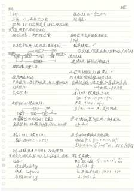（原图：`eval/fixtures/data/C47.jpg`，点击放大）

- 类目：流程图/架构图 | gold 字符 1121 / glm 预测 1036 | 编辑 548(ins 129/del 215/sub 204) | EditRate 0.4884 | 网关延迟 17.94s
- 已知差异要点：glm 预测比 gold 短 85 字符（可能漏抄/截断，或按语义化删除删除了删除段）
  - 流程图/架构图类：gold 与 glm 对节点文字、箭头方向的 Markdown 描述方式可能不同，请以原图核对节点与连线是否完备、方向是否正确。
- 复核副本：`gold/C47.gold.md`

- [ ] gold 无需修改
- [ ] gold 需修改（在 `gold/C47.gold.md` 副本上改后同步回 fixtures）

<details><summary>AI 草拟 gold 全文</summary>

```markdown
# 绪论

**自动控制**

## 1. Def.

- 系统：[?]，具有一定功能
- 控制：自动利用控制装置操纵被控对象，使被控量按规定使变化
- 被控对象：被控[?]被控量

自动控制系统：在没有人直接参与[?]……

结构图（文字描述）：

- 输入/参考 → 控制器 → 执行机构 → 被控对象 → 输出（被控量）
- 被控对象、测量元件 → 反馈 → 不断地回到控制器
- 扰动 ←↓ 作用于（执行机构、被控对象）

控制的基本方式：

1. 开环控制：信号单向传递，输出受扰动影响
2. 闭环控制
3. 复合控制

- 带干扰补偿的开环：
    - 输入 → 控制器 → 执行机构 → 被控对象 → 输出
    - 干扰测量 →（补偿通道）→ 执行机构（前馈补偿）
- 按误差控制的闭环：见 last
- 复合控制：按输入补偿 / 按扰动补偿

输入 r(t)，输出 c(t)
跟踪：c(t) = r(t)

Def. 系统受到外作用后，被控量随时间变化的全过程称为动态过程（动态/过渡）性能：

- 稳定 stability
- 快速 swiftness
- 准确 accuracy

稳态误差 ess：lim(t→∞) e(t) ←t 为超[?]量[?]

# 自动控制系统的数学模型

## 1. Def.

- 数学模型
- 微分方程 / 传递函数 / 频率响应 / 信号流[?]图（<<划掉>>）
- 差分方程
- 建模方法：解析法 / 实验法

## 二. 控制系统微分方程建立 [?]……

## 3）非线性微分方程的线性化

①. 线性系统：满足叠加[?]叠加原理的系统
    - ⇒ 可加性：齐次性[?]齐次效性
    - 若：x, y 为[?]程线性系统
    - 可加：f(x₁+x₂) = f(x₁) + f(x₂)
    - 齐次：f(ax) = a f(x)
    - 若 f(x) = cos ωt · x；线性[?时变]（<<划掉>>）

②. 平衡[?]位置附近[?]每一个小偏差变化
    - y − f = k₀x

③. Laplace 变换及反变换
    - 若[?] f(t)，t ≥ 0，def.
    - L[f(t)] = F(s) = ∫₀^∞ f(t) e^{-st} dt，s ∈ C（//[?]微分[?]算）

常见变换：

- a. 单位阶跃函数：f(t) = 1(t) = { 1, t≥0；0, t<0 }
    - 则 L[f(t)] = 1/s
- b. 单位斜坡：f(t) = t，t>0
    - 则 L[f(t)] = 1/s²
```
</details>

<details><summary>glm-5.3-flash 预测全文</summary>

```markdown
# 绪论

## 1. Def.

- 系统：～，具有一定功能
- 控制：利用控制装置操纵被控对象，使被控量按预定期望变化
- 被控对象：被控装置

自动控制系统：在没有直接参与…

框图：

给定 → 控制 → 执行 → 被控对象（飞机）← 测量 ← 输出
扰动 → 执行
被控对象、测量元件

控制的基本方式：

- 开环控制：信号单向传递，输出量对控制
- 闭环控制
- 复合控制

开环扰动补偿的开环：

测量 → 执行 → 被控对象 ← 扰动
给定 → 测量

按偏差控制的闭环：见上
复合控制：按输入补偿 / 按扰动补偿

输入 r(t)，输出 c(t)
函数关系：c(t) 与 r(t)

Def. 系统受外部作用后，被控量随时间变化的全过程称为动态过程（过渡过程）
指标：

- 稳定 / 稳定性 stability
- 快速 quickness swiftness
- 准确 accuracy

稳态误差 ess：$\lim_{t\to\infty} e(t)$
超调量 σ%

# 自动控制系统的数学模型

## 1. Def.

数学模型：～
微分方程 / 传递函数 / 频率响应 / 状态方程（微分方程）
建模方法：解析法 / 实验法

## 二 控制系统微分方程建立：～

### 3) 非线性微分方程的线性化

① 线性系统：满足叠加原理的系统
⇒ 可加性、齐次性
⛓：均态 程线性系统
可加：$f(x_1+x_2) = f(x_1)+f(x_2)$
齐次：$f(ax) = af(x)$
例 $f(x)=\cos\omega t\cdot x$：线性时变

② 平衡位置附近的小偏差变化
$y-k_0 x$ 底斜率

③ 1. Laplace 变换及反变换
对实函数 $f(t)$，$t\ge 0$，def.
$$\mathcal{L}[f(t)] = F(s) = \int_0^\infty f(t)e^{-st}\,\mathrm{d}t,\quad s\in\mathbb{C}$$（能收敛）

常见变换：

a. 单位阶跃函数：$f(t)=1(t)=\begin{cases}1 & t\ge 0\\ 0 & t<0\end{cases}$
$\mathcal{L}[1(t)] = \dfrac{1}{s}$

b. 单位斜坡：$f(t)=t$，$t>0$
$\mathcal{L}[f(t)] = \dfrac{1}{s^2}$
```
</details>

---

## 27. C50｜流程图/架构图

（原图：`eval/fixtures/data/C50.jpg`，点击放大）

- 类目：流程图/架构图 | gold 字符 1159 / glm 预测 1796 | 编辑 1238(ins 784/del 148/sub 306) | EditRate 1.0672 | 网关延迟 35.93s
- 已知差异要点：glm 预测比 gold 长 637 字符（可能多抄或补了细节）；插入占比高（784/1238）——glm 出现了 gold 没有的内容
  - 流程图/架构图类：gold 与 glm 对节点文字、箭头方向的 Markdown 描述方式可能不同，请以原图核对节点与连线是否完备、方向是否正确。
- 复核副本：`gold/C50.gold.md`

- [ ] gold 无需修改
- [ ] gold 需修改（在 `gold/C50.gold.md` 副本上改后同步回 fixtures）

<details><summary>AI 草拟 gold 全文</summary>

```markdown
# 根轨迹法 Chapter 4

## 稳态：误差计算

*（右侧旁注：R(s) → ①[F][图] → E(s)，图示 R(s) 至 [比较器] 至 [G(s)]，E(s)，反馈箭头向下）*

### 1. 误差定义：

① e(t) = r(t) - c(t)

② e(t) = Γ(t) - b(t)（反馈）

### 二. 稳态误差：

E_ss := lim (s→∞) e(t)

### 3. 终值定理：

当 lim (t→∞) e(t) 与 lim (s→0) SE(s) 存在时

E_ss = lim (t→∞) e(t) = lim (s→0) sE(s)

即自由产生 SE(s) 的极点 <<划掉>> 如果有 <<划掉>> 于右半 <<划掉>>

<<划掉>> 部

（必要保证）

---

## 根

## 1. 根轨迹：概念与方程

D(t)：系统开环增益 0 → +∞ 变化时，闭环特征根在复平面上的运动轨迹

CH = k* Π (s + z_j) ...（暂略）

K*：根轨迹增益

根轨迹方程：G(s)H(s) = -1

→ 模值方程，K* · (Π|s+z_j|)/(Π|s+p_i|) = 1 （必要）

相角方程：Σ∠(s - z_j) - Σ∠(s - p_i) = (2k+1)π（必要条件）

Σz_j：开环零点.  Σp_i：开环极点.

---

对开环传递函数<<涂改>><<划掉>> 开环函数

G(s)H(s) = K* Π(s+z_j) / [Π(s^v) · Π(s+p_i)] = K* Π(s+z_j) / [s^v Π(s+p_i)]

E_ss = lim (s→0) sE(s) = lim (s→0) [s / (1 + s^v Π...)] R(s)

### 二决定因素：

① 输入信号 R(s)

② 是 <<划掉>> 开环增益 k

③ 系统型号 v

Def. 静态 位置 误差系数

k_p := lim (s→0) G(s)H(s)

k_p := { k_0, v=0; ∞, v≥1 }

E_ss = 1/k_p   对 R(s) = 1/s 阶跃信号

---

Def. 静态 速度 误差系数

k_v := lim (s→0) s·G(s)H(s)

k_v := { 0, v=0; k, v=1; ∞, v≥2 }

E_ss = 1/k_v := { ∞, v=0. 1/k, v=1. 0, v≥2 }   对 R(s) = 1/s²

---

Def. 静态 加速度 误差系数

k_a := { 0, v=0,1; k, v=2; ∞ } := lim (s→0) s²·G(s)H(s)
```
</details>

<details><summary>glm-5.3-flash 预测全文</summary>

```markdown
# 根轨迹 Chapter 4

## 稳态误差计算

### 1. 误差定义：

① $e(t) \colon r(t) - c(t)$

② $E(s) = R(s) - B(s)$（反馈）

### 二. 稳态误差：

$$E_{ss} = \lim_{s\to 0} sE(s)$$

### 3. 终值定理：

当 $e(t)$ 与 $\mathscr{L}[SE(s)]$ 存在时

$$E_{ss} = \lim_{s\to 0} sE(s) = \lim_{s\to 0} SE(s)$$

即若且仅当 $SE(s)$ 的极点：如果有左半部（必须验证）

## 根轨迹

### 一. 根轨迹概念与方程

$D$ 时系统开环传递 $0\to +\infty$ 变化时，闭环特征根在复平面上的运动轨迹

$$CH = k\prod_{j=1}^{m}(s-z_j)/\prod_{i=1}^{n}(s-p_i)\quad (较少)$$

$K^*$：根轨迹增益

根轨迹方程：$G(s)H(s) = \pm 1$

> 模值方程，$K^* = \frac{|G(s)H(s)|}{|核(s)H(s)|} = 1$（必要）

相角方程：$\sum\angle(s-z_j) - \sum\angle(s-p_i) = (2k+1)\pi$（充要）

$\approx$：开环零点　$P_i$：开环极点

$$G(s)H(s) = \frac{K^*\prod_{i=1}^{m}(\tau_i s + 1)\cdots z_j(s-z_j)}{\prod_{i=1}^{n}(T_{ji}s+1)\prod(s-p_i)} = \frac{\prod(s-z_j)}{\prod(s-p_i)}$$

$$E_{ss} = \lim_{s\to 0} SE(s) = \lim_{s\to 0}\frac{s}{s + \prod_{p_i}}\cdot R(s)$$

### 二. 决定因素：

1. 输入信号 $R(s)$
2. 系统开环增益 $k$
3. 系统型号 $\nu$

Def. 静态位置误差系数

$$k_p = \lim_{s\to 0} G(s)H(s)$$

$$k_p = \begin{cases} K & \nu = 0 \\ 0 & \nu \geq 1 \end{cases}$$

$$E_{ss} = \frac{1}{1+k_p} \quad 对\ R(s) = \frac{1}{s}阶跃信号$$

Def. 静态速度误差系数

$$k_v = \lim_{s\to 0} sG(s)H(s)$$

$$k_v = \begin{cases} 0 & \nu = 0 \\ K & \nu = 1 \\ 0 & \nu \geq 2 \end{cases}$$

$$E_{ss} = \frac{1}{k_v} = \begin{cases} \infty & \nu = 0 \\ \frac{1}{K} & \nu = 1 \end{cases} 对\ R(s) = \frac{1}{s^2}$$

Def. 静态加速度误差系数

$$k_a = \begin{cases} 0 & \nu \leq 1 \\ K & \nu = 2 \\ \infty & \nu \geq 3 \end{cases} = \lim_{s\to 0} s^2 G(s)H(s)$$

## 二. 根轨迹绘制基本法则

1. 分支数等于方程阶数
2. 连续且对称于实轴
3. 起始于开环极点，终止于开环零点
4. 对实轴上点 $s_1$，左侧 $m$ + $n$ 个极点零点

若 $m+n$ 为奇数，则 $s_1$ 是根轨迹点：

5. 根轨迹的分离点：

$$对\ D(s) = \prod_{i=1}^{n}(s-p_i) + K^*\prod_{j=1}^{m}(s-z_j)$$

$$D(s)|_{s=d} = 0 \ \Rightarrow \ \frac{d}{ds}D(s)|_{s=d} = 0$$

$$\Rightarrow \sum\frac{1}{d - p_i} = \sum\frac{1}{d - z_j}$$
```
</details>

---

## 28. C52｜中英混排

（原图：`eval/fixtures/data/C52.jpg`，点击放大）

- 类目：中英混排 | gold 字符 2035 / glm 预测 2068 | 编辑 1612(ins 297/del 265/sub 1050) | EditRate 0.7917 | 网关延迟 43.85s
- 已知差异要点：glm 预测比 gold 长 33 字符（可能多抄或补了细节）；替换占比高（1050/1612）——多为措辞/LaTeX 记号/分段差异
  - 中英混排类：核对中英文词与全角/半角、标点是否与图一致。
- 复核副本：`gold/C52.gold.md`

- [ ] gold 无需修改
- [ ] gold 需修改（在 `gold/C52.gold.md` 副本上改后同步回 fixtures）

<details><summary>AI 草拟 gold 全文</summary>

```markdown
# 频率稳定判据

## 1. 幅角原理

设 F(S) : 端( S→L )/ 端( S→K )

若对 S 面内任一闭合路径 Γ<sub>S</sub>，F<sub>S</sub> 不连 <<划掉>><<涂改>> F(S)

变、极点，且 Γ<sub>S</sub> 包围 Z 个零点，Z<sub>i</sub> 个 极点

则有：

- Δ∠F(S) = ΣΔ∠(S-Z<sub>i</sub>) - Σ<sub>i</sub>Δ∠S<<划掉>>-Z<sub>i</sub><<end>> V<sub>i</sub> ?

其中：即当 S 逆时针移动一周时

- F(S) 逆 时 针 移 动 Δ∠ 包圈数 R！

R = P - Z ；其中 P：包围极点 数；Z：包 围 零 点(数)-(s)？<<划掉>>

形象： 0 →(上)>> 图形

逆动 ： 形

注：正穿越：函数曲线由上向下穿过 (-∞, 1)

负 穿越曲线由上向下穿过 (-∞, -1)

n = M - M<sub>n</sub> <<划掉>><<涂改>>

半次：起始于 (-∞, -1)

## 2. 奈奎斯特稳定判据

令 F(S) = H G(S) H(S)

G(S) : <sup>default(?)</sup> / <sub>M(S)N(S)</sub><sub>----<<划掉>><<涂改>></sub>

⇒ F(S) : <sup>M(S)N(S)+M<sub>N</sub>N<sub>M</sub>(?)</sup> / <sub>N(S)N<sub>共</sub></sub>
--------       → 消动特性(?)
→ 闭环特征

令 Γ<sub>S</sub> 为右半平面 无穷大半圆

则 系统稳定 ⇔ Z = P - R = 0

对真实物理系统，G(S)H(S) 有 n > m

奈奎斯特(?)弧 上所有点，映射至同一点。

权变量 F(jw) = 1 + G(jw)H(jw)

⇒ R = G(jw)H(jw) 包围 (-1+j0) 的 围数
     ⇔ Nyquist 曲线

> Thm.（Nyquist 稳定判据）：
> 当 w : -∞ → +∞ 时，开环幅相曲线绕
> (-1 + j0) 点 逆 (?)顺时针 (?) 逆时针 旋转 P 圈. 其中 P 是 开环
> 右半平面的极点 数.
> 注意：Nyquist 曲线内的 对称性.

- Tips：若为 环路<sup>0</sup>/(积分)与 . 取一个 右(?)平面 无穷大(?) <<
  半圆>>； 0 转为左 半平面
- 对 V 个 积分 开环，N . 曲线 从 w = 0<sup>+</sup> 开始，
  该曲线 逆时针 画圆 画 满量 V 个 半径 穿 大 半圆

## 3. 对数频率稳定判据

- 正段：L(w) > 0 的(?)范围内，相频(相角) 会 自 下 向 上
  覆 ( 处 无 线 ) <<涂改>>
- 负段：L(w).Maximum(?)>0 范围内，相频 会 自上向下

## 4. 稳定裕度

1. Def<sub>1</sub>：相角稳定裕度

γ = ∠G(jw<sub>c</sub>)H(jw<sub>c</sub>) + Π

当 | G(jw) H(j(w)) | = 1，/ L(jw) = 0 时，

相频声 γ(w) = -Π + γ + 相 角

- γ > 0 : 稳定

2. Def<sub>2</sub>. 模裕(幅)当(值)负变(?)

a = 1 / | G(jw<sub>g</sub>)H(j(xw)) | <<划掉>>
     | g <<划掉>> = 1 / | G(jw<sub>g</sub>)H(jw<sub>g</sub>) |

h > 1 : 稳定

h > 1 : 相 角 稳定

又称裕为 增益 裕度 （ 开环 增益 可 放
大 的 最大 倍数 ）

## 5. 闭环频率特性

- 闭环 ( 幅) φ(jw) ： G(jw) / (1 + G(jw))
- 闭环 ( 相) φ(jw) : <!M(jw), e<sup>-jθ</sup>>
- M(w) = e = j 1→ 对 应 正 弦 位置 无 静 态 效 差 距 ( 数 )？

M<sub>n</sub> ~ φ / 2(?) 帽 ( 卡 零 ) 度 <<划掉>>  当 ζ < 乏 ( ?) 时

[?] >> 3dB

- w<sub>b</sub>: M(w<sub>b</sub>) = 0.707 M(0)
- M(w) 在 w<sub>b</sub> 处 一 ( ? ) 闭环 Finds 度 近 半 <<划掉>> . 振 荡 频 率 <<划掉>>
  抗 ( ? ) 直 上 <<划掉>> .
```
</details>

<details><summary>glm-5.3-flash 预测全文</summary>

```markdown
# 频率稳定判据

## 1. 幅角原理

设 $F(s)$：密($S$- <$\varepsilon$) / 密($S$- 任)

若对 $S$ 面内任一闭合路径 $\Gamma_s$，$F$ 不连 $F(s)$ 变极点，……且 $\Gamma_F$ 包围一个零点、$Z$-$n$ 则有

$$\angle F(s) = \Sigma_Z \angle S = \Sigma Z\Sigma_S - \Sigma Z\Sigma_P$$

即当 $S$ 沿 $\Gamma_S$ 顺时针移动一圈时，$F(s)$ 逆时针移动 $Z$-$P$ 包圈数 $R$：

$$R = P - Z$$

其中 $P$/$\Gamma$ 包围极点数，$Z$ 包包围零点数。

- 正穿越（次数）：自上而下穿越 $(-\infty, -1)$
- 负穿越（次数）：自下而上穿越 $(-\infty, -1)$
- $N = N_+$ $-$ $N_-$
- 半次：起始于 $(-\infty, -1)$

## 2. 奈奎斯特稳定判据

$$\Phi(s) = \frac{w}{r} = \frac{H \ G(s)}{1 + G(s)H(s)}$$

$$G(s) = \frac{N_G}{D_G};\quad G(s)H(s) = \frac{N_1 N_2}{D_1 D_2}$$

$$\Rightarrow F(s) = \frac{N_1 N_2 \cdots}{D_1 D_2 \cdots}$$

（消无助极点，闭环特征方程特征）

令 $\Gamma_S$ 为右半平面无穷大半圆，则系统稳定 $\Leftrightarrow Z = P - R = 0$

对真实物理系统，$G(s)H(s)$ 有 $n > m$：

- 奈奎斯特轨迹上所有点 $\Leftrightarrow$ 映射至同一点
- 极坐标 $F(j\omega) = 1 + G(j\omega)H(j\omega)$
- $\Rightarrow R = G(j\omega)H(j\omega)$ 包围 $(-1, j0)$ 的圈数 $\Rightarrow$ Nyquist 曲线

**Thm.（Nyquist 稳定判据）：**

当 $\omega: -\infty \to +\infty$ 时，开环幅相曲线绕 $(-1, j0)$ 点逆时针旋转 $P$ 圈；其中 $P$ 是右半平面开环极点数。

注意 Nyquist 曲线的对称性。

- Tips：若需要 $s^0$ 分子（极点），取一个右半平面无穷半圆；$0$ 环在左半平面
- 对 $\nu \neq 0$ 型分环节，$\nu$ 曲线从 $\omega = 0^+$ 开始，顺时针补画一圈，半径无穷大

## 3. 对数频率稳定判据

- 正穿：$L(\omega) > 0$ 范围内，相位自下向上穿至无交叉线
- 负穿：$L(\omega) > 0$ 范围内，相位自下向上

## 4. 稳定裕度

1. Def. 相位稳定裕度：

$$\gamma = \angle G(j\omega_c)H(j\omega_c) = \pi$$

当 $|G(j\omega)H(j\omega)| = 1 \Rightarrow \angle L(\omega) = 0$ 时，相位差 $\varphi(\omega) = 0$ 时相位角

- $\gamma > 0$：稳定
- Def. 模稳定裕度：

设 $|G(j\omega)H(j\omega)| = 1 \Rightarrow$ 与负实轴相交时

$$h = \frac{1}{|G(j\omega)H(j\omega)|}$$

- $h\gamma$：稳定
- 亦称为增益裕度（不失稳定增益常数的最大倍数）

## 5. 闭环频率特性

$$\text{正}\omega(s) = \frac{G(s)}{1 + G(s)}$$

$$\text{正}\omega(j\omega) = M(\omega)e^{j\varphi}$$

$M(\omega) = c / \Rightarrow$ 对随低无信号无稳态（跟随误差）

$M_{\max} = \sqrt{2}$、$M_{\min}$ = 1 ？

$$M_{\max} \sim \frac{1}{|1 + T - T^2|} \approx 733 \text{dB}$$

$$M_{\text{max}} = \frac{1}{\sqrt{1 + \omega^2 T^2}} \quad \frac{1}{\omega T_c < \omega} \approx 733 \text{dB}$$

$$W_c: M(\omega_c) = 0.707 M(0)$$

$M(\omega)$ 在 $W_b$ 以上 Tut 主句（远分线）、抗高频干扰能力递减
```
</details>

---

## 29. D27｜手写笔记

（原图：`eval/fixtures/data/D27.jpg`，点击放大）

- 类目：手写笔记 | gold 字符 1751 / glm 预测 1821 | 编辑 1362(ins 317/del 248/sub 797) | EditRate 0.7774 | 网关延迟 43.78s
- 已知差异要点：glm 预测比 gold 长 70 字符（可能多抄或补了细节）；替换占比高（797/1362）——多为措辞/LaTeX 记号/分段差异
  - 手写类：核对字形易混字、数字/单位、行内缩写是否与图一致。
- 复核副本：`gold/D27.gold.md`

- [ ] gold 无需修改
- [ ] gold 需修改（在 `gold/D27.gold.md` 副本上改后同步回 fixtures）

<details><summary>AI 草拟 gold 全文</summary>

```markdown
T*h*m*. R(D)是关于 D 的凸函数

R(λD)+(1-λ)D_1 ≤ λR(D_1)+(1-λ)R(D_2) [?]

T*h*m*. R(D) 在 p∈[0,D_max) 严格 递减

# 3. 保真度信源编码定理和率失真定理

[?]：取 [?] [?] D, Y; 加码与译[?]码均为 n 长序列；

称 [?]Y 长为 n, 码字数目为 M 的分组码

dn(x^n, y^n) := max max[?] d_n(x_i, y_i)

信源编码：

分支1 [?]
当发端 n 长[?]串，[?]别 (M, n) 一个[?] [?] s.t.

d_n(x^n, y^n) := d_n(x^n, y^n) 时，[?]

⇒ d_n(Y) ≤ E{d_n(X̄, Y)}

⇒ d_n(Y) ≤ [?] d_n(X̄,Y)

⇒ d_n(Y) ≤ 码率 [?] R̄ [若 d≤D, 拒[?]绝 D 的话]

具有最min [?] 十[?] 码字数目的[?]许[?]序数[?]为 M(n,D)

对给定 边缘 序列 分布 [?] [?]，[?] 条件失真[?]度

d_(Y|X̄) := E{d_n(Ȳ)}

:= ∑[?] 离[?]散(P(X̂,γ)){即[?]} d_n(X̄,Y)

对 分组 码 共(M,n), R ≥ log M

# Thm. (信源编码[?]第一定理)

对 依[?]赖 n 长无记[?]忆序列 [?]，给定 d_n(X^n, Y^n),

给定[?]信[?]等[?]字[?] 码 R(D), 则 [?]∀ε>0, ∀δ>0 当[?]对[?]lat[?] [?]码[?]率[?]用，

∃ (保[?]真[?]度 限[?]值[?]) D[?] 的 代[?]码[?] (M,n) 当[?]延误[?]均[?]码[?],

R̄ ≤ R(D)+ε

码字数目 M 满足为 M ≥ 2^{n[R(D)+ε]}

# Thm (rate 失[?]真[?]定理).

对依[?]赖 n 长无记[?]忆[?]，[?] d_n(X^n, Y^n), R(D),

则所有满[?]足保真度 准则 D 的信源 编[?]码 的[?]上有[?]

率[?] 速率[?] 平均码长[?] 大于[?] R(D). 即

log[?] M(n,D) ≥ R(D)

---

# 连续信源

连续 [?] [?]定义:

取[?]值，时间[?] 连续

# 二. 数[?]学 模型

① [ ∫[?] [p_x]^[?] = [y]^[?] ∫_{-∞}^{∞} p(x)dx = ? ] 离[?]散[?]连续信源

② 一 维连续信源 概率模型

F(x) := P{X<x} = ∫_{-∞}^{x} p(u)du

[?]: [ √[?]x = ∫[?] e^{-i(2π[?]/a)ux} + e^{+i(2π[?]/a)ux} ]

[?] h(x)[?] = ∫ h_1(x)^{a,b(x)} p(x)dx

# 3. 连续信源 [?]熵[?]

H(X) := -(X, ∫_Ω^{?} 1/2)

= -∫_a^b p(x) log p(x)dx - ∫[?] p(x) log[?] dx

H(X)                                    H(X)

⇒ H(X) =^{lim}_{?} -∫_{-∞}^{∞} p(x) log p(x) dx

T*h*m*. 对 概率密度[?] [?]受[?]限 事件[?]，

均匀[?]分布[?]具有最大[?]熵 [?]出[?]熵[?] [?]熵[?] (高斯[?]分布[?])

对 D 中闭环有限[?] [?] [?]高斯分布[?]

# 4.

① 联合 [?]熵 H(X,Y) := ∬ p(x,y) log p(x,y) dx dy

条件熵: H(Y|X) := -∬ p(x,y) log p(Y|X) dx dy

互信息: I(X;Y) := H(X)-H(X|Y)

= H(Y)+H(Y|X)-H(X) [?]

H(X)+H(Y) ≤ H(X,Y) [?]
```
</details>

<details><summary>glm-5.3-flash 预测全文</summary>

```markdown
Thm. R(D) 是关于 D 的凸函数

$$R(D)+\lambda(x)D_0 \le \lambda R(D)...$$

Thm. R(D) 在 P∈(0,Dmax] 严格减

3. 保真度信源编码定理和率失定理
设 X: 对应教务 X, Y；加量字母表均为 n 长序列；
对于长度为 n 之码字重组 M 的分组码
$$d_n(x^n, y^n) = \frac{1}{n}\sum_i d(x_i, y_i)$$

信源编码：
当源系 S，存在一个码 0, s.t.
$$d_n(X^n,Y^n) \le D_n ...,\ \frac{1}{n}\log M...$$
$$\Rightarrow d_n(Y) \le E\, P_n(X)\,g(X,Y)$$

若 $d_n(Y) = D$，得分重组满足 D 的允许码；
具有最小长码字母组的允许码基数为 M(n, D)，Max
对应 N 边概率分布 $\{B_{ij}\}$，N 边联络离散
$$d_n(Y) = E_{G_{ij}} d(X,Y)$$
$$= \sum_i \sum_j P_{ij} \{B_{ij}(y_j)\}\, d(x_i|y_j)$$
对分组码 (M, N)，$R = \frac{\alpha}{n}\log M$

Thm.（保真度第三定理）
对于数 n 长无记忆化序列 $\{B_{ij}\}$，合计采样 $d_n(x^n, y^n)$
给定单字母值 R(D)，则 D≥0, D为其他时，
可取值是 R(X) ≤ E(S) 如允许码 (M, n)，其若就 …

$$R \le R(D) + \varepsilon$$
由码字母组数目 M 满足：$M \ge 2^{n[R(D)+\varepsilon]}$ …
Thm. 采样定理：
对数数 n 长无记忆化 X 省了了 $d_n(x^n, y^n), R(D)$，
则取得了满足保真度的准则 D 的信源编码基数
连续 1 式码分小于 R(D)，即
$$\frac{1}{n}\log M(n, D) \le R(D)$$

# 右栏

连续信源
连续定理定义为：
取值、时间连续

## 一、数学模型
① $\left[\frac{x}{p}\right] = \left[\int_{y_1}^{x} p(x)\,\Big|\ \int_{-\infty}^{\infty} p(x)\,\mathrm{d}x = 1\right]$ ，简单连续信源？

② 一维连续信源离散模型：
$$F(x) = P\{X < x\} = \int_{-\infty}^{x} p(x)\,\mathrm{d}x$$
$[学]$: $\int_{0}^{\infty} w^2 e^{-|\alpha| w^2}\,\mathrm{d}x + \alpha_{\text{没}}^{2}w^{2}\,\mathrm{d}x$
$$= \int_{-\infty/\sigma}^{\alpha_{\text{时}}\alpha} p(x)\,\mathrm{d}x$$

## 3. 连续信源熵
$$H(X) = -\int_{-\infty}^{\infty} p(x)\,\mathrm{d}x$$
$$= -\int_{a}^{b} p(x) \int_{X(x)}^{y} \mathrm{d}x\,\mathrm{d}y - \int_{a}^{b} p(x)\cdots$$
$$\Rightarrow H(x) = -\int_{-\infty}^{\infty} p(x)\,\log_b\,\lambda(x)\,\mathrm{d}x$$

Thm. 对幅度赛车受限条件下，
明的分布具有最大熵等点，
又对于一定的取值元的集合呈 … 分布

## 4.
① 联合熵：$H(XY) = \iint p(x,y)\log p(x,y)\,\mathrm{d}x\,\mathrm{d}y$
条件熵：$H(X|Y) = \iint p(x,y)\log p(x|y)\,\mathrm{d}x\,\mathrm{d}y$
互信息：$I(X;Y) = H(X) - H(X|Y)$
$$= H(X) + H(Y) - H(XY)$$
$$H(X) + H(Y) \ge H(XY)$$
```
</details>

---

## 30. D35｜流程图/架构图

（原图：`eval/fixtures/data/D35.jpg`，点击放大）

- 类目：流程图/架构图 | gold 字符 309 / glm 预测 204 | 编辑 170(ins 25/del 131/sub 14) | EditRate 0.5484 | 网关延迟 5.48s
- 已知差异要点：glm 预测比 gold 短 105 字符（可能漏抄/截断，或按语义化删除删除了删除段）；删除占比高（131/170）——glm 未输出 gold 中内容（涂改类多为删除线，其余类请核漏抄）
  - 流程图/架构图类：gold 与 glm 对节点文字、箭头方向的 Markdown 描述方式可能不同，请以原图核对节点与连线是否完备、方向是否正确。
- 复核副本：`gold/D35.gold.md`

- [ ] gold 无需修改
- [ ] gold 需修改（在 `gold/D35.gold.md` 副本上改后同步回 fixtures）

<details><summary>AI 草拟 gold 全文</summary>

```markdown
# 随机存储器

1. RAM 结构
   - SRAM：静态 RAM
   - DRAM：动态 RAM

2. 六管 CMOS 静态存储单元：

只读存储器：

1. ROM 结构

<<涂改>>（科kker/科普 相关字迹，无法辨认：[?][?]）

# 单管 DRAM

电路图（文字描述）：
- 左侧：字线（WL）垂直交叉；晶体管栅极接字线
- 晶体管漏极接位线 BL（节点），源极接存储电容 C_S（接地）
- 位线节点旁接电容 C_B（接地，位线分布电容）

（即：字线 —[MOS管]— 存储电容 C_S ∥ 位线电容 C_B 于一端接地）

# 2. 存储器容量的扩展

1. 位扩展、字扩展、字位扩展
```
</details>

<details><summary>glm-5.3-flash 预测全文</summary>

```markdown
# 随机存储器 / 只读存储器

## 随机存储器

1. RAM 结构
   - SRAM：静态 RAM
   - DRAM：动态 RAM
2. 管 CMOS 静态存储单元：

## 只读存储器

1. ROM 结构

## 单管 DRAM

（电路图：位线（BL）经存储晶体管连接至存储电容 $C_S$（接地），位线对地有电容 $C_B$）

## 2. 存储器容量的扩展

- 位扩展、字扩展、字位扩展
```
</details>

---
